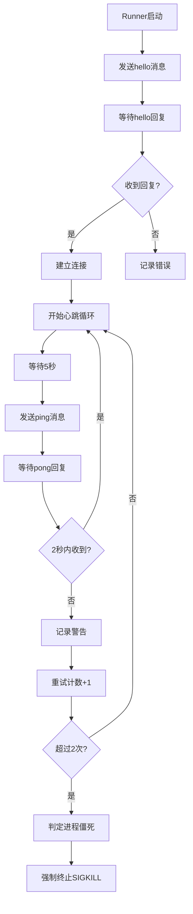
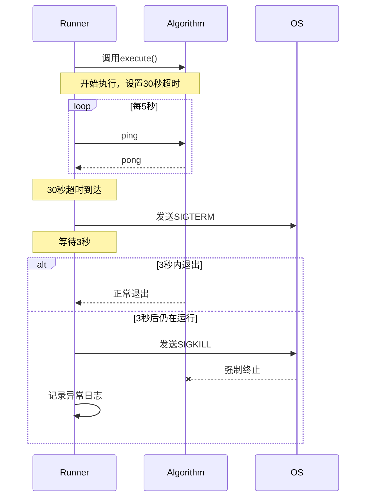
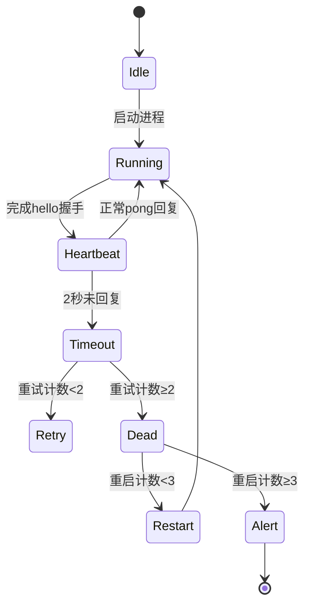

# 心跳与超时机制

<cite>
**本文档引用文件**  
- [base.py](file://procvision_algorithm_sdk/base.py)
- [cli.py](file://procvision_algorithm_sdk/cli.py)
- [session.py](file://procvision_algorithm_sdk/session.py)
- [diagnostics.py](file://procvision_algorithm_sdk/diagnostics.py)
- [logger.py](file://procvision_algorithm_sdk/logger.py)
- [shared_memory.py](file://procvision_algorithm_sdk/shared_memory.py)
- [runner_spec.md](file://runner_spec.md)
- [spec.md](file://spec.md)
- [README.md](file://README.md)
</cite>

## 目录
1. [心跳机制概述](#心跳机制概述)
2. [心跳参数配置](#心跳参数配置)
3. [执行超时处理](#执行超时处理)
4. [心跳消息结构](#心跳消息结构)
5. [进程异常处理与自动重启](#进程异常处理与自动重启)
6. [算法实现建议](#算法实现建议)

## 心跳机制概述

ProcVision算法SDK通过心跳机制确保算法进程的健康状态。Runner定期向算法进程发送`ping`消息，算法必须在规定时间内回复`pong`消息以表明其正常运行。

心跳流程如下：
1. 算法启动后，首先发送`{"type":"hello"}`消息
2. Runner回复`{"type":"hello"}`完成握手
3. 进入正常运行后，Runner每5秒发送一次`ping`消息
4. 算法必须在2秒内回复对应的`pong`消息
5. 若连续多次未收到`pong`回复，Runner将判定算法进程异常并采取相应措施

该机制确保了长时间运行的检测任务的可靠性，能够及时发现并处理进程僵死或响应迟缓的情况。

**Section sources**
- [runner_spec.md](file://runner_spec.md#L80-L85)
- [spec.md](file://spec.md#L634-L678)

## 心跳参数配置

心跳机制包含多个可配置参数，以适应不同场景的需求：

| 参数 | 说明 | 默认值 | 详细说明 |
|------|------|--------|---------|
| ping 间隔 | Runner发送ping的间隔 | 5秒 | 避免过于频繁的心跳检测 |
| 心跳超时时间 | 算法回复pong的超时时间 | 2秒 | 包括网络延迟和算法处理时间 |
| 最大重试次数 | 连续心跳丢失次数阈值 | 2次 | 超过此阈值将判定为进程僵死 |
| execute执行超时 | execute方法最大执行时间 | 30秒 | 超时后将触发终止流程 |
| pre_execute执行超时 | pre_execute方法最大执行时间 | 10秒 | 超时后将触发终止流程 |
| 优雅终止等待时间 | SIGTERM到SIGKILL的等待时间 | 3秒 | 给算法清理资源的时间 |
| 自动重启上限 | 进程崩溃后自动重启次数 | 3次 | 防止无限重启循环 |

这些参数可以在Runner配置文件中进行调整，以适应不同算法的性能特征和运行环境。



**Diagram sources**
- [runner_spec.md](file://runner_spec.md#L678-L689)
- [spec.md](file://spec.md#L678-L689)

## 执行超时处理

除了心跳机制外，SDK还对核心执行方法设置了超时限制，以防止算法长时间阻塞。

### execute方法超时处理

`execute`方法的执行超时限制为30秒，处理流程如下：
1. Runner检测到`execute`调用超过30秒未返回
2. 向算法进程发送`SIGTERM`信号（优雅终止）
3. 等待3秒让算法完成资源清理
4. 如果3秒后进程仍未退出，则发送`SIGKILL`信号（强制终止）

### pre_execute方法超时处理

`pre_execute`方法的执行超时限制为10秒，处理流程与`execute`类似：
1. Runner检测到`pre_execute`调用超过10秒未返回
2. 发送`SIGTERM`信号
3. 等待3秒
4. 仍未退出则发送`SIGKILL`信号

这种分级终止策略既给了算法合理的执行时间，又能及时回收异常进程的系统资源。



**Diagram sources**
- [runner_spec.md](file://runner_spec.md#L678-L689)
- [spec.md](file://spec.md#L678-L689)

## 心跳消息结构

心跳消息采用JSON格式，通过标准输入输出进行通信。

### ping消息结构

```json
{
  "type": "ping",
  "request_id": "ping-20241120-001",
  "timestamp_ms": 1714032005123
}
```

### pong消息结构

```json
{
  "type": "pong",
  "request_id": "ping-20241120-001",
  "timestamp_ms": 1714032005125
}
```

消息字段说明：
- `type`: 消息类型，`ping`或`pong`
- `request_id`: 请求ID，用于匹配ping和pong消息
- `timestamp_ms`: Unix毫秒时间戳，用于计算响应延迟

算法在实现时必须确保`request_id`与收到的ping消息保持一致，以便Runner能够正确匹配请求和响应。

**Section sources**
- [runner_spec.md](file://runner_spec.md#L689-L695)
- [spec.md](file://spec.md#L689-L695)

## 进程异常处理与自动重启

当算法进程出现异常时，Runner有一套完整的处理策略。

### 异常场景处理

| 异常类型 | 处理策略 |
|---------|---------|
| 心跳超时 | 连续2次未收到pong回复，判定为进程僵死，强制终止(SIGKILL) |
| execute超时 | 先发送SIGTERM，等待3秒后仍不退出则SIGKILL |
| 进程崩溃 | 自动重启，最多3次 |
| 协议错误 | 记录错误日志，尝试恢复通信 |

### 自动重启策略

当进程崩溃或被强制终止后，Runner会自动尝试重启：
1. 第一次崩溃：立即重启
2. 第二次崩溃：等待短暂延迟后重启
3. 第三次崩溃：等待较长延迟后重启
4. 超过3次：停止重启，发出告警

这种指数退避式的重启策略既能保证服务的可用性，又能避免在持续故障情况下造成系统资源浪费。



**Diagram sources**
- [runner_spec.md](file://runner_spec.md#L678-L689)
- [spec.md](file://spec.md#L678-L689)

## 算法实现建议

为确保算法能够稳定运行并正确处理心跳机制，提供以下实现建议：

### 独立线程处理心跳

算法实现时必须在独立线程中处理心跳，避免阻塞主执行流程：

```python
class MyAlgorithm(BaseAlgorithm):
    def __init__(self):
        super().__init__()
        self.heartbeat_thread = None
        self.running = False
    
    def start_heartbeat(self):
        """在独立线程中处理心跳"""
        self.running = True
        self.heartbeat_thread = threading.Thread(target=self._heartbeat_loop)
        self.heartbeat_thread.daemon = True
        self.heartbeat_thread.start()
    
    def _heartbeat_loop(self):
        while self.running:
            # 监听stdin的ping消息
            # 立即回复pong
            time.sleep(0.1)  # 避免忙等待
```

### 错误处理最佳实践

1. **不要抛出异常**：所有错误应通过返回值中的`status="ERROR"`表示
2. **提供详细错误信息**：在`message`字段中提供人类可读的错误描述
3. **使用标准错误码**：遵循SDK定义的标准错误码体系

### 资源管理

1. **setup中初始化**：在`setup()`方法中加载模型等重量级资源
2. **teardown中释放**：在`teardown()`方法中释放所有资源
3. **避免内存泄漏**：及时清理临时缓存和中间结果

### 日志记录

使用SDK提供的结构化日志记录：
```python
self.logger.info("步骤执行完成", step_index=step_index, latency_ms=latency)
self.logger.error("图像加载失败", error_code="1002")
```

**Section sources**
- [base.py](file://procvision_algorithm_sdk/base.py)
- [logger.py](file://procvision_algorithm_sdk/logger.py)
- [spec.md](file://spec.md#L634-L637)