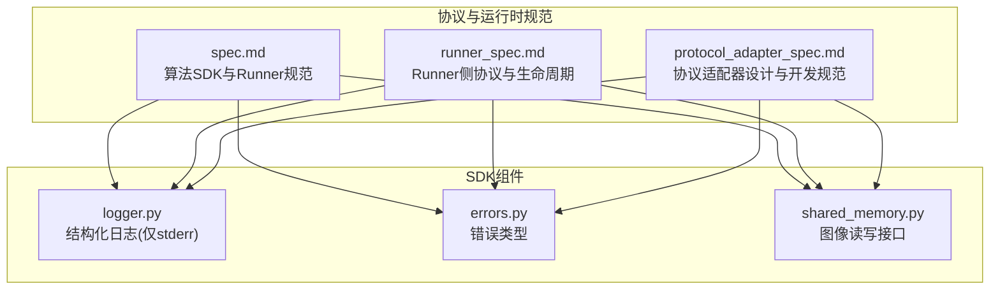
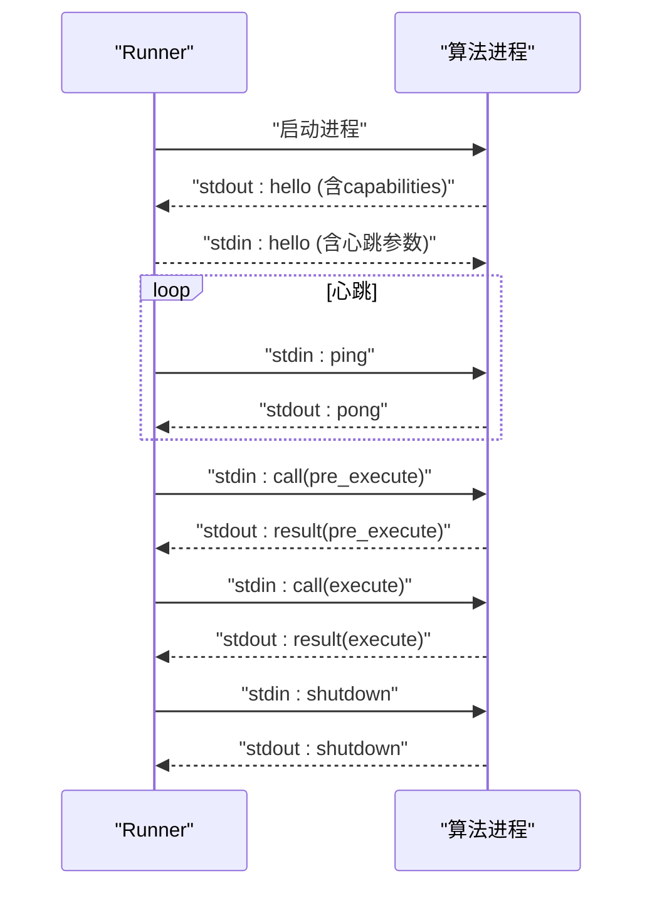
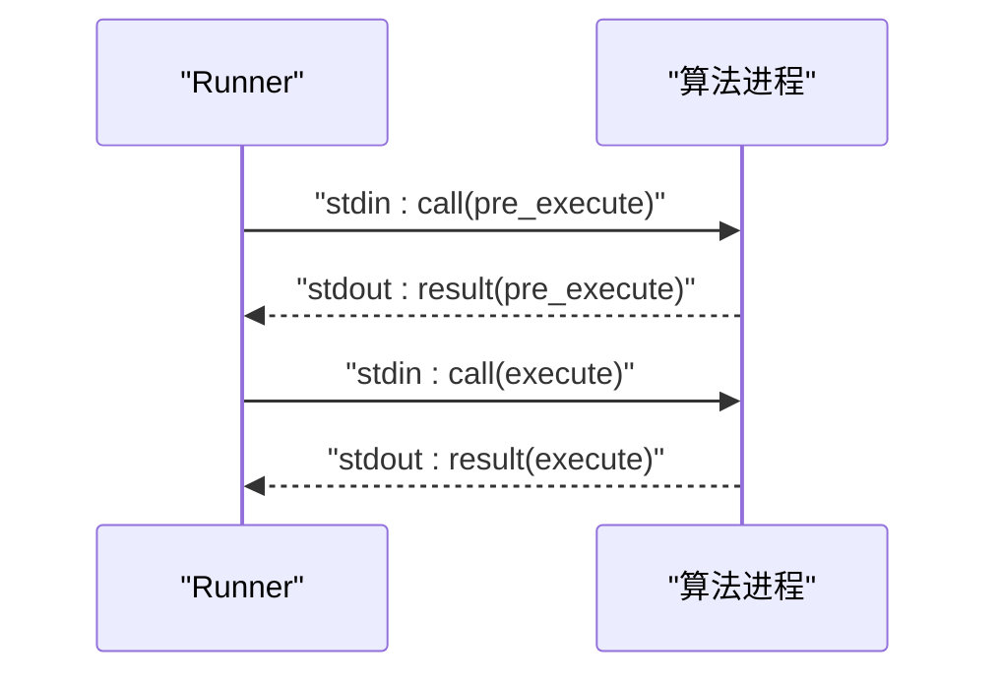
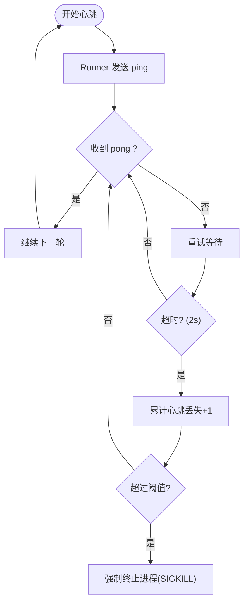
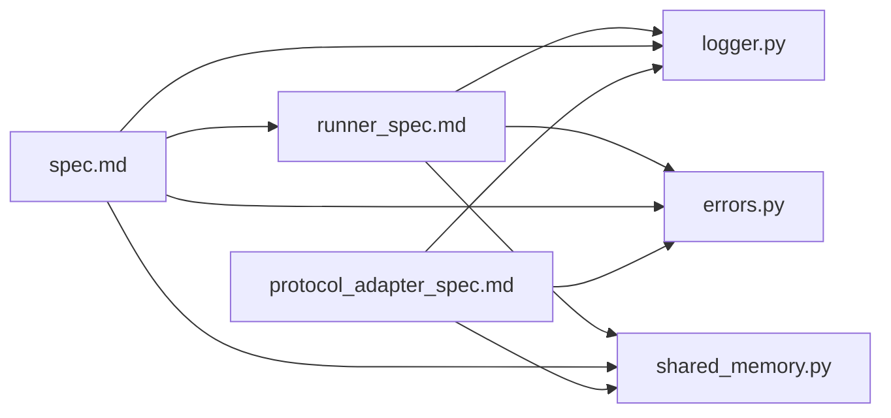

# 通信协议详解

<cite>
**本文引用的文件**
- [spec.md](file://spec.md)
- [runner_spec.md](file://runner_spec.md)
- [logger.py](file://procvision_algorithm_sdk/logger.py)
- [errors.py](file://procvision_algorithm_sdk/errors.py)
- [shared_memory.py](file://procvision_algorithm_sdk/shared_memory.py)
- [protocol_adapter_spec.md](file://protocol_adapter_spec.md)
</cite>

## 目录
1. [简介](#简介)
2. [项目结构](#项目结构)
3. [核心组件](#核心组件)
4. [架构总览](#架构总览)
5. [详细组件分析](#详细组件分析)
6. [依赖关系分析](#依赖关系分析)
7. [性能考量](#性能考量)
8. [故障排查指南](#故障排查指南)
9. [结论](#结论)
10. [附录](#附录)

## 简介
本文件面向工业视觉平台 ProcVision 的算法 SDK，系统化阐述基于 stdin/stdout 的 JSON 帧通信协议，包括帧格式（4字节大端长度前缀 + UTF-8 JSON 负载）、握手流程（hello）、调用流程（call/result）、心跳机制（ping/pong）与关闭流程（shutdown）。同时解释协议字段语义（type、request_id、method、payload、timestamp_ms、status、message、data），并给出日志与协议流隔离策略（stdout 用于协议，stderr 用于日志）。文档还总结技术决策与权衡，例如为何选择管道通信而非网络套接字，并提供错误处理策略、超时机制与进程监控逻辑的实践建议。本次更新重点增加了适配器能力协商、心跳配置参数以及共享内存中BGR到RGB自动转换等新特性说明。

## 项目结构
围绕通信协议与运行时交互，本仓库的关键文件如下：
- 协议与运行时规范：spec.md、runner_spec.md
- 日志与诊断：logger.py、diagnostics.py
- 错误类型：errors.py
- 共享内存读写：shared_memory.py
- 协议适配器规范：protocol_adapter_spec.md

图表来源
- [spec.md](file://spec.md#L615-L637)
- [runner_spec.md](file://runner_spec.md#L1-L60)
- [protocol_adapter_spec.md](file://protocol_adapter_spec.md#L1-L184)
- [logger.py](file://procvision_algorithm_sdk/logger.py#L1-L23)
- [errors.py](file://procvision_algorithm_sdk/errors.py#L1-L13)
- [shared_memory.py](file://procvision_algorithm_sdk/shared_memory.py#L1-L52)

章节来源
- [spec.md](file://spec.md#L615-L637)
- [runner_spec.md](file://runner_spec.md#L1-L60)
- [protocol_adapter_spec.md](file://protocol_adapter_spec.md#L1-L184)

## 核心组件
- 协议帧格式：4字节大端长度前缀 + UTF-8 JSON 负载，确保无粘包。
- 通道分离：stdout 用于协议帧与结果输出；stderr 用于结构化日志。
- 消息类型：hello、call、result、ping、pong、error、shutdown。
- 字段语义：type、request_id、method、payload、timestamp_ms、status、message、data。
- 心跳与超时：Runner 定期发送 ping，算法需在超时内回复 pong；调用超时与进程重启策略由 Runner 管理。
- 握手与能力协商：通过 hello 消息交换 SDK/Runner 版本及 capabilities，实现能力协商。
- 心跳配置：通过 hello 消息传递 `heartbeat_interval_ms` 和 `heartbeat_grace_ms` 参数，实现配置化。
- 图像颜色空间转换：当 `image_meta.color_space` 为 BGR 时，`read_image_from_shared_memory` 函数自动将其转换为 RGB。

章节来源
- [spec.md](file://spec.md#L615-L637)
- [runner_spec.md](file://runner_spec.md#L1-L60)
- [protocol_adapter_spec.md](file://protocol_adapter_spec.md#L45-L58)

## 架构总览
Runner 作为平台侧运行时，通过启动算法进程并与其建立双向管道通信。协议采用长度前缀封包，消息在 stdout/stdin 之间流动，stderr 专用于日志。

图表来源
- [runner_spec.md](file://runner_spec.md#L1-L60)
- [spec.md](file://spec.md#L639-L678)
- [protocol_adapter_spec.md](file://protocol_adapter_spec.md#L45-L58)

## 详细组件分析

### 协议帧格式与通道隔离
- 帧格式：4字节大端长度 + UTF-8 JSON 负载，天然避免粘包。
- 通道：
  - stdout：协议消息（hello/pong/result/shutdown）与算法结果。
  - stdin：Runner 指令（hello/ping/call/stop）。
  - stderr：结构化日志（JSON 行），由 StructuredLogger 统一输出。
- 日志与协议隔离：协议帧仅在 stdout 输出，日志仅在 stderr 输出，避免污染协议流。

章节来源
- [runner_spec.md](file://runner_spec.md#L1-L60)
- [logger.py](file://procvision_algorithm_sdk/logger.py#L1-L23)
- [spec.md](file://spec.md#L634-L637)

### 握手流程与能力协商
- 算法启动后立即输出 hello 帧（stdout），其中包含 `sdk_version` 和 `capabilities` 字段。
- Runner 在 2 秒内回复 hello 帧（stdin），其中包含 `runner_version`、`heartbeat_interval_ms` 和 `heartbeat_grace_ms` 等配置参数。
- 能力协商：双方通过 `hello.capabilities` 字段宣告支持的扩展功能（如 `shared_memory:v1`），若能力不匹配，Runner 可发送 error 并优雅关闭。
- 握手完成后方可发送业务消息。

章节来源
- [runner_spec.md](file://runner_spec.md#L1-L60)
- [protocol_adapter_spec.md](file://protocol_adapter_spec.md#L45-L54)

### 调用流程（call/result）
- Runner 发送 call 帧，payload 包含 step_index、pid、session、user_params、shared_mem_id、image_meta、phase 等。
- 算法处理后返回 result 帧，首层通用状态（status/message），业务结果放入 data。
- pre 阶段不返回业务判定；execute 阶段业务判定在 data.result_status。

图表来源
- [runner_spec.md](file://runner_spec.md#L60-L120)

章节来源
- [runner_spec.md](file://runner_spec.md#L60-L120)

### 心跳机制（ping/pong）与超时
- Runner 每 5 秒发送 ping，算法需在 2 秒内回复 pong。
- 心跳参数：`heartbeat_interval_ms`（ping 间隔）、`heartbeat_grace_ms`（心跳超时时间）、`max_retries`（最大重试次数）。
- 超时处理：Runner 记录日志并重试；连续超时达到阈值后强制终止进程；execute 超时策略由 Runner 管理。
- 超时参数（示例）：ping 间隔 5 秒、心跳超时 2 秒、execute 超时 30 秒、优雅终止等待 3 秒、自动重启上限 3 次。

图表来源
- [spec.md](file://spec.md#L639-L678)
- [protocol_adapter_spec.md](file://protocol_adapter_spec.md#L57-L60)

章节来源
- [spec.md](file://spec.md#L678-L689)
- [protocol_adapter_spec.md](file://protocol_adapter_spec.md#L57-L60)

### 关闭流程（shutdown）
- Runner 发送 shutdown 帧，算法 teardown 后返回 shutdown 结果并退出进程。

章节来源
- [spec.md](file://spec.md#L634-L637)

### 字段语义说明
- type：消息类型（hello、call、result、ping、pong、error、shutdown）。
- request_id：请求唯一标识，用于配对响应。
- method：仅在 call 中出现，表示调用方法（pre_execute、execute）。
- payload：调用参数载体（包含 step_index、pid、session、user_params、shared_mem_id、image_meta、phase 等）。
- timestamp_ms：Unix 毫秒时间戳。
- status：通用状态（OK、ERROR）。
- message：人类可读信息（错误时必填）。
- data：业务数据（result_status、ng_reason、defect_rects、position_rects、debug 等）。
- capabilities：在 hello 消息中，用于宣告支持的扩展功能（如 `ping`, `call`, `shutdown`, `shared_memory:v1`）。
- heartbeat_interval_ms：在 hello 消息中，定义 Runner 发送 ping 的间隔（毫秒）。
- heartbeat_grace_ms：在 hello 消息中，定义算法回复 pong 的超时时间（毫秒）。

章节来源
- [runner_spec.md](file://runner_spec.md#L60-L120)
- [spec.md](file://spec.md#L615-L637)
- [protocol_adapter_spec.md](file://protocol_adapter_spec.md#L48-L52)

### 日志与协议流隔离策略
- stdout：仅输出协议帧与结果。
- stderr：仅输出结构化日志（StructuredLogger），包含 level、timestamp_ms、message 等字段。
- 建议：算法侧所有日志统一通过 logger 输出，避免直接 print 或写入 stdout。

章节来源
- [logger.py](file://procvision_algorithm_sdk/logger.py#L1-L23)
- [spec.md](file://spec.md#L634-L637)

### 错误处理策略与错误码
- 错误类型：RecoverableError、FatalError、GPUOutOfMemoryError、ProgramError。
- 错误码：标准错误码（如 1001、1002、1003、1004、1005、1006、1007、9999）。
- Runner 策略：可重试错误按策略重试；超时与心跳丢失按心跳参数处理；致命错误终止并重启进程。

章节来源
- [errors.py](file://procvision_algorithm_sdk/errors.py#L1-L13)
- [runner_spec.md](file://runner_spec.md#L200-L260)

### 图像传输与共享内存
- Runner 将图像写入共享内存并提供 shared_mem_id 与 image_meta（width、height、timestamp_ms、camera_id）。
- 算法通过 SDK 接口读取图像，返回 numpy 数组或 PIL 图像（内部转换）。
- **BGR到RGB自动转换**：当 `image_meta` 中的 `color_space` 字段为 "BGR" 时，`read_image_from_shared_memory` 函数会自动将图像数据从 BGR 颜色空间转换为 RGB 颜色空间，确保算法接收到统一的 RGB 格式数据。

章节来源
- [shared_memory.py](file://procvision_algorithm_sdk/shared_memory.py#L1-L52)
- [runner_spec.md](file://runner_spec.md#L120-L180)
- [protocol_adapter_spec.md](file://protocol_adapter_spec.md#L85-L90)

## 依赖关系分析
- 协议与运行时：spec.md 与 runner_spec.md 定义协议与 Runner 行为。
- 日志：logger.py 提供结构化日志输出，确保 stderr 专用。
- 错误：errors.py 定义错误类型，Runner 依据错误类型决定重试与终止策略。
- 共享内存：shared_memory.py 提供图像读写接口，支撑 Runner 与算法的数据通道。
- 协议适配器：protocol_adapter_spec.md 定义了能力协商、心跳配置等新特性，是现有规范的补充。

图表来源
- [spec.md](file://spec.md#L615-L637)
- [runner_spec.md](file://runner_spec.md#L1-L60)
- [protocol_adapter_spec.md](file://protocol_adapter_spec.md#L1-L184)
- [logger.py](file://procvision_algorithm_sdk/logger.py#L1-L23)
- [errors.py](file://procvision_algorithm_sdk/errors.py#L1-L13)
- [shared_memory.py](file://procvision_algorithm_sdk/shared_memory.py#L1-L52)

## 性能考量
- 管道通信：stdin/stdout 管道在本地进程间通信，延迟低、无网络抖动，适合高吞吐的检测流水线。
- 帧格式：4字节长度前缀 + UTF-8 JSON，编解码开销小，避免粘包与半包。
- 心跳与超时：合理的 ping 间隔与超时阈值平衡健康监控与系统开销。
- 图像传输：JPEG-only 约定简化解码流程，减少 CPU 开销；同时需注意压缩带来的精度损失与边界场景。
- **颜色空间转换**：在 `read_image_from_shared_memory` 中进行 BGR 到 RGB 的转换，避免了在算法主逻辑中进行额外处理，提高了性能。

章节来源
- [runner_spec.md](file://runner_spec.md#L1-L60)
- [spec.md](file://spec.md#L639-L678)
- [shared_memory.py](file://procvision_algorithm_sdk/shared_memory.py#L46-L115)

## 故障排查指南
- 握手失败：确认算法启动后立即输出 hello（stdout），Runner 在 2 秒内回复 hello（stdin）。
- 心跳丢失：检查算法是否及时回复 pong；确认 Runner 的心跳参数与进程负载情况。
- 调用超时：检查 pre_execute/execute 的执行时间是否超过阈值；优化算法逻辑或增加超时配置。
- 日志污染：确认仅在 stderr 输出日志，stdout 仅输出协议帧。
- 错误码定位：结合错误码与 message 快速定位问题类型（参数错误、资源不足、超时等）。
- **BGR转换问题**：若图像颜色异常，检查 `image_meta.color_space` 是否正确设置为 "BGR"，并确认 `read_image_from_shared_memory` 是否成功执行了转换。

章节来源
- [runner_spec.md](file://runner_spec.md#L1-L60)
- [spec.md](file://spec.md#L639-L678)
- [logger.py](file://procvision_algorithm_sdk/logger.py#L1-L23)
- [errors.py](file://procvision_algorithm_sdk/errors.py#L1-L13)
- [shared_memory.py](file://procvision_algorithm_sdk/shared_memory.py#L46-L115)

## 结论
本协议以管道通信为基础，采用长度前缀封包与通道隔离，确保协议稳定与日志清晰。通过引入能力协商、心跳参数配置和BGR到RGB自动转换等新特性，进一步增强了协议的灵活性、可配置性和易用性。配合心跳与超时机制，Runner 能够可靠地监控算法进程并进行自动重启与错误处理。算法侧只需专注于实现 get_info、pre_execute、execute 与生命周期钩子，并通过 SDK 的日志与共享内存接口完成数据与状态管理即可。

## 附录
- 实际消息示例（字段与结构参考）：
  - hello：用于握手，双方交换版本信息和能力。
  - ping/pong：心跳保活，算法需在超时内回复。
  - call：Runner 调用算法，payload 包含 step_index、pid、session、user_params、shared_mem_id、image_meta、phase。
  - result：算法返回，首层通用状态（status/message），业务结果放入 data。
  - shutdown：Runner 请求关闭，算法 teardown 后返回 shutdown。

章节来源
- [runner_spec.md](file://runner_spec.md#L1-L120)
- [spec.md](file://spec.md#L615-L637)
- [protocol_adapter_spec.md](file://protocol_adapter_spec.md#L45-L58)