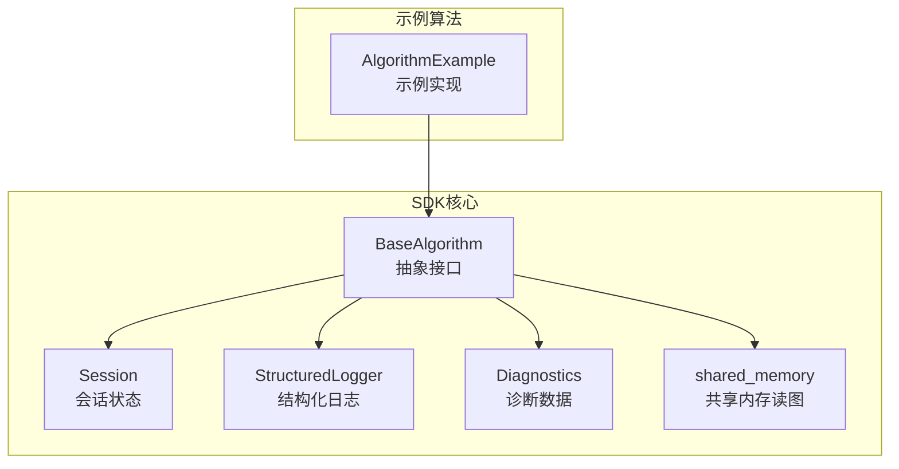
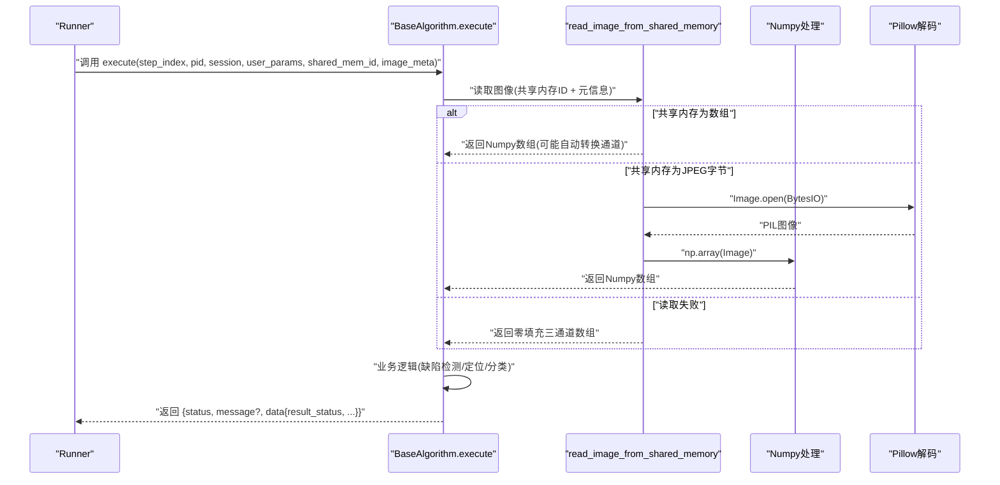
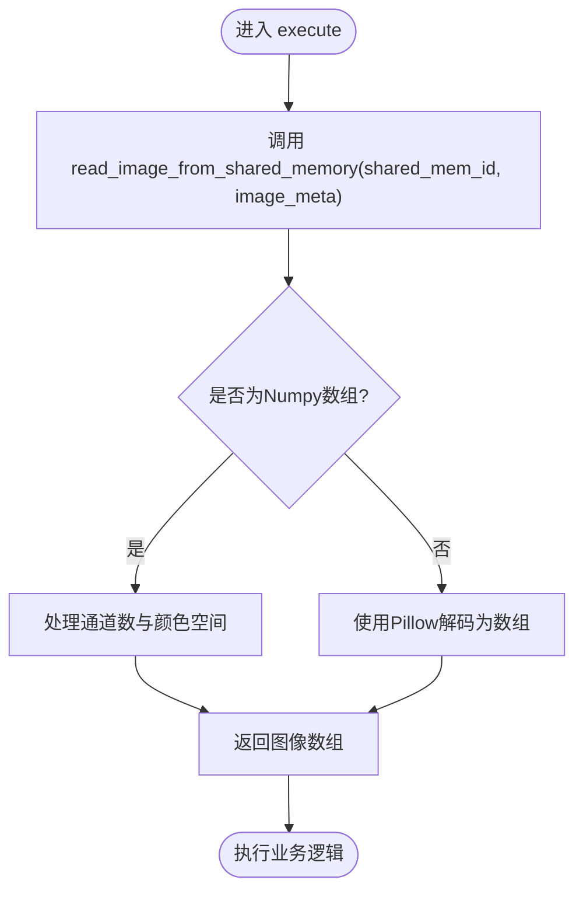
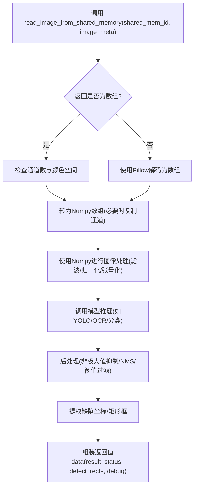
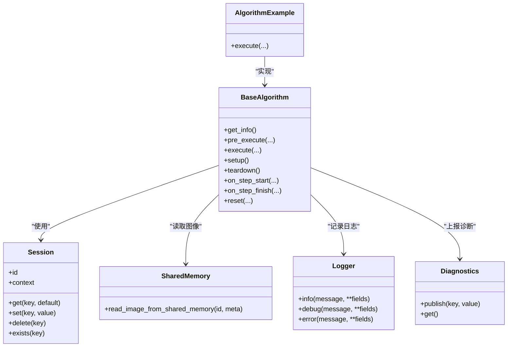

# execute 方法

<cite>
**本文引用的文件**
- [procvision_algorithm_sdk/base.py](file://procvision_algorithm_sdk/base.py)
- [procvision_algorithm_sdk/shared_memory.py](file://procvision_algorithm_sdk/shared_memory.py)
- [algorithm-example/algorithm_example/main.py](file://algorithm-example/algorithm_example/main.py)
- [tests/test_base_algo.py](file://tests/test_base_algo.py)
- [spec.md](file://spec.md)
- [README.md](file://README.md)
- [procvision_algorithm_sdk/session.py](file://procvision_algorithm_sdk/session.py)
- [procvision_algorithm_sdk/logger.py](file://procvision_algorithm_sdk/logger.py)
- [procvision_algorithm_sdk/diagnostics.py](file://procvision_algorithm_sdk/diagnostics.py)
- [tests/test_shared_memory.py](file://tests/test_shared_memory.py)
</cite>

## 目录
1. [简介](#简介)
2. [项目结构](#项目结构)
3. [核心组件](#核心组件)
4. [架构总览](#架构总览)
5. [详细组件分析](#详细组件分析)
6. [依赖关系分析](#依赖关系分析)
7. [性能考量](#性能考量)
8. [故障排查指南](#故障排查指南)
9. [结论](#结论)
10. [附录](#附录)

## 简介
本文件围绕算法SDK中的execute抽象方法展开，作为算法核心业务逻辑的执行入口，负责在每个处理步骤中实际执行图像分析或视觉检测任务。我们将系统阐述execute的调用时机、参数语义、图像读取流程、返回值结构、错误处理策略与性能优化建议，并给出基于Pillow解码与Numpy处理的完整流程示意与最佳实践。

## 项目结构
该SDK围绕BaseAlgorithm抽象类提供统一的生命周期钩子与接口契约，配合Session状态管理、StructuredLogger结构化日志、Diagnostics诊断数据上报、以及共享内存读图工具read_image_from_shared_memory，形成“预处理+执行+诊断”的完整链路。

图表来源
- [procvision_algorithm_sdk/base.py](file://procvision_algorithm_sdk/base.py#L1-L58)
- [procvision_algorithm_sdk/session.py](file://procvision_algorithm_sdk/session.py#L1-L36)
- [procvision_algorithm_sdk/shared_memory.py](file://procvision_algorithm_sdk/shared_memory.py#L1-L53)
- [procvision_algorithm_sdk/logger.py](file://procvision_algorithm_sdk/logger.py#L1-L24)
- [procvision_algorithm_sdk/diagnostics.py](file://procvision_algorithm_sdk/diagnostics.py#L1-L12)
- [algorithm-example/algorithm_example/main.py](file://algorithm-example/algorithm_example/main.py#L1-L150)

章节来源
- [procvision_algorithm_sdk/base.py](file://procvision_algorithm_sdk/base.py#L1-L58)
- [procvision_algorithm_sdk/session.py](file://procvision_algorithm_sdk/session.py#L1-L36)
- [procvision_algorithm_sdk/shared_memory.py](file://procvision_algorithm_sdk/shared_memory.py#L1-L53)
- [README.md](file://README.md#L1-L116)

## 核心组件
- BaseAlgorithm.execute：算法的核心执行入口，接收步骤控制、上下文、用户参数与图像元信息，返回检测结果与诊断信息。
- Session：贯穿一次检测流程的状态容器，支持键值对存储与上下文拷贝。
- read_image_from_shared_memory：从共享内存读取图像，支持JPEG与数组两种来源，自动处理颜色空间与通道数。
- StructuredLogger/Diagnostics：结构化日志与诊断数据上报，便于UI展示与远程排障。
- 示例算法AlgorithmExample：演示execute的典型实现与返回值组织。

章节来源
- [procvision_algorithm_sdk/base.py](file://procvision_algorithm_sdk/base.py#L1-L58)
- [procvision_algorithm_sdk/session.py](file://procvision_algorithm_sdk/session.py#L1-L36)
- [procvision_algorithm_sdk/shared_memory.py](file://procvision_algorithm_sdk/shared_memory.py#L1-L53)
- [algorithm-example/algorithm_example/main.py](file://algorithm-example/algorithm_example/main.py#L1-L150)

## 架构总览
下面的序列图展示了Runner调用execute的典型流程，包括参数传递、图像读取、业务处理与结果返回。

图表来源
- [procvision_algorithm_sdk/base.py](file://procvision_algorithm_sdk/base.py#L1-L58)
- [procvision_algorithm_sdk/shared_memory.py](file://procvision_algorithm_sdk/shared_memory.py#L1-L53)
- [algorithm-example/algorithm_example/main.py](file://algorithm-example/algorithm_example/main.py#L1-L150)

## 详细组件分析

### execute抽象方法与参数语义
- step_index：当前步骤索引（从1开始），用于区分不同检测阶段的逻辑分支。
- pid：产品型号编码，每次调用时动态传入，算法据此选择对应配置或模型。
- session：平台为本次工艺提供的会话对象，包含id、context与可序列化状态存储，用于跨步骤数据共享。
- user_params：来自UI/配置下发的可调参数，按步骤schema校验后传入，驱动算法行为。
- shared_mem_id：平台提供的共享内存ID，图像数据存放于该ID对应的共享内存中。
- image_meta：图像元信息，包含width、height、timestamp_ms、camera_id等最小集合，用于尺寸校验与调试。

执行职责与调用时机
- execute在每一步检测流程中被调用，承担实际的图像分析或视觉检测任务。
- 与pre_execute不同，execute不返回参考信息，而是返回业务判定结果与诊断数据。

章节来源
- [procvision_algorithm_sdk/base.py](file://procvision_algorithm_sdk/base.py#L1-L58)
- [spec.md](file://spec.md#L1-L799)
- [procvision_algorithm_sdk/session.py](file://procvision_algorithm_sdk/session.py#L1-L36)

### 图像读取与共享内存交互
- shared_mem_id + image_meta共同决定输入图像的来源与形状。
- read_image_from_shared_memory会优先尝试从共享内存读取数组；若为JPEG字节，则使用Pillow解码为Numpy数组；若失败或元信息无效，返回零填充的三通道数组，保证后续处理不崩溃。
- 颜色空间处理：当元信息中包含color_space且为BGR时，会自动转换为RGB；若数组为单通道灰度，会复制为三通道RGB。

图表来源
- [procvision_algorithm_sdk/shared_memory.py](file://procvision_algorithm_sdk/shared_memory.py#L1-L53)

章节来源
- [procvision_algorithm_sdk/shared_memory.py](file://procvision_algorithm_sdk/shared_memory.py#L1-L53)
- [tests/test_shared_memory.py](file://tests/test_shared_memory.py#L1-L16)

### 返回值结构与字段含义
- status：通用状态，OK表示调用成功，ERROR表示调用失败（如图像为空、参数不合法等）。
- message：人类可读信息（仅在ERROR时出现）。
- data：业务结果，包含：
  - result_status：业务判定（OK/NG），用于流程控制。
  - ng_reason：不合格原因（可选）。
  - 缺陷坐标/矩形：defect_rects、position_rects等（按业务定义），建议限制数量（如不超过20个）。
  - debug：附加诊断信息，如置信度、亮度、耗时、模型版本等。
- 诊断数据：可通过Diagnostics.publish上报额外指标，供UI展示与远程排查。

章节来源
- [spec.md](file://spec.md#L1-L799)
- [procvision_algorithm_sdk/diagnostics.py](file://procvision_algorithm_sdk/diagnostics.py#L1-L12)

### 使用Pillow解码与Numpy处理的完整流程示意
以下流程图展示了从共享内存读取图像到使用Pillow解码与Numpy处理的完整步骤，便于在execute中组织代码结构。

图表来源
- [procvision_algorithm_sdk/shared_memory.py](file://procvision_algorithm_sdk/shared_memory.py#L1-L53)
- [algorithm-example/algorithm_example/main.py](file://algorithm-example/algorithm_example/main.py#L1-L150)

### 错误处理与健壮性
- 图像读取失败：当shared_mem_id对应的图像为空或无法解码时，read_image_from_shared_memory会返回零填充三通道数组，execute应将其识别为错误并返回status=ERROR，同时设置message与error_code。
- 参数校验：在execute中应校验pid是否受支持、user_params是否满足业务约束，不合法时返回ERROR。
- 异常捕获：execute不应抛出异常，所有错误通过返回值中的status与message表达。
- 标准错误码：规范中定义了若干标准错误码，建议在返回值中携带error_code字段，便于Runner与UI统一处理。

章节来源
- [spec.md](file://spec.md#L1-L799)
- [tests/test_base_algo.py](file://tests/test_base_algo.py#L1-L65)
- [algorithm-example/algorithm_example/main.py](file://algorithm-example/algorithm_example/main.py#L1-L150)

### 性能关键点与优化建议
- 避免在execute中进行模型加载等耗时操作：模型加载应在setup中完成，execute仅做推理与后处理。
- 减少不必要的图像拷贝：尽量复用从共享内存读取的数组，避免重复解码。
- 控制返回数据规模：限制缺陷矩形数量（如不超过20个），降低序列化与传输开销。
- 使用debug字段记录耗时与关键指标，便于定位瓶颈。
- 避免在execute中进行I/O操作（磁盘、网络），统一通过共享内存与Runner协议交互。

章节来源
- [spec.md](file://spec.md#L1-L799)
- [algorithm-example/algorithm_example/main.py](file://algorithm-example/algorithm_example/main.py#L1-L150)

## 依赖关系分析
- BaseAlgorithm.execute依赖Session进行状态共享，依赖read_image_from_shared_memory进行图像读取，依赖StructuredLogger与Diagnostics进行日志与诊断上报。
- 示例算法AlgorithmExample实现了BaseAlgorithm，展示了execute的典型返回结构与debug字段使用。

图表来源
- [procvision_algorithm_sdk/base.py](file://procvision_algorithm_sdk/base.py#L1-L58)
- [procvision_algorithm_sdk/session.py](file://procvision_algorithm_sdk/session.py#L1-L36)
- [procvision_algorithm_sdk/shared_memory.py](file://procvision_algorithm_sdk/shared_memory.py#L1-L53)
- [procvision_algorithm_sdk/logger.py](file://procvision_algorithm_sdk/logger.py#L1-L24)
- [procvision_algorithm_sdk/diagnostics.py](file://procvision_algorithm_sdk/diagnostics.py#L1-L12)
- [algorithm-example/algorithm_example/main.py](file://algorithm-example/algorithm_example/main.py#L1-L150)

章节来源
- [procvision_algorithm_sdk/base.py](file://procvision_algorithm_sdk/base.py#L1-L58)
- [procvision_algorithm_sdk/session.py](file://procvision_algorithm_sdk/session.py#L1-L36)
- [procvision_algorithm_sdk/shared_memory.py](file://procvision_algorithm_sdk/shared_memory.py#L1-L53)
- [procvision_algorithm_sdk/logger.py](file://procvision_algorithm_sdk/logger.py#L1-L24)
- [procvision_algorithm_sdk/diagnostics.py](file://procvision_algorithm_sdk/diagnostics.py#L1-L12)
- [algorithm-example/algorithm_example/main.py](file://algorithm-example/algorithm_example/main.py#L1-L150)

## 性能考量
- 初始化与推理分离：在setup中完成模型加载与资源分配，execute仅做推理与后处理。
- 图像解码与转换：尽量利用read_image_from_shared_memory的自动通道与颜色空间处理，避免重复解码。
- 数据规模控制：限制返回的缺陷矩形数量，减少序列化与网络传输成本。
- 诊断指标：通过debug字段记录关键指标，便于定位性能瓶颈。
- I/O与同步：避免在execute中进行磁盘I/O或网络请求，统一通过共享内存与Runner协议交互。

章节来源
- [spec.md](file://spec.md#L1-L799)
- [algorithm-example/algorithm_example/main.py](file://algorithm-example/algorithm_example/main.py#L1-L150)

## 故障排查指南
- 图像为空或解码失败：检查shared_mem_id与image_meta是否正确，确认Runner已写入JPEG或数组；在execute中对返回值进行判空并返回ERROR。
- 参数不合法：校验pid与user_params，不符合要求时返回ERROR并携带error_code。
- 日志与诊断：使用StructuredLogger记录关键事件，使用Diagnostics.publish上报指标，便于UI展示与远程排查。
- 单元测试参考：示例算法与测试用例展示了execute的基本返回结构与错误处理模式，可作为实现参考。

章节来源
- [tests/test_shared_memory.py](file://tests/test_shared_memory.py#L1-L16)
- [tests/test_base_algo.py](file://tests/test_base_algo.py#L1-L65)
- [procvision_algorithm_sdk/logger.py](file://procvision_algorithm_sdk/logger.py#L1-L24)
- [procvision_algorithm_sdk/diagnostics.py](file://procvision_algorithm_sdk/diagnostics.py#L1-L12)

## 结论
execute作为算法的核心执行入口，承担着在每一步检测中完成图像分析与视觉检测的职责。通过明确的参数语义、严格的返回值结构、稳健的图像读取流程与完善的诊断机制，算法能够在Runner的统一调度下高效、可靠地完成检测任务。建议在实现中遵循“初始化与推理分离、避免execute中的耗时操作、控制返回数据规模、使用debug字段记录关键指标”的原则，以获得最佳性能与可维护性。

## 附录
- 示例算法实现参考：[algorithm-example/algorithm_example/main.py](file://algorithm-example/algorithm_example/main.py#L1-L150)
- 接口规范与返回值结构参考：[spec.md](file://spec.md#L1-L799)
- README中的快速开始与接口要点参考：[README.md](file://README.md#L1-L116)