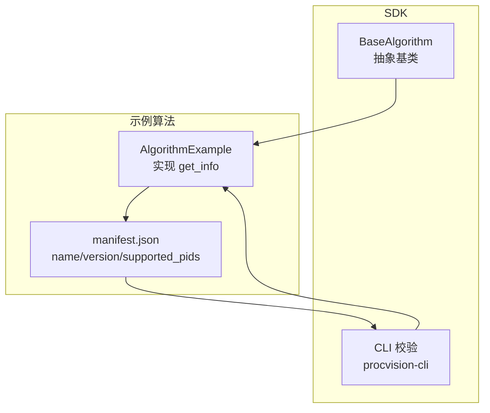
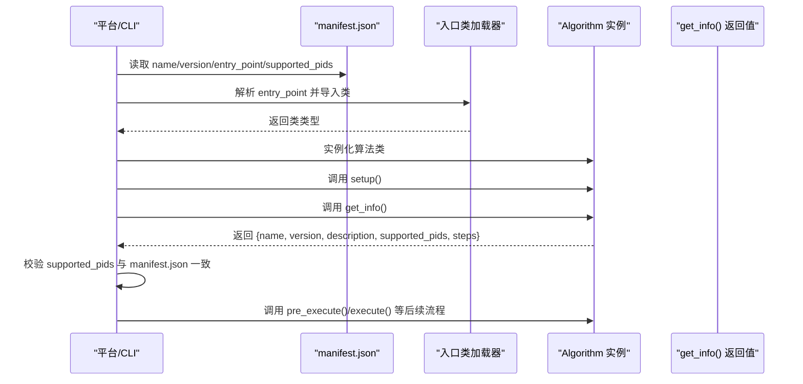
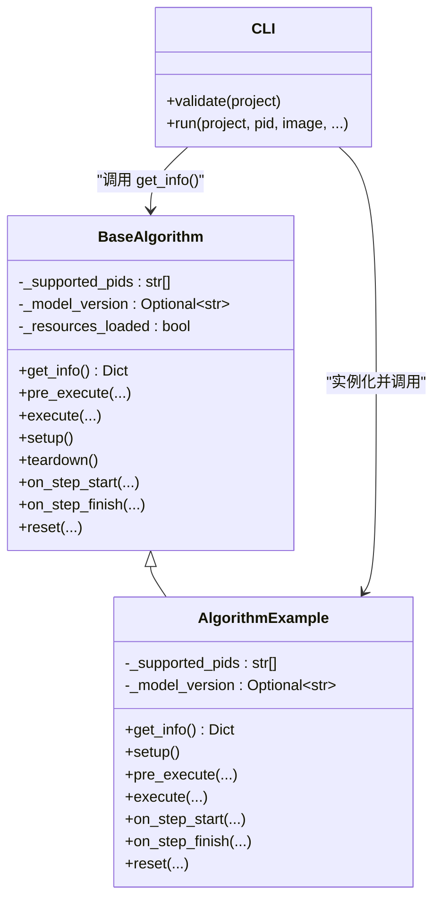

# get_info 方法

<cite>
**本文引用的文件**
- [procvision_algorithm_sdk/base.py](file://procvision_algorithm_sdk/base.py)
- [algorithm-example/algorithm_example/main.py](file://algorithm-example/algorithm_example/main.py)
- [algorithm-example/manifest.json](file://algorithm-example/manifest.json)
- [procvision_algorithm_sdk/cli.py](file://procvision_algorithm_sdk/cli.py)
- [spec.md](file://spec.md)
- [algorithm_dev_quickstart.md](file://algorithm_dev_quickstart.md)
- [README.md](file://README.md)
</cite>

## 目录
1. [简介](#简介)
2. [项目结构](#项目结构)
3. [核心组件](#核心组件)
4. [架构总览](#架构总览)
5. [详细组件分析](#详细组件分析)
6. [依赖分析](#依赖分析)
7. [性能考虑](#性能考虑)
8. [故障排查指南](#故障排查指南)
9. [结论](#结论)
10. [附录](#附录)

## 简介
本文件聚焦于算法 SDK 中的 get_info 抽象方法，说明其职责、返回值规范、与 manifest.json 的一致性要求，以及在平台路由与兼容性检查中的作用。get_info 是 BaseAlgorithm 的抽象方法，必须由子类实现，用于向平台返回算法的元信息，包括支持的 PID 列表、算法名称、版本号、描述及步骤参数规格等。平台在加载算法包时会调用该方法，用于：
- 进行兼容性校验（如 supported_pids 与 manifest.json 一致）
- 进行路由决策（根据 PID 选择合适的算法包）
- 生成 UI/配置界面所需的步骤参数 schema

## 项目结构
围绕 get_info 的关键文件与角色如下：
- 抽象基类：BaseAlgorithm（定义 get_info 抽象方法）
- 示例实现：AlgorithmExample（在 get_info 中返回 name、version、description、supported_pids、steps）
- 配置文件：manifest.json（声明 name、version、entry_point、supported_pids 等）
- CLI 校验：procvision-cli 在 validate 流程中调用 get_info 并与 manifest.json 的 supported_pids 做一致性校验
- 规范文档：spec.md 与 algorithm_dev_quickstart.md 明确返回值结构与字段约束

图表来源
- [procvision_algorithm_sdk/base.py](file://procvision_algorithm_sdk/base.py#L1-L58)
- [algorithm-example/algorithm_example/main.py](file://algorithm-example/algorithm_example/main.py#L1-L149)
- [algorithm-example/manifest.json](file://algorithm-example/manifest.json#L1-L24)
- [procvision_algorithm_sdk/cli.py](file://procvision_algorithm_sdk/cli.py#L60-L110)

章节来源
- [procvision_algorithm_sdk/base.py](file://procvision_algorithm_sdk/base.py#L1-L58)
- [algorithm-example/algorithm_example/main.py](file://algorithm-example/algorithm_example/main.py#L1-L149)
- [algorithm-example/manifest.json](file://algorithm-example/manifest.json#L1-L24)
- [procvision_algorithm_sdk/cli.py](file://procvision_algorithm_sdk/cli.py#L60-L110)
- [README.md](file://README.md#L1-L116)

## 核心组件
- BaseAlgorithm.get_info：抽象方法，子类必须实现，返回字典结构，包含 name、version、description、supported_pids、steps 等字段。
- AlgorithmExample.get_info：示例实现，返回 name、version、description、supported_pids、steps 等字段，steps 中包含 index、name、params 等。
- manifest.json：声明 name、version、entry_point、supported_pids 等，get_info 的 supported_pids 必须与之完全一致。
- CLI 校验：procvision-cli.validate 在加载入口类后，调用 get_info，并比较 manifest.json 与 get_info 返回的 supported_pids 是否一致。

章节来源
- [procvision_algorithm_sdk/base.py](file://procvision_algorithm_sdk/base.py#L1-L58)
- [algorithm-example/algorithm_example/main.py](file://algorithm-example/algorithm_example/main.py#L1-L149)
- [algorithm-example/manifest.json](file://algorithm-example/manifest.json#L1-L24)
- [procvision_algorithm_sdk/cli.py](file://procvision_algorithm_sdk/cli.py#L60-L110)
- [spec.md](file://spec.md#L320-L380)
- [algorithm_dev_quickstart.md](file://algorithm_dev_quickstart.md#L32-L78)

## 架构总览
下面的时序图展示了平台在加载算法包时调用 get_info 的典型流程，以及与 manifest.json 的一致性校验。

图表来源
- [procvision_algorithm_sdk/cli.py](file://procvision_algorithm_sdk/cli.py#L60-L110)
- [algorithm-example/manifest.json](file://algorithm-example/manifest.json#L1-L24)
- [algorithm-example/algorithm_example/main.py](file://algorithm-example/algorithm_example/main.py#L1-L149)

章节来源
- [procvision_algorithm_sdk/cli.py](file://procvision_algorithm_sdk/cli.py#L60-L110)
- [algorithm-example/manifest.json](file://algorithm-example/manifest.json#L1-L24)
- [algorithm-example/algorithm_example/main.py](file://algorithm-example/algorithm_example/main.py#L1-L149)

## 详细组件分析

### get_info 抽象方法定义与职责
- 定义位置：BaseAlgorithm.get_info 为抽象方法，子类必须实现。
- 调用时机：平台在加载算法包时调用，通常发生在算法初始化阶段（setup 之后）。
- 返回值：字典结构，包含以下关键字段：
  - name：算法唯一标识，应与 manifest.json 中的 name 一致
  - version：语义化版本，应与 manifest.json 中的 version 一致
  - description：算法描述（可选）
  - supported_pids：算法支持的产品型号列表，必须与 manifest.json 中的 supported_pids 完全一致
  - steps：算法步骤列表，每一步包含 index、name、params 等，params 描述每步的可配置参数 schema
- 重要约束：
  - 返回值必须为字典
  - supported_pids 与 manifest.json 必须严格一致
  - steps 字段应为列表，且每步的 params 应描述参数类型、默认值、取值范围等

章节来源
- [procvision_algorithm_sdk/base.py](file://procvision_algorithm_sdk/base.py#L1-L58)
- [spec.md](file://spec.md#L320-L380)
- [algorithm_dev_quickstart.md](file://algorithm_dev_quickstart.md#L32-L78)

### 示例实现：AlgorithmExample.get_info
- AlgorithmExample 在 get_info 中返回 name、version、description、supported_pids、steps 等字段，steps 中包含 index、name、params 等。
- supported_pids 与 manifest.json 中的 supported_pids 保持一致，便于平台进行一致性校验与路由。

章节来源
- [algorithm-example/algorithm_example/main.py](file://algorithm-example/algorithm_example/main.py#L1-L149)
- [algorithm-example/manifest.json](file://algorithm-example/manifest.json#L1-L24)

### 与 manifest.json 的一致性校验
- CLI 校验逻辑会在加载入口类后，调用 get_info，并提取 supported_pids 与 manifest.json 中的 supported_pids 进行比较，若不一致则标记为 FAIL。
- 一致性校验是平台进行路由与兼容性检查的基础。

章节来源
- [procvision_algorithm_sdk/cli.py](file://procvision_algorithm_sdk/cli.py#L60-L110)
- [algorithm_dev_quickstart.md](file://algorithm_dev_quickstart.md#L32-L78)

### 返回值结构与字段说明
- name：算法唯一标识，必须与 manifest.json 中的 name 一致
- version：语义化版本，必须与 manifest.json 中的 version 一致
- description：算法描述（可选）
- supported_pids：算法支持的产品型号列表，必须与 manifest.json 中的 supported_pids 完全一致
- steps：算法步骤列表，每步包含 index、name、params 等；params 描述参数类型、默认值、取值范围等

章节来源
- [spec.md](file://spec.md#L320-L380)
- [algorithm_dev_quickstart.md](file://algorithm_dev_quickstart.md#L32-L78)

### 调用流程与平台使用方式
- 平台在加载算法包时调用 get_info，用于：
  - 兼容性检查：校验 supported_pids 与 manifest.json 一致
  - 路由决策：根据 PID 选择合适的算法包
  - UI/配置：根据 steps.params 生成参数界面
- get_info 的调用发生在算法初始化阶段，不应包含耗时操作，以保证平台加载效率

章节来源
- [procvision_algorithm_sdk/cli.py](file://procvision_algorithm_sdk/cli.py#L60-L110)
- [README.md](file://README.md#L1-L116)

## 依赖分析
- BaseAlgorithm 依赖 Session、StructuredLogger、Diagnostics 等组件，但 get_info 本身不依赖这些组件，仅返回元信息
- AlgorithmExample 继承 BaseAlgorithm，实现 get_info，并维护 _supported_pids
- CLI 校验依赖 get_info 的返回值结构，用于一致性校验

图表来源
- [procvision_algorithm_sdk/base.py](file://procvision_algorithm_sdk/base.py#L1-L58)
- [algorithm-example/algorithm_example/main.py](file://algorithm-example/algorithm_example/main.py#L1-L149)
- [procvision_algorithm_sdk/cli.py](file://procvision_algorithm_sdk/cli.py#L60-L110)

章节来源
- [procvision_algorithm_sdk/base.py](file://procvision_algorithm_sdk/base.py#L1-L58)
- [algorithm-example/algorithm_example/main.py](file://algorithm-example/algorithm_example/main.py#L1-L149)
- [procvision_algorithm_sdk/cli.py](file://procvision_algorithm_sdk/cli.py#L60-L110)

## 性能考虑
- get_info 的调用发生在算法初始化阶段，不应包含耗时操作（如模型加载、IO 等），以避免影响平台加载速度与稳定性
- 若需要动态返回支持的 PID，可在 get_info 中根据运行时条件构造列表，但应尽量避免阻塞操作

章节来源
- [README.md](file://README.md#L1-L116)

## 故障排查指南
- supported_pids 不一致：CLI 校验会报告 manifest 与 get_info 返回的 supported_pids 不一致，需确保两者完全相同
- 返回值类型错误：get_info 必须返回字典，否则校验失败
- steps 字段缺失或类型错误：steps 必须为列表，否则校验失败
- name/version 与 manifest.json 不一致：会导致平台无法识别算法包或版本不匹配

章节来源
- [procvision_algorithm_sdk/cli.py](file://procvision_algorithm_sdk/cli.py#L60-L110)
- [algorithm_dev_quickstart.md](file://algorithm_dev_quickstart.md#L32-L78)

## 结论
get_info 是算法元信息的统一出口，承担着与 manifest.json 一致性校验、平台路由与兼容性检查的关键职责。子类必须在 get_info 中返回 name、version、description、supported_pids、steps 等字段，并确保 supported_pids 与 manifest.json 完全一致。该方法应在初始化阶段快速返回，不应包含耗时操作，以保障平台加载效率与稳定性。

## 附录

### 符合规范的 JSON 响应示例（来自规范）
- get_info 返回值结构示例（字段说明见规范）：
  - name：算法唯一标识（必须与 manifest.json 中的 name 一致）
  - version：语义化版本（必须与 manifest.json 中的 version 一致）
  - description：算法描述
  - supported_pids：算法支持的产品型号列表（必须与 manifest.json 中的 supported_pids 完全一致）
  - steps：算法步骤列表，每步包含 index、name、params 等

章节来源
- [spec.md](file://spec.md#L320-L380)

### 如何在子类中实现 get_info 动态返回支持的 PID
- 在子类中维护 _supported_pids，并在 get_info 中返回该列表
- 若需要根据运行时条件动态调整，可在 get_info 中构造列表，但应避免阻塞操作
- 确保最终返回的 supported_pids 与 manifest.json 中的 supported_pids 保持一致

章节来源
- [algorithm-example/algorithm_example/main.py](file://algorithm-example/algorithm_example/main.py#L1-L149)
- [algorithm-example/manifest.json](file://algorithm-example/manifest.json#L1-L24)