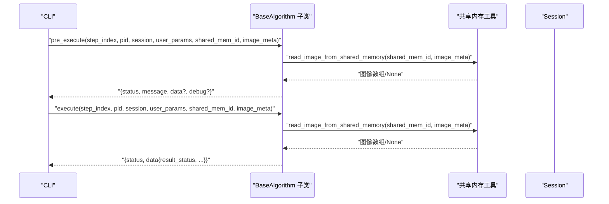
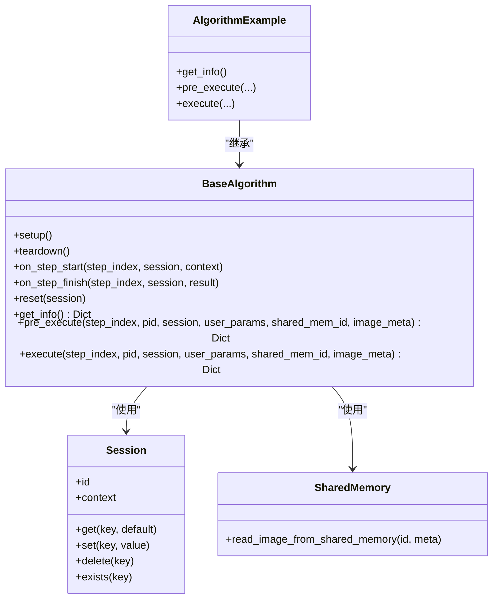

# pre_execute 方法

<cite>
**本文引用的文件**
- [procvision_algorithm_sdk/base.py](file://procvision_algorithm_sdk/base.py)
- [procvision_algorithm_sdk/cli.py](file://procvision_algorithm_sdk/cli.py)
- [procvision_algorithm_sdk/shared_memory.py](file://procvision_algorithm_sdk/shared_memory.py)
- [procvision_algorithm_sdk/session.py](file://procvision_algorithm_sdk/session.py)
- [algorithm-example/algorithm_example/main.py](file://algorithm-example/algorithm_example/main.py)
- [tests/test_base_algo.py](file://tests/test_base_algo.py)
- [spec.md](file://spec.md)
- [algorithm_dev_quickstart.md](file://algorithm_dev_quickstart.md)
</cite>

## 目录
1. [简介](#简介)
2. [项目结构](#项目结构)
3. [核心组件](#核心组件)
4. [架构总览](#架构总览)
5. [详细组件分析](#详细组件分析)
6. [依赖关系分析](#依赖关系分析)
7. [性能考量](#性能考量)
8. [故障排查指南](#故障排查指南)
9. [结论](#结论)
10. [附录](#附录)

## 简介
本篇文档聚焦于 BaseAlgorithm 抽象类中的 pre_execute 方法，系统阐述其作为“预执行阶段”的核心职责与接口规范。pre_execute 在每一步执行前被调用，用于完成步骤前的准备工作，包括但不限于：参数与上下文校验、图像数据预读、生成参考信息（如标定框、模板等）、以及必要的轻量级资源初始化。本文将详细解释各参数的含义与使用场景，给出返回值结构要求与错误状态示例，并结合共享内存机制说明如何在预执行阶段预读图像信息，最后提供基于 _resources_loaded 标志的优化实践，避免在 execute 中重复初始化。

## 项目结构
围绕 pre_execute 的相关文件组织如下：
- 接口定义与基类：procvision_algorithm_sdk/base.py
- CLI 运行器与示例实现：procvision_algorithm_sdk/cli.py
- 共享内存工具：procvision_algorithm_sdk/shared_memory.py
- 会话对象：procvision_algorithm_sdk/session.py
- 示例算法实现：algorithm-example/algorithm_example/main.py
- 单元测试：tests/test_base_algo.py
- 规范与接口说明：spec.md
- 快速入门与示例：algorithm_dev_quickstart.md

```mermaid
graph TB
subgraph "SDK 核心"
BA["BaseAlgorithm<br/>抽象接口"]
SM["shared_memory.py<br/>共享内存工具"]
SES["Session<br/>会话对象"]
end
subgraph "示例与测试"
EX["AlgorithmExample<br/>示例实现"]
TST["test_base_algo.py<br/>单元测试"]
end
subgraph "CLI"
CLI["cli.py<br/>Dev Runner"]
end
BA --> SM
BA --> SES
EX --> BA
TST --> BA
CLI --> BA
CLI --> SM
```

图表来源
- [procvision_algorithm_sdk/base.py](file://procvision_algorithm_sdk/base.py#L1-L58)
- [procvision_algorithm_sdk/shared_memory.py](file://procvision_algorithm_sdk/shared_memory.py#L1-L53)
- [procvision_algorithm_sdk/session.py](file://procvision_algorithm_sdk/session.py#L1-L36)
- [algorithm-example/algorithm_example/main.py](file://algorithm-example/algorithm_example/main.py#L1-L150)
- [tests/test_base_algo.py](file://tests/test_base_algo.py#L1-L65)
- [procvision_algorithm_sdk/cli.py](file://procvision_algorithm_sdk/cli.py#L1-L615)

章节来源
- [procvision_algorithm_sdk/base.py](file://procvision_algorithm_sdk/base.py#L1-L58)
- [procvision_algorithm_sdk/cli.py](file://procvision_algorithm_sdk/cli.py#L1-L615)

## 核心组件
- BaseAlgorithm.pre_execute：抽象接口，定义了预执行阶段的参数签名与返回值约定。
- Session：会话对象，承载本次工艺的上下文与状态存储。
- shared_memory：共享内存工具，提供读取图像数据的能力。
- CLI：Dev Runner，负责加载算法、构造参数并调用 pre_execute/execute。

章节来源
- [procvision_algorithm_sdk/base.py](file://procvision_algorithm_sdk/base.py#L1-L58)
- [procvision_algorithm_sdk/session.py](file://procvision_algorithm_sdk/session.py#L1-L36)
- [procvision_algorithm_sdk/shared_memory.py](file://procvision_algorithm_sdk/shared_memory.py#L1-L53)
- [procvision_algorithm_sdk/cli.py](file://procvision_algorithm_sdk/cli.py#L1-L615)

## 架构总览
下面的时序图展示了 CLI 如何调用算法的 pre_execute 与 execute 流程，以及与共享内存的交互。



图表来源
- [procvision_algorithm_sdk/cli.py](file://procvision_algorithm_sdk/cli.py#L192-L225)
- [procvision_algorithm_sdk/cli.py](file://procvision_algorithm_sdk/cli.py#L400-L430)
- [procvision_algorithm_sdk/shared_memory.py](file://procvision_algorithm_sdk/shared_memory.py#L1-L53)

## 详细组件分析

### pre_execute 方法签名与职责
- 方法签名与参数
  - step_index：当前步骤索引（从1开始），用于区分不同步骤的预处理逻辑。
  - pid：产品型号编码，用于判断是否支持该产品，或据此加载对应配置/模型。
  - session：会话对象，包含上下文与状态存储，可用于跨步骤传递信息。
  - user_params：UI/配置下发的可调参数，按步骤 schema 校验后的字典。
  - shared_mem_id：平台提供的共享内存ID，图像数据存放于此。
  - image_meta：图像元信息（分辨率、格式、时间戳等），用于读取图像或生成参考信息。
- 职责
  - 参数与上下文校验：如 pid 是否在 supported_pids 内。
  - 图像数据预读：通过 shared_mem_id 与 image_meta 读取图像，提前发现图像为空等异常。
  - 生成参考信息：如 calibration_rects、模板、ROI 等，供后续步骤使用。
  - 轻量级资源初始化：如根据 pid 加载步骤特定配置，但避免重量级资源（模型）在此处初始化。

章节来源
- [procvision_algorithm_sdk/base.py](file://procvision_algorithm_sdk/base.py#L1-L58)
- [spec.md](file://spec.md#L190-L389)

### 参数详解与使用场景
- step_index
  - 场景：区分步骤逻辑，如步骤1做定位，步骤2做检测。
  - 示例：在示例算法中，根据 step_index 返回不同的参考信息。
- pid
  - 场景：产品差异化处理，如不同 PID 使用不同模型或配置。
  - 示例：在示例算法中，先校验 pid 是否受支持。
- session
  - 场景：跨步骤传递状态（如计时、中间结果键值），或携带 trace_id 等上下文。
  - 示例：在示例算法中，记录 step_start_ms 并在 on_step_finish 发布诊断。
- user_params
  - 场景：步骤参数（如阈值、模式），用于影响参考信息生成或后续检测。
  - 示例：在示例算法中，参数用于控制检测逻辑（虽然此处未直接在 pre_execute 使用）。
- shared_mem_id 与 image_meta
  - 场景：预读图像，进行尺寸校验、颜色空间转换、或生成模板/ROI。
  - 示例：在示例算法与 CLI 实现中，均通过 read_image_from_shared_memory 读取图像。

章节来源
- [algorithm-example/algorithm_example/main.py](file://algorithm-example/algorithm_example/main.py#L1-L150)
- [procvision_algorithm_sdk/cli.py](file://procvision_algorithm_sdk/cli.py#L400-L430)
- [procvision_algorithm_sdk/shared_memory.py](file://procvision_algorithm_sdk/shared_memory.py#L1-L53)

### 返回值结构与错误状态
- 结构要求
  - status：必填，"OK" 或 "ERROR"。
  - message：必填（错误时尤为必要），人类可读信息。
  - data：可选，业务数据（如 calibration_rects、模板等）。
  - debug：可选，调试信息（如 latency_ms）。
- 错误状态示例
  - 不支持的 pid：返回错误码与提示。
  - 图像为空：返回错误码与提示。
- 规范参考
  - 接口文档对 pre_execute 返回值结构有明确示例。

章节来源
- [spec.md](file://spec.md#L190-L389)
- [algorithm-example/algorithm_example/main.py](file://algorithm-example/algorithm_example/main.py#L1-L150)
- [procvision_algorithm_sdk/cli.py](file://procvision_algorithm_sdk/cli.py#L400-L430)

### 与共享内存的集成
- 预读图像
  - 通过 shared_mem_id 与 image_meta 调用 read_image_from_shared_memory，提前发现图像为空或尺寸异常。
  - 在 CLI 的示例实现中，先读取图像再返回宽高信息。
- 颜色空间与形状处理
  - shared_memory 工具会根据 color_space 与 shape 做相应处理（如 BGR->RGB、灰度转三通道等）。
- 性能与一致性
  - 预读图像有助于在 pre_execute 阶段尽早失败，避免 execute 中重复 IO。

章节来源
- [procvision_algorithm_sdk/shared_memory.py](file://procvision_algorithm_sdk/shared_memory.py#L1-L53)
- [procvision_algorithm_sdk/cli.py](file://procvision_algorithm_sdk/cli.py#L400-L430)

### 基于 _resources_loaded 的优化实践
- 目标
  - 将重量级资源（如模型）的初始化放在 setup/teardown 生命周期中，避免在 pre_execute/execute 中重复初始化。
- 实践要点
  - 在 BaseAlgorithm 中维护 _resources_loaded 标志，首次加载后置位。
  - 在 pre_execute 中检查 _resources_loaded，若已加载则直接返回；否则在 execute 中进行加载并设置标志。
  - 若需要按 pid 加载不同模型配置，可在 pre_execute 中根据 pid 选择配置，但不执行模型加载，将实际加载推迟到 execute。
- 优势
  - 减少 execute 中的重复初始化开销，提升整体吞吐。
  - 保持 pre_execute 的轻量化，专注于步骤前的准备工作。

章节来源
- [procvision_algorithm_sdk/base.py](file://procvision_algorithm_sdk/base.py#L1-L58)

### 示例与最佳实践
- 示例一：最小算法实现（两步骤）
  - pre_execute：根据 pid 校验与 step_index 返回不同的参考信息。
  - execute：根据 step_index 返回检测结果。
- 示例二：Dev Runner 中的预执行
  - CLI 在 pre_execute 中先校验 pid 与读取图像，再返回宽高与延迟信息。
- 示例三：单元测试
  - 测试覆盖了 pre_execute/execute 的基本调用与返回状态。

章节来源
- [algorithm-example/algorithm_example/main.py](file://algorithm-example/algorithm_example/main.py#L1-L150)
- [procvision_algorithm_sdk/cli.py](file://procvision_algorithm_sdk/cli.py#L400-L430)
- [tests/test_base_algo.py](file://tests/test_base_algo.py#L1-L65)

## 依赖关系分析
- BaseAlgorithm 依赖 Session 与 shared_memory 工具。
- CLI 依赖 BaseAlgorithm 与 shared_memory，负责构造参数并调用算法。
- 示例算法继承 BaseAlgorithm，实现 get_info/pre_execute/execute。
- 单元测试依赖 BaseAlgorithm 与 shared_memory。



图表来源
- [procvision_algorithm_sdk/base.py](file://procvision_algorithm_sdk/base.py#L1-L58)
- [procvision_algorithm_sdk/session.py](file://procvision_algorithm_sdk/session.py#L1-L36)
- [procvision_algorithm_sdk/shared_memory.py](file://procvision_algorithm_sdk/shared_memory.py#L1-L53)
- [algorithm-example/algorithm_example/main.py](file://algorithm-example/algorithm_example/main.py#L1-L150)

## 性能考量
- 预读图像与早期失败
  - 在 pre_execute 中读取图像并进行尺寸/格式校验，可尽早发现异常，减少后续步骤的无效计算。
- 轻重分离
  - 将重量级资源（模型）初始化移至 setup/teardown，避免在每步执行前重复加载。
- 调试信息
  - 通过 debug 字段返回 latency_ms 等指标，便于定位瓶颈。

章节来源
- [procvision_algorithm_sdk/cli.py](file://procvision_algorithm_sdk/cli.py#L400-L430)
- [algorithm-example/algorithm_example/main.py](file://algorithm-example/algorithm_example/main.py#L1-L150)

## 故障排查指南
- 常见错误与定位
  - 不支持的 pid：检查 supported_pids 与 get_info 的一致性。
  - 图像为空：确认 shared_mem_id 与 image_meta 是否正确，以及共享内存中是否存在数据。
  - 参数类型不符：确保 user_params 符合步骤 schema。
- 调试建议
  - 在 pre_execute 中返回 debug 信息，记录关键耗时。
  - 使用 Session 的 set/get 记录跨步骤状态，辅助排障。

章节来源
- [spec.md](file://spec.md#L190-L389)
- [procvision_algorithm_sdk/session.py](file://procvision_algorithm_sdk/session.py#L1-L36)
- [procvision_algorithm_sdk/shared_memory.py](file://procvision_algorithm_sdk/shared_memory.py#L1-L53)

## 结论
pre_execute 是每步执行前的关键接口，承担参数校验、图像预读与参考信息生成等职责。通过规范的返回值结构与错误处理，配合共享内存工具，可实现稳定高效的预处理流程。建议将重量级资源初始化置于生命周期钩子中，利用 _resources_loaded 标志避免重复加载，从而在保证功能正确性的前提下提升性能与可维护性。

## 附录
- 快速入门与示例
  - 参考快速入门文档中的最小算法实现与返回结构示例。
- 接口规范
  - 参考接口文档对 pre_execute 的参数与返回值的详细说明。

章节来源
- [algorithm_dev_quickstart.md](file://algorithm_dev_quickstart.md#L120-L268)
- [spec.md](file://spec.md#L190-L389)