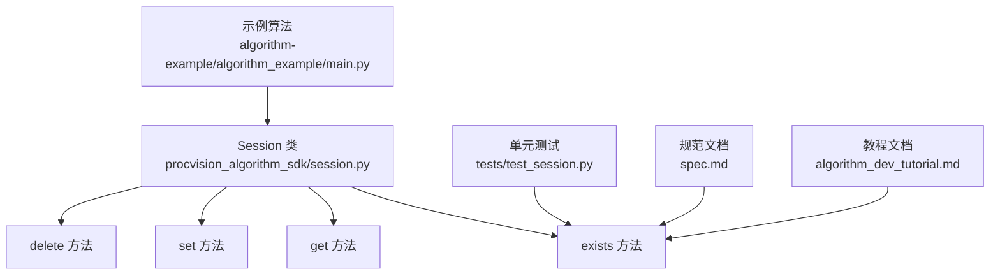
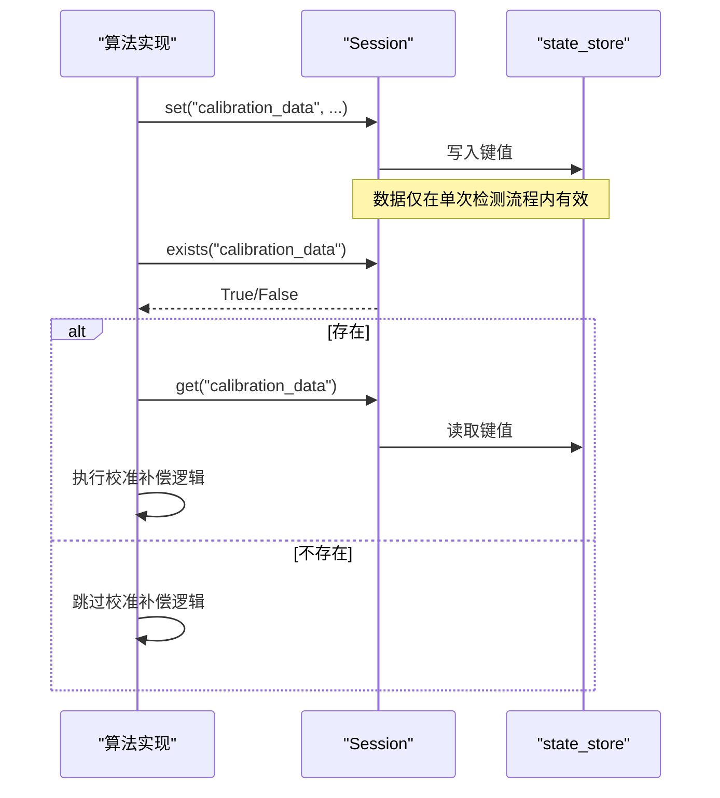
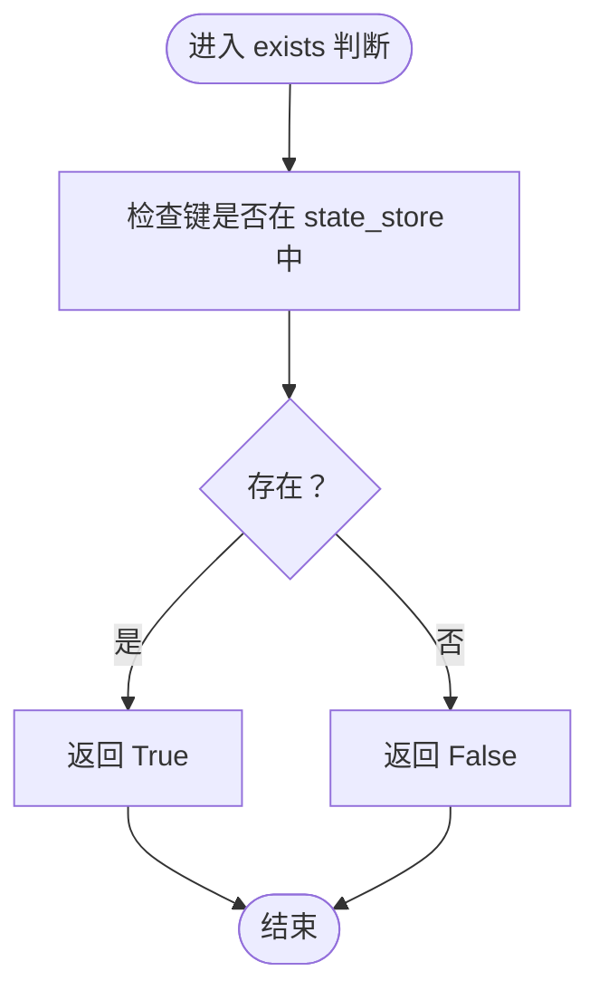
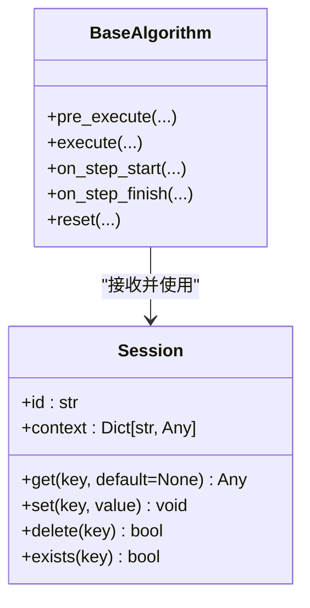

# 检查键存在性 (exists)

<cite>
**本文引用的文件**
- [procvision_algorithm_sdk/session.py](file://procvision_algorithm_sdk/session.py)
- [tests/test_session.py](file://tests/test_session.py)
- [spec.md](file://spec.md)
- [algorithm_dev_tutorial.md](file://algorithm_dev_tutorial.md)
- [algorithm-example/algorithm_example/main.py](file://algorithm-example/algorithm_example/main.py)
</cite>

## 目录
1. [简介](#简介)
2. [项目结构](#项目结构)
3. [核心组件](#核心组件)
4. [架构总览](#架构总览)
5. [详细组件分析](#详细组件分析)
6. [依赖关系分析](#依赖关系分析)
7. [性能考量](#性能考量)
8. [故障排查指南](#故障排查指南)
9. [结论](#结论)
10. [附录](#附录)

## 简介
本文聚焦于 Session.exists 方法，系统说明其作用、实现原理、使用场景与最佳实践。Session.exists 提供对会话状态中键存在性的快速判断，返回布尔值，用于避免在调用 get 前因键不存在而引发异常或进行条件分支控制。其内部实现基于字典的 in 操作，具备极高的性能与可频繁调用特性，适合在 execute 等关键路径中作为条件判断使用。本文还对比了 exists 与 try-except 捕获 KeyError 的性能与可读性差异，并给出在 execute 中依据 session.exists('calibration_data') 决策是否执行校准补偿逻辑的参考路径。

## 项目结构
围绕 Session.exists 的相关代码与测试主要分布在以下位置：
- 会话实现与 API 定义：procvision_algorithm_sdk/session.py
- 规范文档与 API 注释：spec.md
- 教程与使用说明：algorithm_dev_tutorial.md
- 示例算法（展示 execute 流程与 session 使用）：algorithm-example/algorithm_example/main.py
- 单元测试（覆盖 exists 的正确性）：tests/test_session.py

图表来源
- [procvision_algorithm_sdk/session.py](file://procvision_algorithm_sdk/session.py#L1-L36)
- [tests/test_session.py](file://tests/test_session.py#L1-L24)
- [spec.md](file://spec.md#L400-L485)
- [algorithm_dev_tutorial.md](file://algorithm_dev_tutorial.md#L96-L101)
- [algorithm-example/algorithm_example/main.py](file://algorithm-example/algorithm_example/main.py#L1-L150)

章节来源
- [procvision_algorithm_sdk/session.py](file://procvision_algorithm_sdk/session.py#L1-L36)
- [spec.md](file://spec.md#L400-L485)
- [algorithm_dev_tutorial.md](file://algorithm_dev_tutorial.md#L96-L101)
- [algorithm-example/algorithm_example/main.py](file://algorithm-example/algorithm_example/main.py#L1-L150)
- [tests/test_session.py](file://tests/test_session.py#L1-L24)

## 核心组件
- Session 类：提供会话上下文，包含只读 context、内部状态存储 state_store，以及 get/set/delete/exists 等方法。
- exists 方法：用于判断指定键是否存在于当前会话状态中，返回布尔值。
- get 方法：用于安全地读取键值，不存在时返回默认值。
- set 方法：设置键值并对值进行 JSON 可序列化性检查。
- delete 方法：删除键并返回是否删除成功。

章节来源
- [procvision_algorithm_sdk/session.py](file://procvision_algorithm_sdk/session.py#L1-L36)
- [spec.md](file://spec.md#L400-L485)

## 架构总览
Session 作为跨步骤的数据共享载体，在算法生命周期中贯穿 pre_execute、execute 与各生命周期钩子。开发者通过 set 将中间结果写入 state_store，通过 get/exists 在后续步骤中读取或判断是否存在，从而实现条件执行与流程控制。

图表来源
- [procvision_algorithm_sdk/session.py](file://procvision_algorithm_sdk/session.py#L1-L36)
- [spec.md](file://spec.md#L400-L485)

## 详细组件分析

### Session.exists 方法详解
- 作用：判断指定键是否存在于当前会话状态中，返回布尔值。
- 返回值：存在返回真，不存在返回假。
- 性能特征：内部实现为对 state_store 的 in 操作，时间复杂度为 O(1)，可频繁调用。
- 使用场景：
  - 在调用 get 前先检查键是否存在，避免因键不存在而引发异常或进行条件分支控制。
  - 在 execute 中根据键是否存在决定是否执行校准补偿等逻辑。
- 与 get 的配合：get 支持默认值参数，但若需要显式分支或避免异常，exists 更直观。

图表来源
- [procvision_algorithm_sdk/session.py](file://procvision_algorithm_sdk/session.py#L1-L36)

章节来源
- [procvision_algorithm_sdk/session.py](file://procvision_algorithm_sdk/session.py#L1-L36)
- [tests/test_session.py](file://tests/test_session.py#L1-L24)
- [spec.md](file://spec.md#L400-L485)

### 与 get 的协作与最佳实践
- 在需要“存在则读取，否则跳过”的场景中，推荐先调用 exists，再决定是否调用 get。
- 若仅需读取且允许默认值，也可直接使用 get(key, default)；但在需要显式分支或避免异常时，exists 更清晰。
- 在 execute 中，若存在校准数据，则执行补偿逻辑；否则跳过，以减少不必要的计算。

章节来源
- [procvision_algorithm_sdk/session.py](file://procvision_algorithm_sdk/session.py#L1-L36)
- [spec.md](file://spec.md#L400-L485)

### 与 try-except 捕获 KeyError 的对比
- 性能对比：
  - exists：O(1) 字典 in 操作，无异常开销，适合频繁调用。
  - try-except：涉及异常抛出与捕获，属于高开销路径，不适合频繁使用。
- 可读性对比：
  - exists：语义明确，意图清晰，分支逻辑直观。
  - try-except：需要额外的异常处理块，可读性略低，且易被忽略。
- 建议：
  - 在存在性判断与条件执行场景中优先使用 exists。
  - 仅在确实需要捕获异常或处理非预期情况时使用 try-except。

章节来源
- [procvision_algorithm_sdk/session.py](file://procvision_algorithm_sdk/session.py#L1-L36)

### 在 execute 中使用 exists 的参考路径
- 场景：当会话中存在 'calibration_data' 时，执行校准补偿逻辑；否则跳过。
- 参考实现位置：
  - execute 方法签名与流程参考：[algorithm-example/algorithm_example/main.py](file://algorithm-example/algorithm_example/main.py#L1-L150)
  - Session API 定义与注释参考：[spec.md](file://spec.md#L400-L485)
  - exists 方法实现参考：[procvision_algorithm_sdk/session.py](file://procvision_algorithm_sdk/session.py#L1-L36)
- 实施要点：
  - 在 execute 开始处先调用 session.exists('calibration_data') 进行条件判断。
  - 若存在，则调用 session.get('calibration_data') 获取数据并执行补偿逻辑。
  - 若不存在，则直接跳过补偿逻辑，继续后续流程。
- 注意事项：
  - 由于 Session 仅在单次检测流程内有效，跨产品检测会重新初始化，因此无需担心历史数据干扰。
  - set 值必须可 JSON 序列化，否则会抛出类型错误，这与 exists 的使用互不影响。

章节来源
- [algorithm-example/algorithm_example/main.py](file://algorithm-example/algorithm_example/main.py#L1-L150)
- [spec.md](file://spec.md#L400-L485)
- [procvision_algorithm_sdk/session.py](file://procvision_algorithm_sdk/session.py#L1-L36)

## 依赖关系分析
- Session 类位于 procvision_algorithm_sdk/session.py，对外暴露 id/context/get/set/delete/exists 等成员。
- BaseAlgorithm 在其 execute/pre_execute 等方法中接收 Session 参数，用于跨步骤数据共享。
- 单元测试通过断言 exists 的返回值与 get/delete 的配合，验证了 Session 的行为一致性。

图表来源
- [procvision_algorithm_sdk/session.py](file://procvision_algorithm_sdk/session.py#L1-L36)
- [procvision_algorithm_sdk/base.py](file://procvision_algorithm_sdk/base.py#L1-L58)

章节来源
- [procvision_algorithm_sdk/session.py](file://procvision_algorithm_sdk/session.py#L1-L36)
- [procvision_algorithm_sdk/base.py](file://procvision_algorithm_sdk/base.py#L1-L58)

## 性能考量
- exists 的实现为字典的 in 操作，时间复杂度为 O(1)，空间复杂度为 O(1)。
- 由于是纯字典查找，可频繁调用，不会引入显著开销。
- 在高频分支判断场景中，exists 是首选方案；若改为 try-except 捕获 KeyError，将引入异常路径的额外成本。

章节来源
- [procvision_algorithm_sdk/session.py](file://procvision_algorithm_sdk/session.py#L1-L36)

## 故障排查指南
- 常见问题与处理：
  - set 时值不可 JSON 序列化：会抛出类型错误，需确保存入的数据可被 JSON 序列化。
  - 误以为 get 不存在会抛异常：get 支持默认值，不会抛异常；如需分支判断，应使用 exists。
  - 期望 exists 与 get 的行为不一致：两者均基于 state_store，行为一致；若出现异常，检查键名大小写与类型。
- 单元测试参考：
  - 测试覆盖了 set/get/delete/exists 的基本行为，可作为回归验证的参考。

章节来源
- [tests/test_session.py](file://tests/test_session.py#L1-L24)
- [procvision_algorithm_sdk/session.py](file://procvision_algorithm_sdk/session.py#L1-L36)

## 结论
Session.exists 提供了对会话状态键存在性的高效判断，返回布尔值，适用于在调用 get 前进行条件判断、避免异常与进行分支控制。其内部实现基于字典的 in 操作，性能优异，可频繁调用。在 execute 等关键路径中，建议优先使用 exists 进行条件判断，以提升性能与可读性；仅在确需捕获异常或处理非预期情况时使用 try-except。结合规范文档与示例算法，可安全、稳定地在会话中传递与使用中间结果。

## 附录
- 相关文档与示例：
  - Session API 定义与注释：[spec.md](file://spec.md#L400-L485)
  - 教程与使用说明：[algorithm_dev_tutorial.md](file://algorithm_dev_tutorial.md#L96-L101)
  - 示例算法（execute 流程）：[algorithm-example/algorithm_example/main.py](file://algorithm-example/algorithm_example/main.py#L1-L150)
  - 单元测试（exists 行为）：[tests/test_session.py](file://tests/test_session.py#L1-L24)