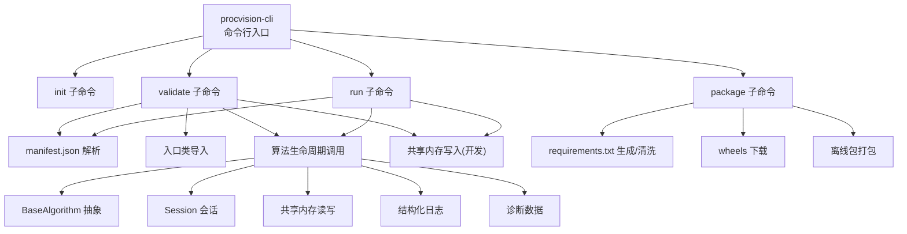
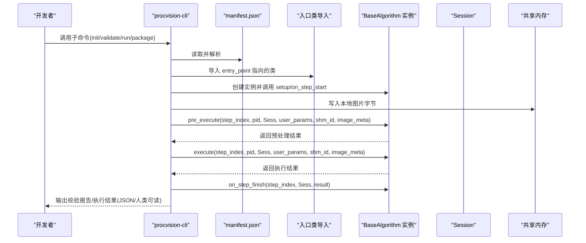
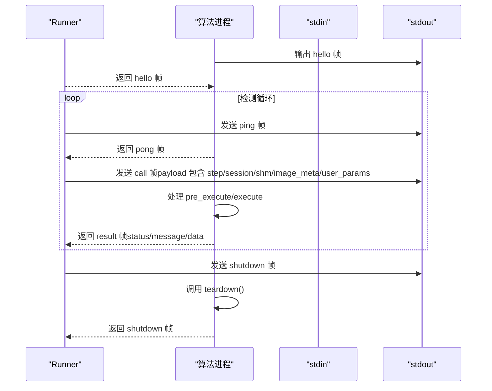
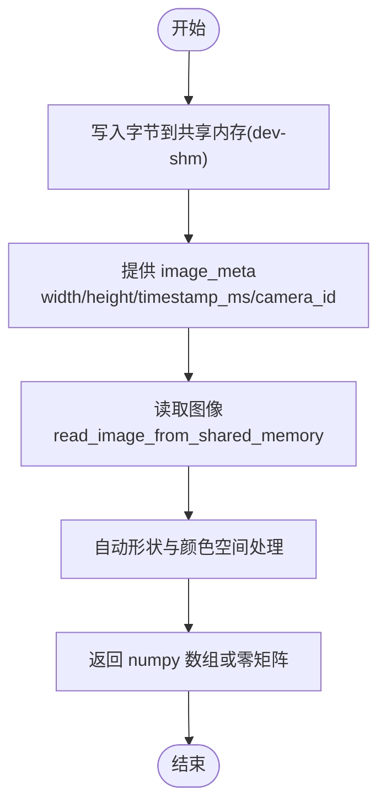
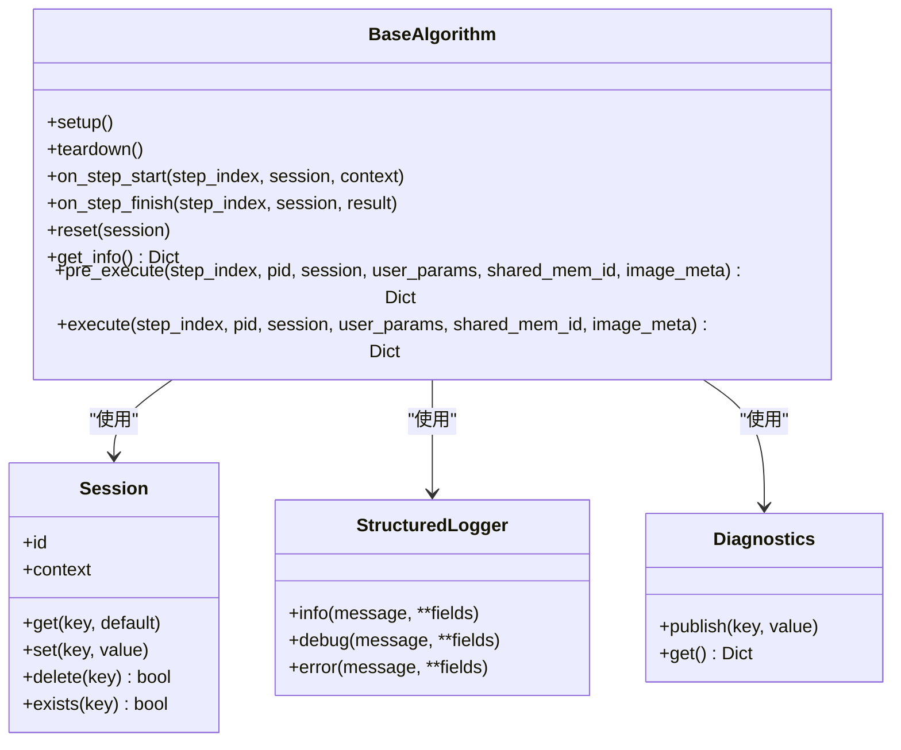
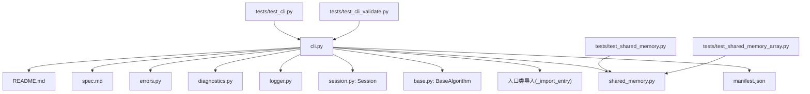

# CLI工具参考

<cite>
**本文引用的文件**
- [cli.py](file://procvision_algorithm_sdk/cli.py)
- [base.py](file://procvision_algorithm_sdk/base.py)
- [session.py](file://procvision_algorithm_sdk/session.py)
- [shared_memory.py](file://procvision_algorithm_sdk/shared_memory.py)
- [logger.py](file://procvision_algorithm_sdk/logger.py)
- [diagnostics.py](file://procvision_algorithm_sdk/diagnostics.py)
- [errors.py](file://procvision_algorithm_sdk/errors.py)
- [spec.md](file://spec.md)
- [README.md](file://README.md)
- [algorithm-example/manifest.json](file://algorithm-example/manifest.json)
- [algorithm-example/algorithm_example/main.py](file://algorithm-example/algorithm_example/main.py)
- [tests/test_cli.py](file://tests/test_cli.py)
- [tests/test_cli_validate.py](file://tests/test_cli_validate.py)
- [tests/test_shared_memory.py](file://tests/test_shared_memory.py)
- [tests/test_shared_memory_array.py](file://tests/test_shared_memory_array.py)
</cite>

## 目录
1. [简介](#简介)
2. [项目结构](#项目结构)
3. [核心组件](#核心组件)
4. [架构总览](#架构总览)
5. [详细组件分析](#详细组件分析)
6. [依赖关系分析](#依赖关系分析)
7. [性能考虑](#性能考虑)
8. [故障排查指南](#故障排查指南)
9. [结论](#结论)
10. [附录](#附录)

## 简介
本文件为 procvision-cli 命令行工具的权威参考，覆盖所有子命令（init、validate、run、package）的调用方式、参数、选项、输入/输出格式与行为；详述 IPC/Pipe 通信模式（数据流、消息传递、进程同步）；提供协议特定示例、错误处理策略与性能优化技巧；并给出常见用例、客户端（开发者）实现指南与调试方法。

## 项目结构
- 命令行入口与子命令实现位于 SDK 包的 CLI 模块中，提供 init、validate、run、package 四个子命令。
- 核心算法抽象与生命周期钩子定义于 BaseAlgorithm，会话上下文 Session 提供状态共享，共享内存工具用于图像数据读写。
- README 与规范文档（spec.md）明确了接口契约、IPC 协议、图像传输与错误处理等关键约束。

图表来源
- [cli.py](file://procvision_algorithm_sdk/cli.py#L1-L615)
- [base.py](file://procvision_algorithm_sdk/base.py#L1-L58)
- [session.py](file://procvision_algorithm_sdk/session.py#L1-L36)
- [shared_memory.py](file://procvision_algorithm_sdk/shared_memory.py#L1-L53)
- [logger.py](file://procvision_algorithm_sdk/logger.py#L1-L24)
- [diagnostics.py](file://procvision_algorithm_sdk/diagnostics.py#L1-L12)

章节来源
- [cli.py](file://procvision_algorithm_sdk/cli.py#L1-L615)
- [README.md](file://README.md#L1-L116)

## 核心组件
- BaseAlgorithm：定义 get_info、pre_execute、execute 以及生命周期钩子（setup、teardown、on_step_start、on_step_finish、reset），并提供结构化日志与诊断能力。
- Session：提供会话上下文与状态存储，支持 JSON 可序列化值的 get/set/delete。
- 共享内存工具：dev_write_image_to_shared_memory、read_image_from_shared_memory，支持字节与数组两种输入，自动处理颜色空间与形状兼容。
- 结构化日志与诊断：StructuredLogger、Diagnostics，用于输出结构化日志与收集诊断指标。
- CLI 子命令：init、validate、run、package，分别用于脚手架初始化、包结构与入口校验、本地模拟运行、离线包构建。

章节来源
- [base.py](file://procvision_algorithm_sdk/base.py#L1-L58)
- [session.py](file://procvision_algorithm_sdk/session.py#L1-L36)
- [shared_memory.py](file://procvision_algorithm_sdk/shared_memory.py#L1-L53)
- [logger.py](file://procvision_algorithm_sdk/logger.py#L1-L24)
- [diagnostics.py](file://procvision_algorithm_sdk/diagnostics.py#L1-L12)

## 架构总览
procvision-cli 作为开发者本地工具，围绕 SDK 的 BaseAlgorithm 抽象工作，通过 manifest.json 描述入口类与支持的 PID，使用共享内存模拟平台传图，依次调用算法生命周期钩子与核心接口，最后输出校验报告或执行结果。离线包构建阶段负责清洗 requirements、下载 wheels 并打包。

图表来源
- [cli.py](file://procvision_algorithm_sdk/cli.py#L1-L615)
- [base.py](file://procvision_algorithm_sdk/base.py#L1-L58)
- [shared_memory.py](file://procvision_algorithm_sdk/shared_memory.py#L1-L53)
- [session.py](file://procvision_algorithm_sdk/session.py#L1-L36)

## 详细组件分析

### 子命令：init
- 功能：根据算法名称初始化脚手架，生成 manifest.json 与包源码目录（含入口类与基础实现）。
- 输入/参数
  - name：算法名称（必填）
  - dir：目标目录（可选，默认当前目录下以算法名命名）
  - pids：支持的 PID 列表，逗号分隔（可选，默认占位 PID_TO_FILL）
  - version：算法版本（可选，默认 1.0.0）
  - desc：算法描述（可选）
- 输出/行为
  - 生成 manifest.json、包目录、入口类与 __init__.py
  - 生成 .procvision_env.json，包含 wheels 平台、Python 版本、实现与 ABI 等缓存配置
  - 返回 {"status": "OK", "path": ...} 或错误信息
- 典型用例
  - 初始化新算法包：procvision-cli init "MyAlgo" --dir ./my-algo --pids "P001,P002" --version "1.0.0" --desc "我的算法"
- 注意事项
  - 生成的入口类名与模块名会做安全化处理，确保合法标识符
  - 生成的示例实现包含 get_info、pre_execute、execute 的最小骨架，开发者需按注释修改

章节来源
- [cli.py](file://procvision_algorithm_sdk/cli.py#L250-L360)

### 子命令：validate
- 功能：校验算法包结构与入口实现，包括 manifest 加载、字段完整性、入口类导入与继承关系、get_info 返回结构、supported_pids 一致性、预执行与执行流程的返回结构、可选离线包 zip 结构检查。
- 输入/参数
  - project：算法项目根目录（可选，默认当前目录）
  - --manifest：指定 manifest.json 路径（可替代 --project）
  - --zip：离线交付 zip 包路径（检查 wheels/ 与必需文件）
  - --json：以 JSON 输出结果
- 输出/行为
  - 返回包含 summary 与 checks 的结构化报告
  - checks 列表包含各项检查名称、结果（PASS/FAIL）与消息
  - summary 包含 status（PASS/FAIL）、passed、failed
  - 人类可读输出时，使用 ✅/❌ 标记并通过 print 输出
- 典型用例
  - 校验项目：procvision-cli validate ./algorithm-example
  - 校验离线包：procvision-cli validate --zip ./algo-offline.zip
  - 以 JSON 输出：procvision-cli validate ./algorithm-example --json
- 错误处理策略
  - manifest 不存在或加载失败：直接标记 FAIL 并返回
  - 入口类导入失败或未继承 BaseAlgorithm：标记 FAIL
  - get_info 返回非字典或 steps 非列表：标记 FAIL
  - supported_pids 不一致：标记 FAIL
  - 预执行/执行返回结构不符合规范：标记 FAIL
  - zip 包检查失败：标记 FAIL
- 性能优化技巧
  - 尽量减少 get_info 中的 IO 操作
  - 预执行阶段避免加载重型模型，仅做必要校验
  - 使用 Session.set/get 在步骤间传递轻量数据，避免重复计算

章节来源
- [cli.py](file://procvision_algorithm_sdk/cli.py#L1-L249)
- [tests/test_cli_validate.py](file://tests/test_cli_validate.py#L1-L11)

### 子命令：run
- 功能：本地模拟运行算法，使用本地图片写入共享内存并调用 pre_execute/execute，输出预执行与执行结果。
- 输入/参数
  - project：算法项目根目录（必填）
  - --pid：产品型号编码（必填，必须在 manifest 的 supported_pids 中）
  - --image：本地图片路径（必填，JPEG/PNG）
  - --step：步骤索引（可选，默认 1）
  - --params：JSON 字符串形式的用户参数（可选）
  - --json：以 JSON 输出结果
- 输出/行为
  - 返回 {"pre_execute": ..., "execute": ...}
  - 人类可读输出时，打印 pre_execute 的 status/message 与 execute 的 status/result_status/ng_reason/defect_rects 数量
  - 退出码：execute.status == "OK" 时为 0，否则为 1
- 典型用例
  - 本地运行：procvision-cli run ./algorithm-example --pid p001 --image ./test.jpg --json
  - 指定步骤与参数：procvision-cli run ./algorithm-example --pid p001 --image ./test.jpg --step 1 --params '{"threshold":0.8}'
- 错误处理策略
  - 项目目录不存在：提示并退出 2
  - 未找到 manifest.json：提示并退出 2
  - 图片文件不存在：提示并退出 2
  - --params 不是合法 JSON：提示并退出 2
  - execute.status != "OK"：退出 1
- 性能优化技巧
  - 将 heavy 初始化放入 setup，避免每次 run 重复加载
  - 预执行阶段尽量只做必要校验，避免解码大图
  - 使用 Session.set/get 缓存中间结果，减少重复计算

章节来源
- [cli.py](file://procvision_algorithm_sdk/cli.py#L361-L615)
- [tests/test_cli.py](file://tests/test_cli.py#L1-L20)

### 子命令：package
- 功能：构建离线交付 zip 包，下载 wheels 并打包源码、manifest、requirements 与 wheels。
- 输入/参数
  - project：算法项目根目录（必填）
  - -o/--output：输出 zip 文件路径（可选，默认按 name/version 生成）
  - -r/--requirements：requirements.txt 路径（可选，默认使用项目内文件或自动生成）
  - -a/--auto-freeze：缺少 requirements.txt 时自动生成（pip freeze）（可选，默认开启）
  - -w/--wheels-platform：wheels 目标平台（可选，默认读取缓存或 win_amd64）
  - -p/--python-version：目标 Python 版本（可选，默认读取缓存或 3.10）
  - -i/--implementation：Python 实现（如 cp、pp）（可选，默认读取缓存或 cp）
  - -b/--abi：ABI（如 cp310）（可选，默认读取缓存或 cp310）
  - -s/--skip-download：跳过依赖下载，仅打包现有内容（可选）
- 输出/行为
  - 成功：返回 {"status": "OK", "zip": zip_path} 并打印成功信息
  - 失败：返回 {"status": "ERROR", "message": "..."} 并打印失败信息
- 典型用例
  - 默认参数构建：procvision-cli package ./algorithm-example
  - 指定输出与平台：procvision-cli package ./algorithm-example -o ./dist/algo.zip -w win_amd64 -p 3.10 -i cp -b cp310
  - 跳过下载：procvision-cli package ./algorithm-example -s
- 错误处理策略
  - requirements.txt 不存在且未启用 auto-freeze：返回 ERROR
  - pip download 失败：返回 ERROR，并在提示中建议在目标 Python 版本虚拟环境中生成 requirements.txt
  - 跳过下载时仅打包现有内容，不进行 wheels 下载
- 性能优化技巧
  - 使用 --skip-download 仅打包已有 wheels，加速迭代
  - 在 .procvision_env.json 中预设 wheels 平台、Python 版本、实现与 ABI，减少手工参数
  - 清洗 requirements，去除哈希与多余注释，减小包体积

章节来源
- [cli.py](file://procvision_algorithm_sdk/cli.py#L180-L359)

### IPC/Pipe 通信模式（Runner 与算法进程）
- 通信方式：runner 通过启动算法可执行入口并使用 stdin/stdout 双向管道通信。协议采用“4字节大端长度 + UTF-8 JSON”帧格式，确保无粘包。
- 消息字段（两层结构）：
  - 顶层：type（hello|call|result|ping|pong|error|shutdown）、request_id、timestamp_ms、status、message、data
  - payload：call 帧包含 step_index、session、shared_mem_id、image_meta、user_params 等
- 握手流程：算法启动后立即输出 hello 帧，runner 返回 hello 帧；握手完成前不得发送业务消息。
- 调用流程：runner 发送 call 帧，算法处理后返回 result 帧；首层通用状态（status/message），业务结果放在 data 中。
- 心跳/超时：runner 定期发送 ping，算法需在指定超时时间内回复 pong；execute 超时（默认 30 秒）与 pre_execute 超时（默认 10 秒）由 runner 强制终止并记录日志。
- 日志与协议隔离：算法仅在 stdout 输出协议帧，所有日志写入 stderr（由 logger 统一管理）。
- 关闭流程：runner 发送 shutdown，算法应调用 teardown 并返回 shutdown 结果后退出进程。

图表来源
- [spec.md](file://spec.md#L615-L633)

章节来源
- [spec.md](file://spec.md#L615-L633)

### 数据流与共享内存
- 图像传输：平台将相机采集的图像以 JPEG 编码写入共享内存，并提供 shared_mem_id 与 image_meta（width、height、timestamp_ms、camera_id）。
- 读取接口：read_image_from_shared_memory(shared_mem_id, image_meta) 支持字节与 numpy 数组输入，自动处理灰度扩展、BGR→RGB 转换与回退行为。
- 开发/测试写入：dev_write_image_to_shared_memory 与 write_image_array_to_shared_memory 用于本地模拟。

图表来源
- [shared_memory.py](file://procvision_algorithm_sdk/shared_memory.py#L1-L53)
- [algorithm_dev_tutorial.md](file://algorithm_dev_tutorial.md#L103-L127)

章节来源
- [shared_memory.py](file://procvision_algorithm_sdk/shared_memory.py#L1-L53)
- [algorithm_dev_tutorial.md](file://algorithm_dev_tutorial.md#L103-L127)

### 生命周期与会话
- 生命周期钩子：setup、on_step_start、pre_execute、execute、on_step_finish、teardown、reset
- 会话上下文：Session 提供 id、context（只读）、get/set/delete/exists，支持 JSON 可序列化值
- 日志与诊断：StructuredLogger 输出结构化日志；Diagnostics 收集诊断指标

图表来源
- [base.py](file://procvision_algorithm_sdk/base.py#L1-L58)
- [session.py](file://procvision_algorithm_sdk/session.py#L1-L36)
- [logger.py](file://procvision_algorithm_sdk/logger.py#L1-L24)
- [diagnostics.py](file://procvision_algorithm_sdk/diagnostics.py#L1-L12)

章节来源
- [base.py](file://procvision_algorithm_sdk/base.py#L1-L58)
- [session.py](file://procvision_algorithm_sdk/session.py#L1-L36)
- [logger.py](file://procvision_algorithm_sdk/logger.py#L1-L24)
- [diagnostics.py](file://procvision_algorithm_sdk/diagnostics.py#L1-L12)

## 依赖关系分析
- CLI 子命令依赖 manifest.json 解析、入口类导入、BaseAlgorithm 生命周期、Session 与共享内存工具。
- package 子命令依赖 requirements.txt 清洗、pip 下载 wheels、zip 打包。
- 测试覆盖了 validate 与 run 的基本行为，以及共享内存读写的边界情况。

图表来源
- [cli.py](file://procvision_algorithm_sdk/cli.py#L1-L615)
- [base.py](file://procvision_algorithm_sdk/base.py#L1-L58)
- [session.py](file://procvision_algorithm_sdk/session.py#L1-L36)
- [shared_memory.py](file://procvision_algorithm_sdk/shared_memory.py#L1-L53)
- [logger.py](file://procvision_algorithm_sdk/logger.py#L1-L24)
- [diagnostics.py](file://procvision_algorithm_sdk/diagnostics.py#L1-L12)
- [errors.py](file://procvision_algorithm_sdk/errors.py#L1-L14)
- [spec.md](file://spec.md#L1-L799)
- [README.md](file://README.md#L1-L116)
- [tests/test_cli.py](file://tests/test_cli.py#L1-L20)
- [tests/test_cli_validate.py](file://tests/test_cli_validate.py#L1-L11)
- [tests/test_shared_memory.py](file://tests/test_shared_memory.py#L1-L15)
- [tests/test_shared_memory_array.py](file://tests/test_shared_memory_array.py#L1-L37)

章节来源
- [cli.py](file://procvision_algorithm_sdk/cli.py#L1-L615)
- [tests/test_cli.py](file://tests/test_cli.py#L1-L20)
- [tests/test_cli_validate.py](file://tests/test_cli_validate.py#L1-L11)
- [tests/test_shared_memory.py](file://tests/test_shared_memory.py#L1-L15)
- [tests/test_shared_memory_array.py](file://tests/test_shared_memory_array.py#L1-L37)

## 性能考虑
- 预执行阶段避免加载重型模型与大图解码，仅做必要校验与 ROI 计算。
- 将 heavy 初始化放入 setup，避免每次 run 重复加载。
- 使用 Session.set/get 在步骤间传递轻量数据，减少重复计算与 IO。
- 共享内存读取时优先使用 numpy 数组输入，避免不必要的解码与转换。
- package 时清洗 requirements，去除哈希与多余注释，减小包体积；必要时使用 --skip-download 仅打包现有 wheels。
- 控制 defect_rects 数量（≤20），避免返回过大 payload。

## 故障排查指南
- validate 报错
  - manifest 不存在或加载失败：检查 manifest.json 路径与权限
  - 入口类导入失败：确认 entry_point 格式与模块路径正确
  - supported_pids 不一致：确保 get_info 与 manifest 中 supported_pids 完全一致
  - 预执行/执行返回结构不符合规范：检查返回字典结构与字段类型
- run 报错
  - 项目目录不存在或未找到 manifest.json：确认项目根目录包含 manifest.json
  - 图片文件不存在：确认 --image 路径正确
  - --params 不是合法 JSON：修正 JSON 格式
  - execute.status != "OK"：查看返回 message 与 data 中的错误原因
- package 报错
  - requirements.txt 不存在且未启用 auto-freeze：提供 --requirements 或使用 --auto-freeze
  - pip download 失败：检查目标 Python 版本、ABI 与 wheels 平台设置，建议在目标 Python 版本虚拟环境中生成 requirements.txt
- 共享内存读取异常
  - 读取失败或无数据：read_image_from_shared_memory 会回退为零矩阵，检查 image_meta 的 width/height 是否有效
  - 数组颜色空间：当 image_meta.color_space=BGR 时自动转换为 RGB，确保上游设置正确

章节来源
- [cli.py](file://procvision_algorithm_sdk/cli.py#L1-L615)
- [tests/test_shared_memory.py](file://tests/test_shared_memory.py#L1-L15)
- [tests/test_shared_memory_array.py](file://tests/test_shared_memory_array.py#L1-L37)

## 结论
procvision-cli 为算法开发提供了从脚手架初始化、包结构校验、本地模拟运行到离线包构建的完整工具链。结合 SDK 的 BaseAlgorithm 抽象、Session 会话与共享内存工具，开发者可以快速实现符合规范的算法模块，并通过 CLI 进行自测与交付。IPC/Pipe 通信协议明确了 Runner 与算法进程之间的消息格式、握手、心跳与超时策略，确保在生产环境中的稳定性与可靠性。

## 附录
- 常见用例
  - 初始化：procvision-cli init "MyAlgo" --dir ./my-algo --pids "P001,P002"
  - 校验：procvision-cli validate ./algorithm-example --json
  - 本地运行：procvision-cli run ./algorithm-example --pid p001 --image ./test.jpg --step 1 --params '{"threshold":0.8}' --json
  - 构建离线包：procvision-cli package ./algorithm-example -o ./dist/algo.zip -w win_amd64 -p 3.10 -i cp -b cp310
- 客户端（开发者）实现指南
  - 实现 get_info，确保 supported_pids 与 manifest 一致
  - 在 pre_execute 中仅做必要校验，避免 heavy 操作
  - 在 execute 中返回 result_status、ng_reason 与 defect_rects（如适用）
  - 使用 Session.set/get 在步骤间传递轻量数据
  - 使用 logger 输出结构化日志，使用 diagnostics 上报诊断指标
- 调试方法
  - 使用 --json 输出结构化结果，便于自动化集成
  - 在本地图片上验证算法逻辑，逐步缩小问题范围
  - 检查 requirements 与 wheels 平台配置，确保离线包可安装
  - 关注 validate 的各项检查结果，逐项修复