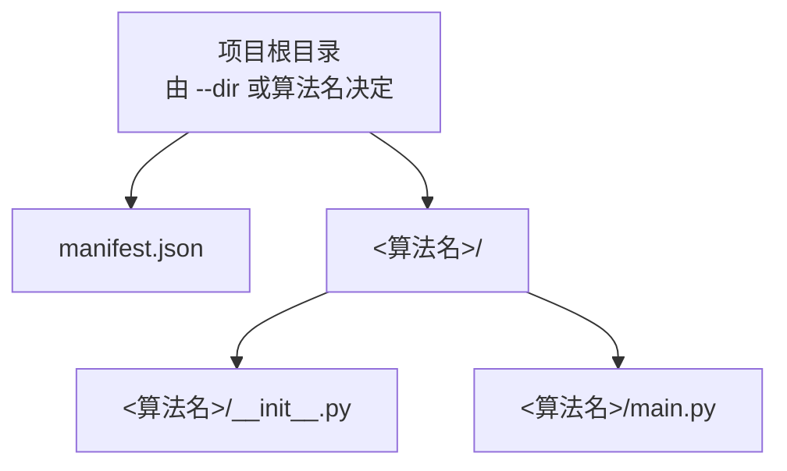
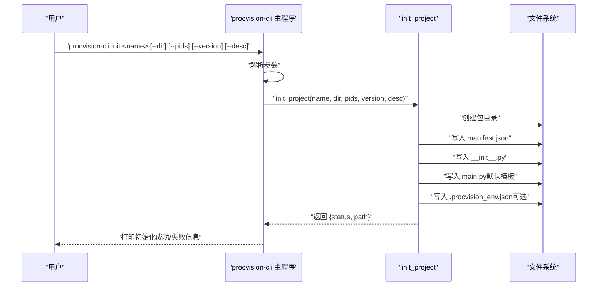
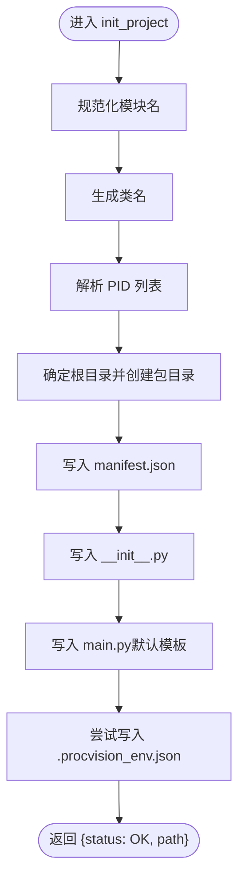
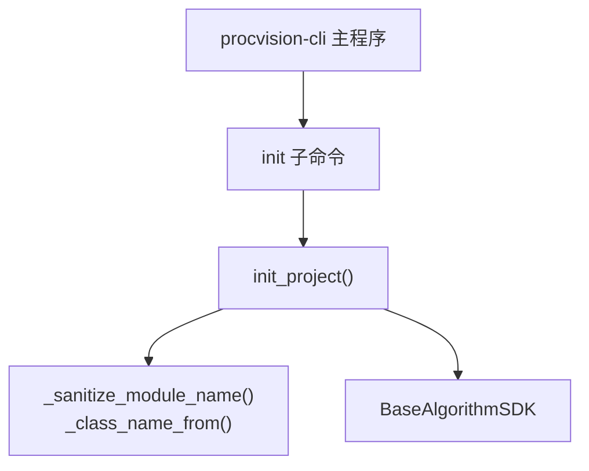

# init 命令

<cite>
**本文引用的文件**
- [cli.py](file://procvision_algorithm_sdk/cli.py)
- [algorithm-example/manifest.json](file://algorithm-example/manifest.json)
- [algorithm-example/algorithm_example/main.py](file://algorithm-example/algorithm_example/main.py)
- [algorithm-example/algorithm_example/__init__.py](file://algorithm-example/algorithm_example/__init__.py)
- [algorithm_dev_quickstart.md](file://algorithm_dev_quickstart.md)
- [README.md](file://README.md)
</cite>

## 目录
1. [简介](#简介)
2. [项目结构](#项目结构)
3. [核心组件](#核心组件)
4. [架构总览](#架构总览)
5. [详细组件分析](#详细组件分析)
6. [依赖分析](#依赖分析)
7. [性能考虑](#性能考虑)
8. [故障排查指南](#故障排查指南)
9. [结论](#结论)
10. [附录](#附录)

## 简介
本节面向首次使用 procvision-cli 初始化算法开发项目的开发者，系统性说明 init 命令的作用、参数、生成文件结构、后续开发步骤与常见问题。init 命令会根据算法名称生成标准脚手架：manifest.json、包目录与 main.py，并内置默认代码模板，帮助开发者快速进入二次开发阶段。

## 项目结构
init 命令生成的项目目录遵循最小可运行约定，典型结构如下：
- 顶层目录：由 --dir 或算法名称决定
  - manifest.json：算法元数据与入口定义
  - 包目录：与算法名称对应的模块目录
    - __init__.py：导出主类
    - main.py：算法实现模板（包含 get_info、pre_execute、execute 等）

图表来源
- [cli.py](file://procvision_algorithm_sdk/cli.py#L344-L420)
- [algorithm-example/manifest.json](file://algorithm-example/manifest.json#L1-L24)
- [algorithm-example/algorithm_example/__init__.py](file://algorithm-example/algorithm_example/__init__.py#L1-L1)
- [algorithm-example/algorithm_example/main.py](file://algorithm-example/algorithm_example/main.py#L1-L150)

章节来源
- [cli.py](file://procvision_algorithm_sdk/cli.py#L344-L420)
- [algorithm_dev_quickstart.md](file://algorithm_dev_quickstart.md#L1-L120)

## 核心组件
- init_project：核心实现函数，负责生成 manifest.json、包目录、__init__.py 与 main.py，并写入默认模板与环境配置。
- 参数解析器：在 main 中注册 init 子命令及其参数。
- 模块名规范化与类名生成：通过内部函数将用户输入的算法名称转换为合法的 Python 模块名与类名。
- 默认模板注入：生成包含 get_info、pre_execute、execute 的基础实现，便于快速验证。

章节来源
- [cli.py](file://procvision_algorithm_sdk/cli.py#L329-L420)
- [cli.py](file://procvision_algorithm_sdk/cli.py#L531-L556)
- [cli.py](file://procvision_algorithm_sdk/cli.py#L586-L613)

## 架构总览
init 命令的调用链路如下：命令行解析 -> 子命令分发 -> init_project -> 文件生成 -> 返回结果。

图表来源
- [cli.py](file://procvision_algorithm_sdk/cli.py#L531-L556)
- [cli.py](file://procvision_algorithm_sdk/cli.py#L586-L613)
- [cli.py](file://procvision_algorithm_sdk/cli.py#L344-L420)

## 详细组件分析

### init_project 实现细节
- 模块名规范化：将算法名称转换为合法的小写 Python 模块名，替换非法字符为下划线，去除多余下划线，若为空则回退为默认值。
- 类名生成：将算法名称拆分为单词片段，首字母大写拼接，最终追加固定后缀，若为空则回退为默认类名。
- PID 列表处理：支持逗号分隔的 PID 列表，若为空则填充占位符。
- 目录创建：根据 --dir 或算法名确定根目录，创建包目录。
- manifest.json 生成：包含 name、version、entry_point、description、supported_pids、steps 等字段。
- main.py 模板：包含类定义、get_info、pre_execute、execute 的最小实现与错误处理。
- 环境配置：尝试写入 .procvision_env.json，包含目标 Python 版本、实现、ABI、平台与 auto_freeze 等默认值。

图表来源
- [cli.py](file://procvision_algorithm_sdk/cli.py#L329-L420)

章节来源
- [cli.py](file://procvision_algorithm_sdk/cli.py#L329-L420)

### 参数说明
- name（必填）：算法名称，用于生成模块目录、入口类名与 manifest 字段。
- --dir/-d（可选）：目标目录路径，默认在当前目录下以算法名创建。
- --pids（可选）：支持的产品型号列表，逗号分隔；留空则生成占位符。
- --version/-v（可选）：算法版本，默认 1.0.0。
- --desc/-e（可选）：算法描述，默认基于算法名生成。

章节来源
- [cli.py](file://procvision_algorithm_sdk/cli.py#L531-L556)
- [algorithm_dev_quickstart.md](file://algorithm_dev_quickstart.md#L1-L120)

### 生成文件内容与结构
- manifest.json
  - 字段：name、version、entry_point、description、supported_pids、steps。
  - entry_point：形如 "<模块名>.main:<类名>"。
  - supported_pids：与 get_info 返回一致。
- 包目录
  - __init__.py：导出主类。
  - main.py：包含最小实现模板，提供 get_info、pre_execute、execute 的骨架与错误处理。
- .procvision_env.json（可选）：记录打包所需的 wheels 平台、Python 版本、实现与 ABI 等默认值。

章节来源
- [cli.py](file://procvision_algorithm_sdk/cli.py#L344-L420)
- [algorithm-example/manifest.json](file://algorithm-example/manifest.json#L1-L24)
- [algorithm-example/algorithm_example/__init__.py](file://algorithm-example/algorithm_example/__init__.py#L1-L1)
- [algorithm-example/algorithm_example/main.py](file://algorithm-example/algorithm_example/main.py#L1-L150)

### 后续开发步骤
- 修改 main.py：完善 get_info 的 steps 与参数定义，实现 pre_execute 与 execute 的业务逻辑。
- 更新 manifest.json：确保 supported_pids 与 get_info 返回一致。
- 进行本地验证与运行：使用 validate 与 run 子命令进行自测。
- 生成离线包：使用 package 子命令打包交付。

章节来源
- [algorithm_dev_quickstart.md](file://algorithm_dev_quickstart.md#L1-L268)
- [README.md](file://README.md#L1-L116)

## 依赖分析
- init_project 依赖内部工具函数：模块名规范化、类名生成。
- 生成的入口类需继承 SDK 的 BaseAlgorithm，并实现 get_info、pre_execute、execute。
- CLI 主程序负责参数解析与子命令分发。

图表来源
- [cli.py](file://procvision_algorithm_sdk/cli.py#L329-L420)
- [cli.py](file://procvision_algorithm_sdk/cli.py#L531-L556)
- [cli.py](file://procvision_algorithm_sdk/cli.py#L586-L613)

章节来源
- [cli.py](file://procvision_algorithm_sdk/cli.py#L329-L420)
- [cli.py](file://procvision_algorithm_sdk/cli.py#L531-L556)
- [cli.py](file://procvision_algorithm_sdk/cli.py#L586-L613)

## 性能考虑
- init 命令为一次性文件生成操作，耗时极短，无需额外性能优化。
- 建议在生成后立即进行 validate 与 run 测试，以便尽早发现潜在问题。

[本节为通用指导，无需列出具体文件来源]

## 故障排查指南
- 名称格式不合法
  - 现象：模块名或类名不符合 Python 规范导致导入异常。
  - 解决：使用英文、数字与下划线组合命名，避免空格与特殊字符。
- 目录权限问题
  - 现象：无法创建包目录或写入文件。
  - 解决：检查目标目录权限，确保当前用户具有写权限；必要时切换到有权限的目录。
- PID 列表为空
  - 现象：生成占位符，后续需手动替换。
  - 解决：在 main.py 与 manifest.json 中补充真实 PID 列表。
- 入口类名冲突
  - 现象：类名与现有模块冲突。
  - 解决：更换算法名称，确保类名唯一且符合规范。
- 环境配置写入失败
  - 现象：.procvision_env.json 未生成。
  - 解决：检查磁盘空间与权限；可手动创建并填写默认值。

章节来源
- [cli.py](file://procvision_algorithm_sdk/cli.py#L329-L420)
- [algorithm_dev_quickstart.md](file://algorithm_dev_quickstart.md#L1-L268)

## 结论
init 命令为算法开发提供了标准化的起点，通过模块名规范化、类名生成与默认模板注入，显著降低了初始开发门槛。建议在生成后立即完善 main.py 与 manifest.json，并使用 validate 与 run 进行快速验证，最后通过 package 生成离线交付包。

[本节为总结性内容，无需列出具体文件来源]

## 附录

### 实际调用示例
- 最简初始化：procvision-cli init my_algo
- 指定目录与 PID：procvision-cli init my_algo --dir ./projects/my_algo --pids p001,p002 -v 1.2.1 -e "我的算法描述"

章节来源
- [algorithm_dev_quickstart.md](file://algorithm_dev_quickstart.md#L1-L120)

### 生成文件示例结构
- manifest.json
  - 字段：name、version、entry_point、description、supported_pids、steps
- 包目录
  - __init__.py：导出主类
  - main.py：包含 get_info、pre_execute、execute 的最小实现

章节来源
- [algorithm-example/manifest.json](file://algorithm-example/manifest.json#L1-L24)
- [algorithm-example/algorithm_example/__init__.py](file://algorithm-example/algorithm_example/__init__.py#L1-L1)
- [algorithm-example/algorithm_example/main.py](file://algorithm-example/algorithm_example/main.py#L1-L150)