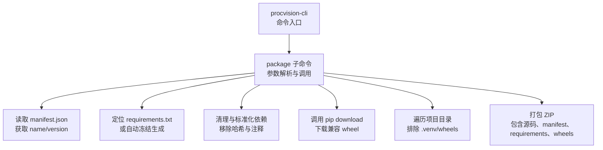
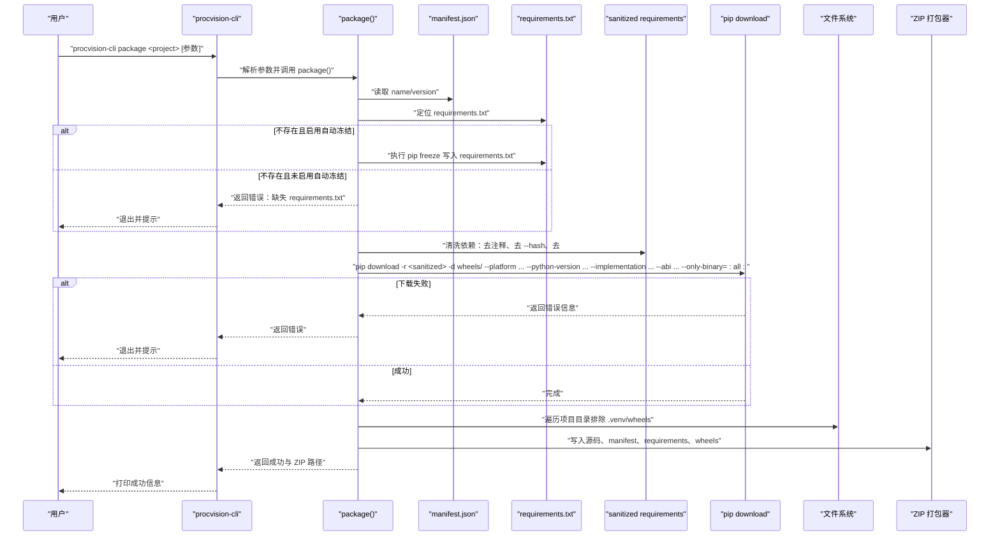
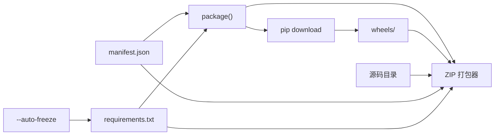

# package 命令

<cite>
**本文引用的文件列表**
- [cli.py](file://procvision_algorithm_sdk/cli.py)
- [README.md](file://README.md)
- [algorithm-example/manifest.json](file://algorithm-example/manifest.json)
- [algorithm-example/algorithm_example/main.py](file://algorithm-example/algorithm_example/main.py)
- [pyproject.toml](file://pyproject.toml)
</cite>

## 目录
1. [简介](#简介)
2. [项目结构](#项目结构)
3. [核心组件](#核心组件)
4. [架构总览](#架构总览)
5. [详细组件分析](#详细组件分析)
6. [依赖关系分析](#依赖关系分析)
7. [性能考量](#性能考量)
8. [故障排查指南](#故障排查指南)
9. [结论](#结论)
10. [附录](#附录)

## 简介
本节面向使用 procvision-cli 的开发者，系统性说明 package 子命令如何将一个算法项目打包为可在生产环境离线运行的 ZIP 包。该命令会整合以下内容：
- 源码目录（除特定忽略项外）
- manifest.json
- requirements.txt（或自动冻结生成）
- wheels/ 目录中的兼容 wheel 文件
- 可选 assets/ 目录（由调用者决定是否包含）

同时，本节将详细解释各参数的作用与行为，包括输出路径、依赖文件来源、目标环境参数（平台、Python 版本、实现、ABI）以及跳过下载选项；并说明内部调用 pip download 的机制、对 .hash 与 --hash 参数的处理策略，以确保依赖的纯净性与可复现性。

## 项目结构
与 package 命令直接相关的文件与目录如下：
- CLI 主入口与子命令定义：procvision_algorithm_sdk/cli.py
- 示例算法项目：algorithm-example/
- 项目打包配置：pyproject.toml
- README 中关于离线交付的说明

图表来源
- [cli.py](file://procvision_algorithm_sdk/cli.py#L1-L614)
- [algorithm-example/manifest.json](file://algorithm-example/manifest.json#L1-L25)

章节来源
- [cli.py](file://procvision_algorithm_sdk/cli.py#L1-L614)
- [README.md](file://README.md#L1-L116)

## 核心组件
- package 函数：负责读取 manifest、定位/生成 requirements、清洗依赖、调用 pip download 获取 wheel、遍历项目目录并打包 ZIP。
- 参数解析器：为 package 子命令提供 -o/-r/-a 以及目标环境参数（-w/-p/-i/-b）与 --skip-download。
- 验证函数：在 package 流程中可被调用以检查离线包是否包含 manifest、requirements 与 wheels。

章节来源
- [cli.py](file://procvision_algorithm_sdk/cli.py#L1-L614)

## 架构总览
下面的序列图展示了 package 命令从解析参数到生成离线包的完整流程。

图表来源
- [cli.py](file://procvision_algorithm_sdk/cli.py#L1-L614)

## 详细组件分析

### package 子命令参数详解
- 位置参数
  - project：算法项目根目录，要求包含 manifest.json。
- 输出控制
  - -o/--output：输出 ZIP 文件路径，默认使用 name 与 version 组合生成文件名。
- 依赖来源
  - -r/--requirements：requirements.txt 路径，默认使用项目内文件；若不存在且未启用自动冻结，则报错。
  - -a/--auto-freeze：当 requirements.txt 不存在时，自动执行 pip freeze 生成 requirements.txt。
- 目标环境参数
  - -w/--wheels-platform：目标平台（如 win_amd64），默认读取缓存或使用 win_amd64。
  - -p/--python-version：目标 Python 版本（如 3.10），默认读取缓存或使用 3.10。
  - -i/--implementation：Python 实现（如 cp），默认读取缓存或使用 cp。
  - -b/--abi：ABI（如 cp310），默认读取缓存或使用 cp310。
- 行为控制
  - -s/--skip-download：跳过依赖下载，仅打包现有内容（适用于已手动准备 wheels 的场景）。

章节来源
- [cli.py](file://procvision_algorithm_sdk/cli.py#L1-L614)

### 依赖清洗与哈希处理
package 在调用 pip download 前会对 requirements 进行清洗，以确保依赖的纯净性与可复现性：
- 移除注释与行尾哈希（包括 #sha256= 后缀）
- 移除 --hash= 前缀的哈希参数
- 保留有效依赖行，写入 requirements.sanitized.txt

上述处理有助于：
- 避免因额外注释或哈希导致的解析歧义
- 保证离线包内的 requirements.txt 是“干净”的，便于后续校验与审计

章节来源
- [cli.py](file://procvision_algorithm_sdk/cli.py#L1-L614)

### pip download 机制与目标环境
package 会调用 pip download 下载与目标环境匹配的 wheel，关键点：
- 使用 --only-binary=:all: 强制仅下载二进制 wheel，避免源码编译
- 通过 --platform、--python-version、--implementation、--abi 指定目标环境
- 将下载产物放入 wheels/ 目录
- 若下载失败，会返回错误信息，并在提示中给出目标环境参数建议

章节来源
- [cli.py](file://procvision_algorithm_sdk/cli.py#L1-L614)

### 打包流程与目录结构
package 会将以下内容打包到 ZIP：
- 源码目录（排除 .venv 与 wheels 子目录）
- manifest.json
- requirements.txt（或 requirements.sanitized.txt）
- wheels/ 目录下的所有 wheel 文件
- 可选 assets/ 目录（由项目决定是否包含）

生成的离线包目录结构示意：
- 算法包根目录（与项目同名）
  - 源码目录（如 algorithm_example/）
  - manifest.json
  - requirements.txt
  - wheels/
    - *.whl
  - assets/（可选）

章节来源
- [cli.py](file://procvision_algorithm_sdk/cli.py#L1-L614)

### 使用示例
- 基本用法
  - procvision-cli package ./algorithm-example
- 自定义输出路径
  - procvision-cli package ./algorithm-example -o ./dist/my_algo-offline.zip
- 指定 requirements 路径
  - procvision-cli package ./algorithm-example -r ./requirements.txt
- 自动冻结 requirements
  - procvision-cli package ./algorithm-example -a
- 指定目标环境
  - procvision-cli package ./algorithm-example -w linux_x86_64 -p 3.10 -i cp -b cp310
- 跳过下载（仅打包已有内容）
  - procvision-cli package ./algorithm-example -s

章节来源
- [cli.py](file://procvision_algorithm_sdk/cli.py#L1-L614)
- [README.md](file://README.md#L1-L116)

### 错误处理与常见问题
- requirements.txt 不存在且未启用自动冻结
  - 现象：返回错误并提示缺少 requirements.txt
  - 解决：提供 -r 指向有效 requirements.txt，或启用 -a 让 package 自动生成
- pip download 失败
  - 现象：返回错误信息，可能包含“未找到匹配发行版”
  - 解决：检查目标环境参数（平台、Python 版本、实现、ABI）是否与依赖兼容；建议在目标 Python 版本的虚拟环境中执行 pip freeze 生成 requirements.txt
- wheels 与源码未包含在 ZIP 中
  - 现象：validate --zip 检查失败
  - 解决：确认 wheels/ 是否存在且包含 wheel 文件；确认源码与 manifest、requirements 已被打包

章节来源
- [cli.py](file://procvision_algorithm_sdk/cli.py#L1-L614)

## 依赖关系分析
- package 依赖 manifest.json 提供 name/version 用于命名输出文件
- package 依赖 requirements.txt（或自动冻结生成）作为下载依赖的输入
- package 通过 pip download 获取 wheels/ 目录中的 wheel
- package 将 wheels/ 与源码一并打包到 ZIP

图表来源
- [cli.py](file://procvision_algorithm_sdk/cli.py#L1-L614)
- [algorithm-example/manifest.json](file://algorithm-example/manifest.json#L1-L25)

章节来源
- [cli.py](file://procvision_algorithm_sdk/cli.py#L1-L614)

## 性能考量
- 跳过下载（--skip-download）可显著缩短打包时间，适用于已提前准备好 wheels 的场景
- 仅下载二进制 wheel（--only-binary=:all:）避免了源码编译开销
- 清洗 requirements 可减少解析与校验负担，提升稳定性

[本节为通用指导，无需列出具体文件来源]

## 故障排查指南
- requirements.txt 不存在
  - 确认项目根目录是否存在 requirements.txt；若不存在，启用 -a 或显式提供 -r
- 目标环境不匹配
  - 检查 -w/-p/-i/-b 与依赖库在目标平台上的可用性；必要时在目标 Python 版本的虚拟环境中生成 requirements.txt
- wheels 为空
  - 确认 pip download 成功；检查网络与镜像源；确认 requirements 清洗后仍包含有效依赖
- ZIP 校验失败
  - 使用 validate --zip 检查离线包是否包含 manifest.json、requirements.txt 与 wheels/

章节来源
- [cli.py](file://procvision_algorithm_sdk/cli.py#L1-L614)

## 结论
package 命令通过“读取 manifest、定位/生成 requirements、清洗依赖、调用 pip download、遍历项目并打包”的流程，将算法项目与依赖打包为可在生产环境离线运行的 ZIP 包。借助目标环境参数与 --skip-download，开发者可以灵活控制打包过程，确保离线包的可复现性与可移植性。

[本节为总结性内容，无需列出具体文件来源]

## 附录

### 示例算法项目结构参考
- algorithm-example/manifest.json：包含 name、version、entry_point 等关键字段
- algorithm-example/algorithm_example/main.py：示例算法实现，展示 get_info、pre_execute、execute 等方法

章节来源
- [algorithm-example/manifest.json](file://algorithm-example/manifest.json#L1-L25)
- [algorithm-example/algorithm_example/main.py](file://algorithm-example/algorithm_example/main.py#L1-L150)

### 项目打包配置参考
- pyproject.toml：定义了脚本入口 procvision-cli 与项目元数据

章节来源
- [pyproject.toml](file://pyproject.toml#L1-L36)