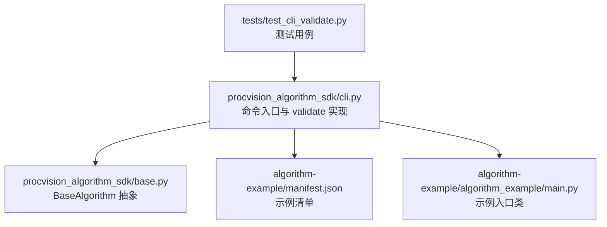
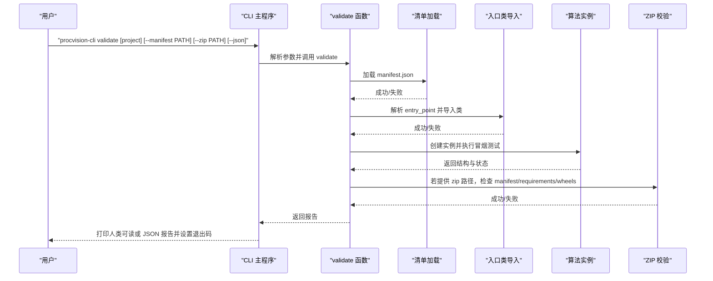
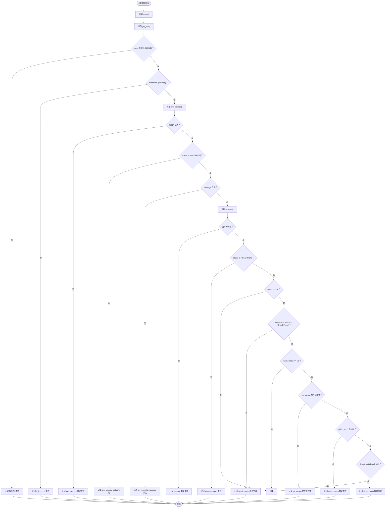
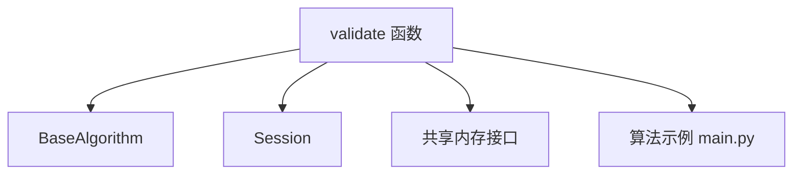

# validate 命令

<cite>
**本文引用的文件**
- [cli.py](file://procvision_algorithm_sdk/cli.py)
- [base.py](file://procvision_algorithm_sdk/base.py)
- [manifest.json](file://algorithm-example/manifest.json)
- [main.py](file://algorithm-example/algorithm_example/main.py)
- [test_cli_validate.py](file://tests/test_cli_validate.py)
- [README.md](file://README.md)
- [algorithm_dev_tutorial.md](file://algorithm_dev_tutorial.md)
- [spec.md](file://spec.md)
- [v0.0.6.md](file://docs/release-notes/v0.0.6.md)
</cite>

## 更新摘要
**变更内容**
- 新增 `--full` 和 `--legacy-validate` 选项说明
- 增加完整适配器握手验证流程说明
- 更新使用示例以反映新选项
- 更新故障排查指南以包含新验证模式

## 目录
1. [简介](#简介)
2. [项目结构](#项目结构)
3. [核心组件](#核心组件)
4. [架构总览](#架构总览)
5. [详细组件分析](#详细组件分析)
6. [依赖关系分析](#依赖关系分析)
7. [性能考量](#性能考量)
8. [故障排查指南](#故障排查指南)
9. [结论](#结论)
10. [附录](#附录)

## 简介
本节面向使用 procvision-cli 的算法开发者，系统讲解 validate 命令的用途、输入输出、校验规则与失败场景诊断方法。validate 命令用于在本地快速验证算法包的结构完整性与接口合规性，包括：
- manifest.json 是否存在且可加载，必要字段是否齐全
- 入口类能否被正确导入并继承基类
- get_info、pre_execute、execute 等方法的冒烟测试流程
- 对离线交付 ZIP 包中 manifest.json、requirements.txt、wheels/ 的校验
- 输出报告的 JSON 结构与解读

此外，文档还结合示例与测试用例，帮助你快速定位常见失败原因并进行修复。

## 项目结构
validate 命令位于 CLI 模块中，围绕 BaseAlgorithm 基类与 Session、共享内存等基础设施工作。典型算法示例位于 algorithm-example 目录，包含清单与示例入口类。

图表来源
- [cli.py](file://procvision_algorithm_sdk/cli.py#L35-L261)
- [base.py](file://procvision_algorithm_sdk/base.py#L1-L58)
- [manifest.json](file://algorithm-example/manifest.json#L1-L25)
- [main.py](file://algorithm-example/algorithm_example/main.py#L1-L150)
- [test_cli_validate.py](file://tests/test_cli_validate.py#L1-L11)

章节来源
- [cli.py](file://procvision_algorithm_sdk/cli.py#L35-L261)
- [README.md](file://README.md#L1-L116)

## 核心组件
- 命令入口与参数解析：validate 子命令支持项目路径、显式 manifest 路径、离线包路径与 JSON 输出开关。
- 清单加载与字段校验：检查 manifest.json 是否存在、可解析、必要字段是否齐全。
- 入口类导入与继承校验：解析 entry_point，导入模块与类，断言其继承自 BaseAlgorithm。
- 冒烟测试：构造 Session 与 image_meta，依次调用 setup、on_step_start、pre_execute、execute、on_step_finish、teardown，校验返回结构与字段。
- ZIP 校验：打开离线包，检查是否包含 manifest.json、requirements.txt、wheels/。
- 报告生成：汇总通过/失败计数与总体状态，输出人类可读或 JSON。

章节来源
- [cli.py](file://procvision_algorithm_sdk/cli.py#L35-L261)
- [algorithm_dev_tutorial.md](file://algorithm_dev_tutorial.md#L130-L160)

## 架构总览
validate 命令的执行流程如下：

图表来源
- [cli.py](file://procvision_algorithm_sdk/cli.py#L35-L261)
- [cli.py](file://procvision_algorithm_sdk/cli.py#L494-L556)

## 详细组件分析

### 命令参数与行为
- 参数
  - project：算法项目根目录，默认当前目录
  - --manifest：显式指定 manifest.json 路径（可替代 project）
  - --zip：离线交付 zip 包路径（校验 wheels/ 与必需文件）
  - --json：以 JSON 输出结果
  - --full：使用适配器子进程执行完整握手与 pre/execute 校验
  - --entry：显式指定入口 <module:Class>，用于 --full 模式
  - --legacy-validate：使用旧的本地导入校验路径
  - --tail-logs：在 --full 模式下实时输出子进程日志
- 行为
  - 默认输出人类可读清单（逐项通过/失败与提示）
  - 通过返回 0，否则返回 1
  - 当使用 --full 选项时，会启动适配器子进程进行完整握手验证
  - 当使用 --legacy-validate 选项时，使用旧的本地导入校验路径

章节来源
- [cli.py](file://procvision_algorithm_sdk/cli.py#L494-L556)
- [spec.md](file://spec.md#L823-L852)

### 清单校验
- manifest.json 是否存在
- 清单是否可解析
- 必填字段：name、version、entry_point、supported_pids
- supported_pids 与 get_info().supported_pids 是否一致

章节来源
- [cli.py](file://procvision_algorithm_sdk/cli.py#L35-L116)
- [manifest.json](file://algorithm-example/manifest.json#L1-L25)

### 入口类导入与继承校验
- 解析 entry_point（模块名:类名）
- 导入模块与类
- 断言类继承自 BaseAlgorithm
- 异常捕获并记录失败原因

章节来源
- [cli.py](file://procvision_algorithm_sdk/cli.py#L18-L34)
- [base.py](file://procvision_algorithm_sdk/base.py#L1-L58)

### 冒烟测试流程
validate 对算法实例执行一次完整的生命周期调用，校验返回结构与字段：
- 生命周期钩子：setup、on_step_start、on_step_finish、teardown
- 预执行：pre_execute
  - 返回类型为字典
  - status 为 "OK"/"ERROR"
  - message 存在
- 执行：execute
  - 返回类型为字典
  - status 为 "OK"/"ERROR"
  - 当 status == "OK" 时：
    - data.result_status ∈ {"OK","NG",None}
    - 当 result_status == "NG" 时：
      - ng_reason 存在且非空
      - defect_rects 为列表
      - defect_rects 数量 ≤ 20
- supported_pids 一致性：manifest.json 与 get_info().supported_pids 必须一致

图表来源
- [cli.py](file://procvision_algorithm_sdk/cli.py#L62-L145)

章节来源
- [cli.py](file://procvision_algorithm_sdk/cli.py#L62-L145)

### 完整适配器握手验证
当使用 `--full` 选项时，validate 命令会启动适配器子进程执行完整握手验证，包括：
- 启动适配器进程并等待 hello 帧
- 发送 hello 响应完成握手
- 发送 pre 执行调用并验证结果
- 发送 execute 执行调用并验证结果
- 发送 shutdown 命令结束会话

验证检查项包括：
- adapter_hello：适配器成功启动并发送 hello 帧
- pre_result：pre 执行调用返回有效结果
- execute_result：execute 执行调用返回有效结果
- execute_result_status：execute 返回结果状态有效
- defect_rects_limit：缺陷矩形数量限制检查

章节来源
- [cli.py](file://procvision_algorithm_sdk/cli.py#L758-L827)
- [v0.0.6.md](file://docs/release-notes/v0.0.6.md#L8-L9)

### ZIP 离线包校验
- 打开离线包
- 检查是否包含 manifest.json
- 检查是否包含 requirements.txt
- 检查是否包含 wheels/（或包含 "/wheels/" 的条目）

章节来源
- [cli.py](file://procvision_algorithm_sdk/cli.py#L128-L145)

### 报告结构与解读
validate 返回的 JSON 报告包含两个顶层字段：
- summary
  - status：总体状态，"PASS" 或 "FAIL"
  - passed：通过的检查项数量
  - failed：失败的检查项数量
- checks：每个检查项的数组，每项包含
  - name：检查项标识
  - result："PASS" 或 "FAIL"
  - message：附加信息（可选）

解读要点：
- summary.status == "PASS" 表示全部检查通过
- 若某项 result == "FAIL"，应查看对应 name 与 message，定位失败原因
- 常见失败项包括：manifest_exists、manifest_load、manifest_fields、entry_import、get_info、step_schema、supported_pids_match、pre_execute_return_dict、pre_status_valid、pre_message_present、execute_return_dict、execute_status_valid、execute_result_status_valid、ng_reason_present、defect_rects_type、defect_rects_count_limit、zip_manifest、zip_requirements、zip_wheels、zip_open、smoke_execute

章节来源
- [cli.py](file://procvision_algorithm_sdk/cli.py#L145-L261)

### 使用示例与输出解读
- 验证项目：procvision-cli validate ./algorithm-example
- 验证离线包：procvision-cli validate --zip ./algo.zip
- 以 JSON 输出：procvision-cli validate ./algorithm-example --json
- 使用完整适配器验证：procvision-cli validate ./algorithm-example --full
- 使用旧验证模式：procvision-cli validate ./algorithm-example --legacy-validate
- 使用完整验证并实时输出日志：procvision-cli validate ./algorithm-example --full --tail-logs

输出解读：
- 人类可读输出：每行一个检查项，通过显示“✅”，失败显示“❌”，并附带简要说明
- JSON 输出：完整报告，便于自动化集成与二次处理

章节来源
- [cli.py](file://procvision_algorithm_sdk/cli.py#L494-L556)
- [algorithm_dev_tutorial.md](file://algorithm_dev_tutorial.md#L130-L160)

### 结合测试用例的失败场景诊断
- 测试用例：缺失清单
  - 场景：传入不存在的项目路径
  - 期望：summary.status == "FAIL"
  - 处理：检查 manifest.json 是否存在于项目根目录或替代路径；确认路径拼接逻辑与权限
- 测试用例：适配器启动失败
  - 场景：使用 --full 选项但适配器无法启动
  - 期望：adapter_start 检查项失败
  - 处理：检查项目路径、环境变量和适配器模块是否存在
- 测试用例：握手失败
  - 场景：适配器未返回 hello 帧
  - 期望：adapter_hello 检查项失败
  - 处理：检查适配器实现是否正确发送 hello 帧

章节来源
- [test_cli_validate.py](file://tests/test_cli_validate.py#L1-L11)
- [cli.py](file://procvision_algorithm_sdk/cli.py#L758-L827)

## 依赖关系分析
validate 命令依赖以下模块与文件：
- BaseAlgorithm：作为入口类继承基类的断言依据
- Session：构造会话上下文，驱动生命周期钩子
- 共享内存接口：读取图像元数据，驱动预执行与执行阶段
- 算法示例：提供标准的 get_info、pre_execute、execute 实现，作为冒烟测试的参考

图表来源
- [cli.py](file://procvision_algorithm_sdk/cli.py#L35-L261)
- [base.py](file://procvision_algorithm_sdk/base.py#L1-L58)
- [main.py](file://algorithm-example/algorithm_example/main.py#L1-L150)

章节来源
- [cli.py](file://procvision_algorithm_sdk/cli.py#L35-L261)
- [base.py](file://procvision_algorithm_sdk/base.py#L1-L58)

## 性能考量
- validate 仅做冒烟测试，不进行实际图像推理，因此耗时极短
- 若 ZIP 校验失败，validate 会记录 zip_open 失败并继续统计其他检查项
- 建议在 CI 中将 validate 作为前置检查，尽早暴露清单与入口问题
- 使用 --full 选项时，由于需要启动子进程，耗时会稍长

## 故障排查指南
- manifest.json 不存在或不可解析
  - 现象：manifest_exists 或 manifest_load 失败
  - 处理：确认清单路径与权限；修正 JSON 语法
- 必填字段缺失
  - 现象：manifest_fields 失败
  - 处理：补齐 name、version、entry_point、supported_pids
- 入口类导入失败或未继承 BaseAlgorithm
  - 现象：entry_import 失败
  - 处理：检查 entry_point 格式（模块名:类名）、类继承关系、Python 路径
- get_info 返回结构异常
  - 现象：get_info 或 step_schema 失败
  - 处理：确保 get_info 返回字典，steps 为列表
- supported_pids 不一致
  - 现象：supported_pids_match 失败
  - 处理：统一 manifest.json 与 get_info().supported_pids
- pre_execute 返回结构异常
  - 现象：pre_execute_return_dict、pre_status_valid、pre_message_present 失败
  - 处理：确保返回字典，status ∈ {"OK","ERROR"}，message 存在
- execute 返回结构异常
  - 现象：execute_return_dict、execute_status_valid、execute_result_status_valid、ng_reason_present、defect_rects_type、defect_rects_count_limit 失败
  - 处理：status ∈ {"OK","ERROR"}；当 result_status == "NG" 时，ng_reason 必须存在且非空，defect_rects 为列表且长度 ≤ 20
- ZIP 校验失败
  - 现象：zip_manifest、zip_requirements、zip_wheels、zip_open 失败
  - 处理：确认离线包包含 manifest.json、requirements.txt、wheels/；若 zip_open 失败，检查 ZIP 文件完整性与权限
- 适配器验证失败
  - 现象：adapter_hello、pre_result、execute_result 等检查项失败
  - 处理：检查适配器实现是否正确处理握手和调用协议；使用 --tail-logs 查看详细日志

章节来源
- [cli.py](file://procvision_algorithm_sdk/cli.py#L62-L145)
- [algorithm_dev_tutorial.md](file://algorithm_dev_tutorial.md#L130-L160)

## 结论
validate 命令提供了对算法包结构与接口的全面冒烟校验，能够快速发现清单缺失、入口类问题、接口返回结构异常以及离线包缺失关键文件等常见问题。通过理解报告结构与失败项含义，开发者可以高效定位并修复问题，提升交付质量与稳定性。新增的 --full 和 --legacy-validate 选项为开发者提供了更灵活的验证方式，支持完整适配器握手验证和旧验证模式的兼容。

## 附录
- 参考规范与教程
  - CLI 参考与约束：[algorithm_dev_tutorial.md](file://algorithm_dev_tutorial.md#L130-L160)
  - 接口要点与最小实现：[README.md](file://README.md#L1-L116)
  - 规范与命令说明：[spec.md](file://spec.md#L823-L852)
  - 版本变更说明：[v0.0.6.md](file://docs/release-notes/v0.0.6.md)