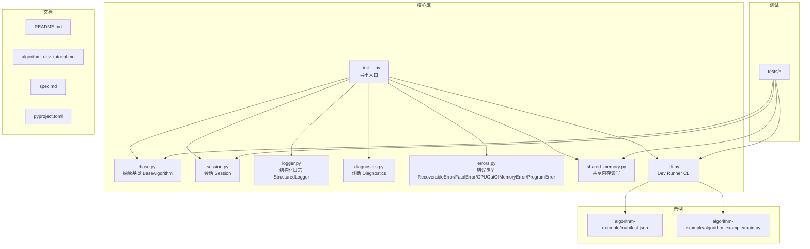
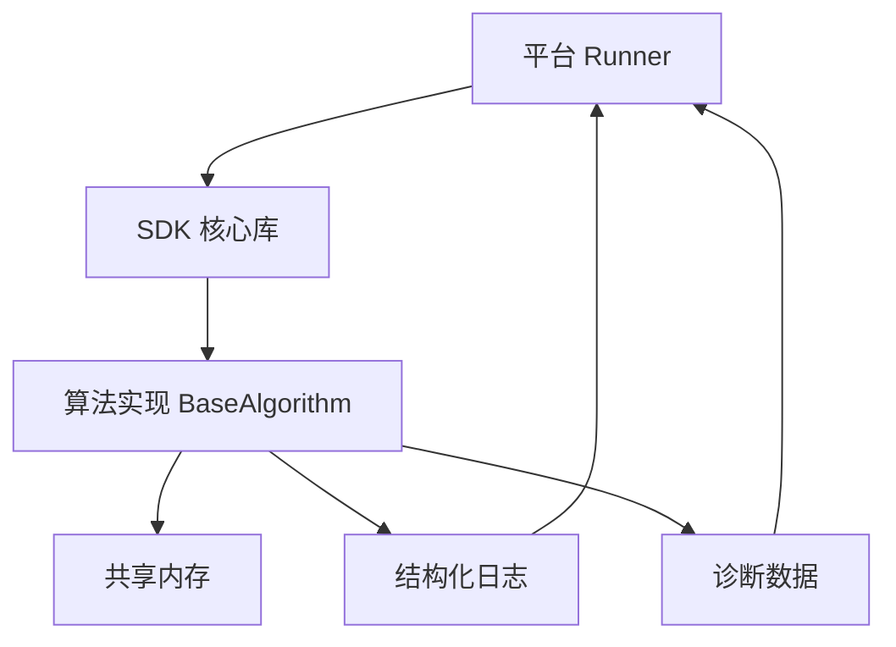
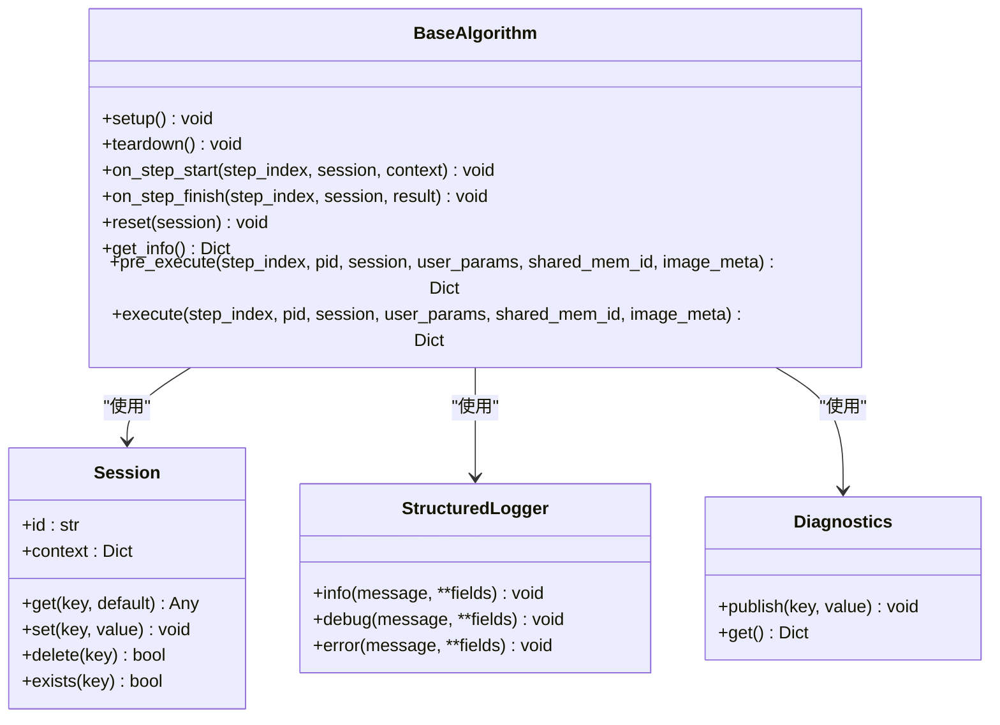
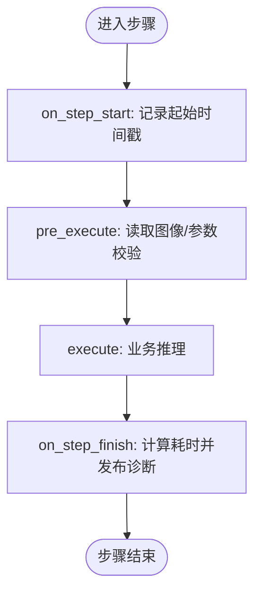
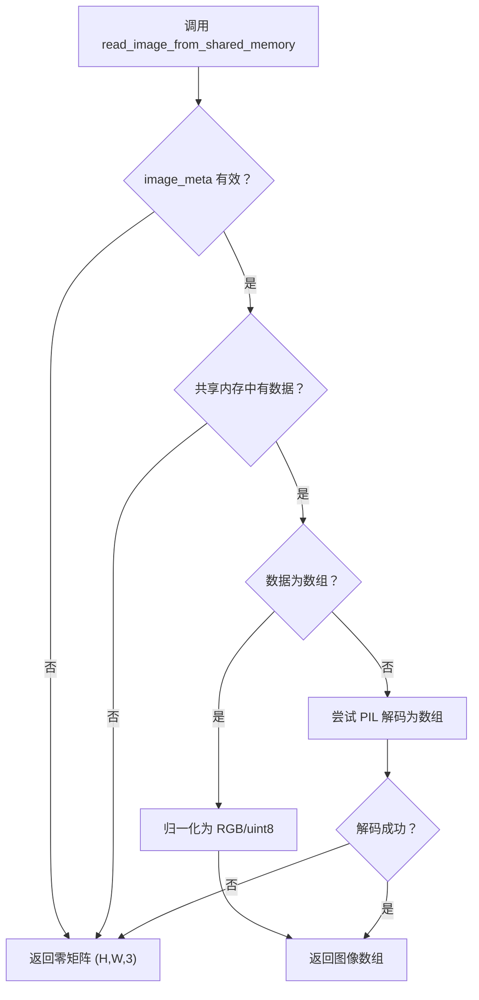
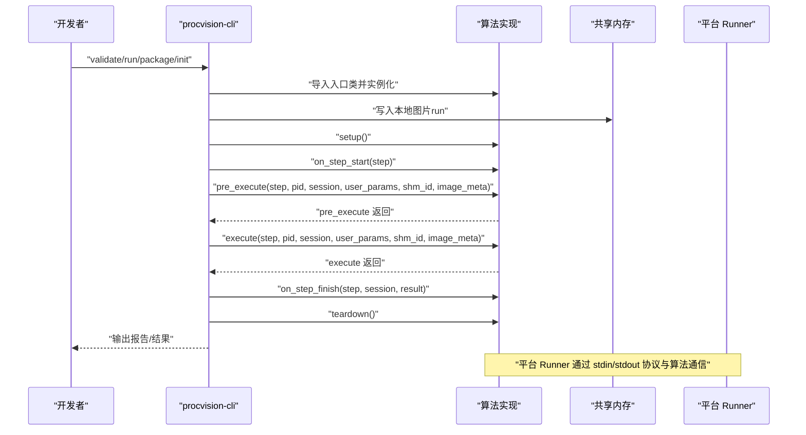
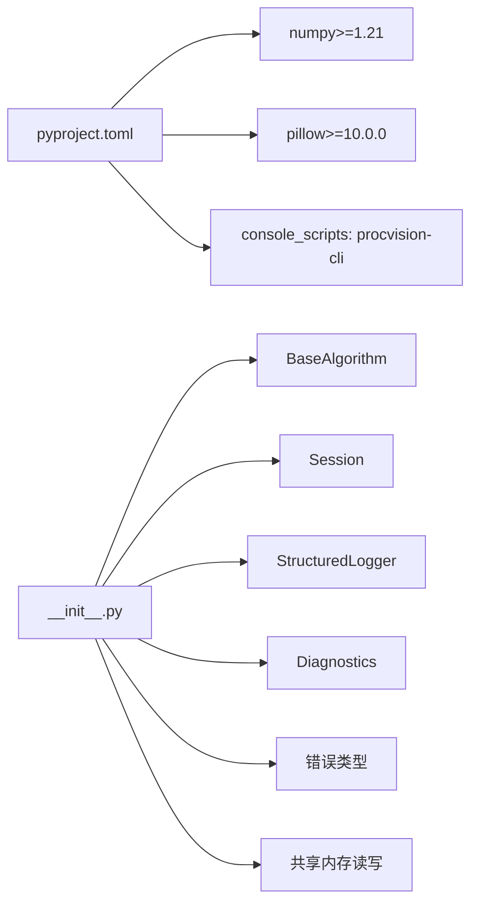

# 开发最佳实践

<cite>
**本文引用的文件**
- [README.md](file://README.md)
- [algorithm_dev_tutorial.md](file://algorithm_dev_tutorial.md)
- [spec.md](file://spec.md)
- [pyproject.toml](file://pyproject.toml)
- [procvision_algorithm_sdk/__init__.py](file://procvision_algorithm_sdk/__init__.py)
- [procvision_algorithm_sdk/base.py](file://procvision_algorithm_sdk/base.py)
- [procvision_algorithm_sdk/session.py](file://procvision_algorithm_sdk/session.py)
- [procvision_algorithm_sdk/logger.py](file://procvision_algorithm_sdk/logger.py)
- [procvision_algorithm_sdk/diagnostics.py](file://procvision_algorithm_sdk/diagnostics.py)
- [procvision_algorithm_sdk/errors.py](file://procvision_algorithm_sdk/errors.py)
- [procvision_algorithm_sdk/shared_memory.py](file://procvision_algorithm_sdk/shared_memory.py)
- [procvision_algorithm_sdk/cli.py](file://procvision_algorithm_sdk/cli.py)
- [algorithm-example/manifest.json](file://algorithm-example/manifest.json)
- [algorithm-example/algorithm_example/main.py](file://algorithm-example/algorithm_example/main.py)
- [tests/test_shared_memory.py](file://tests/test_shared_memory.py)
- [tests/test_session.py](file://tests/test_session.py)
- [tests/test_base_algo.py](file://tests/test_base_algo.py)
- [tests/test_cli.py](file://tests/test_cli.py)
</cite>

## 目录
1. [简介](#简介)
2. [项目结构](#项目结构)
3. [核心组件](#核心组件)
4. [架构总览](#架构总览)
5. [详细组件分析](#详细组件分析)
6. [依赖分析](#依赖分析)
7. [性能考虑](#性能考虑)
8. [故障排查指南](#故障排查指南)
9. [结论](#结论)
10. [附录](#附录)

## 简介
本文件面向工业视觉平台 ProcVision 算法 SDK 的开发者，系统总结开发最佳实践，涵盖错误处理、日志记录、性能优化、多 PID 支持、调用关系、接口与领域模型、使用模式、与平台组件的集成关系、常见问题与解决方案。内容既适合初学者快速上手，也为资深开发者提供深入的技术细节与工程化建议。

## 项目结构
SDK 以“核心库 + 示例 + 测试 + 文档”的方式组织，核心库位于 procvision_algorithm_sdk，示例算法位于 algorithm-example，单元测试位于 tests，配套文档包括 README、开发教程与规范。

图表来源
- [procvision_algorithm_sdk/__init__.py](file://procvision_algorithm_sdk/__init__.py#L1-L19)
- [procvision_algorithm_sdk/base.py](file://procvision_algorithm_sdk/base.py#L1-L58)
- [procvision_algorithm_sdk/session.py](file://procvision_algorithm_sdk/session.py#L1-L36)
- [procvision_algorithm_sdk/logger.py](file://procvision_algorithm_sdk/logger.py#L1-L24)
- [procvision_algorithm_sdk/diagnostics.py](file://procvision_algorithm_sdk/diagnostics.py#L1-L12)
- [procvision_algorithm_sdk/errors.py](file://procvision_algorithm_sdk/errors.py#L1-L14)
- [procvision_algorithm_sdk/shared_memory.py](file://procvision_algorithm_sdk/shared_memory.py#L1-L53)
- [procvision_algorithm_sdk/cli.py](file://procvision_algorithm_sdk/cli.py#L1-L615)
- [algorithm-example/manifest.json](file://algorithm-example/manifest.json#L1-L25)
- [algorithm-example/algorithm_example/main.py](file://algorithm-example/algorithm_example/main.py#L1-L150)
- [tests/test_shared_memory.py](file://tests/test_shared_memory.py#L1-L16)
- [tests/test_session.py](file://tests/test_session.py#L1-L24)
- [tests/test_base_algo.py](file://tests/test_base_algo.py#L1-L65)
- [tests/test_cli.py](file://tests/test_cli.py#L1-L20)
- [README.md](file://README.md#L1-L116)
- [algorithm_dev_tutorial.md](file://algorithm_dev_tutorial.md#L1-L348)
- [spec.md](file://spec.md#L1-L2102)
- [pyproject.toml](file://pyproject.toml#L1-L36)

章节来源
- [README.md](file://README.md#L1-L116)
- [algorithm_dev_tutorial.md](file://algorithm_dev_tutorial.md#L1-L348)
- [spec.md](file://spec.md#L1-L2102)
- [pyproject.toml](file://pyproject.toml#L1-L36)

## 核心组件
- 抽象基类 BaseAlgorithm：定义 get_info、pre_execute、execute 与生命周期钩子（setup/teardown/on_step_start/on_step_finish/reset），统一算法实现契约。
- 会话 Session：提供 KV 状态存储与只读上下文，贯穿一次检测流程。
- 结构化日志 StructuredLogger：输出统一格式的日志，包含 level 与 timestamp_ms。
- 诊断 Diagnostics：聚合关键指标，便于平台采集。
- 错误类型：区分可恢复错误、致命错误、GPU 显存不足、程序异常等。
- 共享内存读写：提供读取图像与开发写入能力，支持字节与数组两种形态。
- CLI：提供 validate/run/package/init 四个子命令，覆盖校验、运行、打包与脚手架初始化。

章节来源
- [procvision_algorithm_sdk/base.py](file://procvision_algorithm_sdk/base.py#L1-L58)
- [procvision_algorithm_sdk/session.py](file://procvision_algorithm_sdk/session.py#L1-L36)
- [procvision_algorithm_sdk/logger.py](file://procvision_algorithm_sdk/logger.py#L1-L24)
- [procvision_algorithm_sdk/diagnostics.py](file://procvision_algorithm_sdk/diagnostics.py#L1-L12)
- [procvision_algorithm_sdk/errors.py](file://procvision_algorithm_sdk/errors.py#L1-L14)
- [procvision_algorithm_sdk/shared_memory.py](file://procvision_algorithm_sdk/shared_memory.py#L1-L53)
- [procvision_algorithm_sdk/cli.py](file://procvision_algorithm_sdk/cli.py#L1-L615)
- [procvision_algorithm_sdk/__init__.py](file://procvision_algorithm_sdk/__init__.py#L1-L19)

## 架构总览
SDK 与平台解耦，平台通过 Runner 与算法进程通信，算法通过 SDK 的接口与工具完成生命周期管理、日志与诊断、图像读取与返回结构化结果。Dev Runner 作为本地开发与自测工具，模拟平台调用链路。

图表来源
- [procvision_algorithm_sdk/base.py](file://procvision_algorithm_sdk/base.py#L1-L58)
- [procvision_algorithm_sdk/shared_memory.py](file://procvision_algorithm_sdk/shared_memory.py#L1-L53)
- [procvision_algorithm_sdk/logger.py](file://procvision_algorithm_sdk/logger.py#L1-L24)
- [procvision_algorithm_sdk/diagnostics.py](file://procvision_algorithm_sdk/diagnostics.py#L1-L12)
- [procvision_algorithm_sdk/cli.py](file://procvision_algorithm_sdk/cli.py#L1-L615)

## 详细组件分析

### 抽象基类与生命周期（BaseAlgorithm）
- 设计要点
  - 实例不绑定 PID，通过每次调用参数 pid 动态适配多 PID。
  - 生命周期钩子可选实现，建议幂等、轻量化，重计算放在 pre_execute/execute。
  - 返回结构严格区分 pre_execute（仅参考信息）与 execute（业务判定）。
- 关键方法
  - get_info：返回 name/version/description/supported_pids/steps。
  - pre_execute：返回 status、message、data（如 calibration_rects）、debug。
  - execute：返回 status、data.result_status（OK/NG）、ng_reason、defect_rects ≤ 20、debug。
  - setup/teardown/on_step_start/on_step_finish/reset：资源管理与诊断输出。
- 多 PID 支持
  - supported_pids 由 get_info 与 manifest.json 双向约束，SDK 校验一致性。
  - 算法内部通过 pid 分支选择配置与参数，避免实例绑定 PID。

图表来源
- [procvision_algorithm_sdk/base.py](file://procvision_algorithm_sdk/base.py#L1-L58)
- [procvision_algorithm_sdk/session.py](file://procvision_algorithm_sdk/session.py#L1-L36)
- [procvision_algorithm_sdk/logger.py](file://procvision_algorithm_sdk/logger.py#L1-L24)
- [procvision_algorithm_sdk/diagnostics.py](file://procvision_algorithm_sdk/diagnostics.py#L1-L12)

章节来源
- [procvision_algorithm_sdk/base.py](file://procvision_algorithm_sdk/base.py#L1-L58)
- [algorithm_dev_tutorial.md](file://algorithm_dev_tutorial.md#L1-L348)
- [spec.md](file://spec.md#L1-L2102)

### 会话与状态（Session）
- 作用：在一次检测流程内共享上下文与临时状态，KV 值必须 JSON 可序列化。
- 建议：仅存放轻量数据（建议 < 100KB），避免跨流程持久化。
- 使用模式：on_step_start 记录起始时间，on_step_finish 计算耗时并写入诊断。

图表来源
- [procvision_algorithm_sdk/base.py](file://procvision_algorithm_sdk/base.py#L1-L58)
- [procvision_algorithm_sdk/session.py](file://procvision_algorithm_sdk/session.py#L1-L36)
- [procvision_algorithm_sdk/diagnostics.py](file://procvision_algorithm_sdk/diagnostics.py#L1-L12)

章节来源
- [procvision_algorithm_sdk/session.py](file://procvision_algorithm_sdk/session.py#L1-L36)
- [tests/test_session.py](file://tests/test_session.py#L1-L24)

### 日志与诊断（StructuredLogger 与 Diagnostics）
- 日志：统一输出 JSON，包含 level 与 timestamp_ms，便于平台采集。
- 诊断：通过 publish 聚合关键指标（如 step_latency_ms），在返回结构 debug 中携带。
- 最佳实践：在钩子中输出事件与耗时，在 execute 中输出业务结果与置信度等。

章节来源
- [procvision_algorithm_sdk/logger.py](file://procvision_algorithm_sdk/logger.py#L1-L24)
- [procvision_algorithm_sdk/diagnostics.py](file://procvision_algorithm_sdk/diagnostics.py#L1-L12)
- [algorithm-example/algorithm_example/main.py](file://algorithm-example/algorithm_example/main.py#L1-L150)

### 共享内存与图像读取（共享内存读写）
- 读取接口：read_image_from_shared_memory(shared_mem_id, image_meta)。
- 元信息：至少包含 width/height/timestamp_ms/camera_id；可选 color_space。
- 兼容性：支持字节（JPEG/PNG）与 numpy.ndarray（RGB/灰度自动转三通道，BGR→RGB）。
- 回退行为：读取失败或无数据返回 (H,W,3) 的零矩阵，便于快速失败与调试。

图表来源
- [procvision_algorithm_sdk/shared_memory.py](file://procvision_algorithm_sdk/shared_memory.py#L1-L53)
- [tests/test_shared_memory.py](file://tests/test_shared_memory.py#L1-L16)

章节来源
- [procvision_algorithm_sdk/shared_memory.py](file://procvision_algorithm_sdk/shared_memory.py#L1-L53)
- [tests/test_shared_memory.py](file://tests/test_shared_memory.py#L1-L16)

### CLI 与 Dev Runner（validate/run/package/init）
- validate：校验 manifest、入口类继承、supported_pids 一致性、返回结构、ZIP 包含 requirements/wheels 等。
- run：写入本地图片到共享内存，构造 Session 与 image_meta，执行完整生命周期并输出摘要。
- package：生成 requirements.sanitized.txt，按平台参数下载 wheels，打包源码与 wheels。
- init：生成脚手架，包含 manifest.json 与入口包 main.py。

图表来源
- [procvision_algorithm_sdk/cli.py](file://procvision_algorithm_sdk/cli.py#L1-L615)
- [procvision_algorithm_sdk/base.py](file://procvision_algorithm_sdk/base.py#L1-L58)
- [procvision_algorithm_sdk/shared_memory.py](file://procvision_algorithm_sdk/shared_memory.py#L1-L53)

章节来源
- [procvision_algorithm_sdk/cli.py](file://procvision_algorithm_sdk/cli.py#L1-L615)
- [tests/test_cli.py](file://tests/test_cli.py#L1-L20)

### 多 PID 支持与配置选项
- supported_pids：在 manifest.json 与 get_info 中保持一致，SDK 校验。
- 参数 schema：steps[index]/params[type/default/min/max/choices/required/unit]。
- 使用模式：在 get_info 中声明支持的 PID 与步骤参数；在 pre_execute/execute 中根据 pid 选择配置与分支逻辑。

章节来源
- [algorithm-example/manifest.json](file://algorithm-example/manifest.json#L1-L25)
- [algorithm-example/algorithm_example/main.py](file://algorithm-example/algorithm_example/main.py#L1-L150)
- [algorithm_dev_tutorial.md](file://algorithm_dev_tutorial.md#L1-L348)
- [spec.md](file://spec.md#L1-L2102)

## 依赖分析
- 依赖声明：numpy>=1.21、pillow>=10.0.0。
- 导出入口：__all__ 暴露 BaseAlgorithm、Session、读写函数、日志与诊断、错误类型。
- CLI 入口：console_scripts 指向 procvision-cli。

图表来源
- [pyproject.toml](file://pyproject.toml#L1-L36)
- [procvision_algorithm_sdk/__init__.py](file://procvision_algorithm_sdk/__init__.py#L1-L19)

章节来源
- [pyproject.toml](file://pyproject.toml#L1-L36)
- [procvision_algorithm_sdk/__init__.py](file://procvision_algorithm_sdk/__init__.py#L1-L19)

## 性能考虑
- 轻量化钩子：on_step_start/finish 不做重计算，将重工作放在 pre_execute/execute。
- 资源管理：在 setup/teardown 中加载/释放模型与句柄，避免在 execute 中延迟加载。
- 图像读取：优先使用 numpy 数组（RGB/灰度自动扩展），减少解码开销；确保 image_meta 宽高为正。
- 诊断与日志：将耗时与关键指标写入 Diagnostics 与 debug，便于平台侧统计与可视化。
- 超时与心跳：遵守 Runner 的心跳与调用超时策略，避免阻塞 ping 响应。

章节来源
- [algorithm_dev_tutorial.md](file://algorithm_dev_tutorial.md#L1-L348)
- [procvision_algorithm_sdk/shared_memory.py](file://procvision_algorithm_sdk/shared_memory.py#L1-L53)
- [procvision_algorithm_sdk/diagnostics.py](file://procvision_algorithm_sdk/diagnostics.py#L1-L12)

## 故障排查指南
- PID 不一致：确保 manifest.json 与 get_info().supported_pids 完全一致。
- 返回结构错误：pre_execute 不含业务判定；execute 的 result_status 仅在 status=OK 时出现。
- wheels 不匹配：在目标 Python 版本与 ABI 环境内执行 pip freeze，生成 requirements.txt。
- 图像尺寸异常：确保 image_meta.width/height 为正整数；读图失败会回退零矩阵。
- 日志与诊断：统一使用 StructuredLogger 输出 JSON 日志；关键指标通过 Diagnostics.publish。
- CLI 退出码：validate/run/package/init 的退出码用于快速判断是否通过。

章节来源
- [procvision_algorithm_sdk/cli.py](file://procvision_algorithm_sdk/cli.py#L1-L615)
- [tests/test_cli.py](file://tests/test_cli.py#L1-L20)
- [tests/test_shared_memory.py](file://tests/test_shared_memory.py#L1-L16)
- [tests/test_session.py](file://tests/test_session.py#L1-L24)
- [tests/test_base_algo.py](file://tests/test_base_algo.py#L1-L65)

## 结论
通过遵循 SDK 的接口契约、生命周期钩子与返回结构规范，结合结构化日志与诊断、严格的多 PID 支持与参数 schema、以及 Dev Runner 的自测流程，算法团队可以高效、稳定地完成工业视觉算法的开发与交付。建议在实际项目中固化上述最佳实践，形成可复用的模板与检查清单，持续提升交付质量与可维护性。

## 附录
- 快速开始与 CLI 使用参考见 README 与开发教程。
- 接口与协议规范详见 spec.md。
- 示例算法参考 algorithm-example。

章节来源
- [README.md](file://README.md#L1-L116)
- [algorithm_dev_tutorial.md](file://algorithm_dev_tutorial.md#L1-L348)
- [spec.md](file://spec.md#L1-L2102)
- [algorithm-example/manifest.json](file://algorithm-example/manifest.json#L1-L25)
- [algorithm-example/algorithm_example/main.py](file://algorithm-example/algorithm_example/main.py#L1-L150)