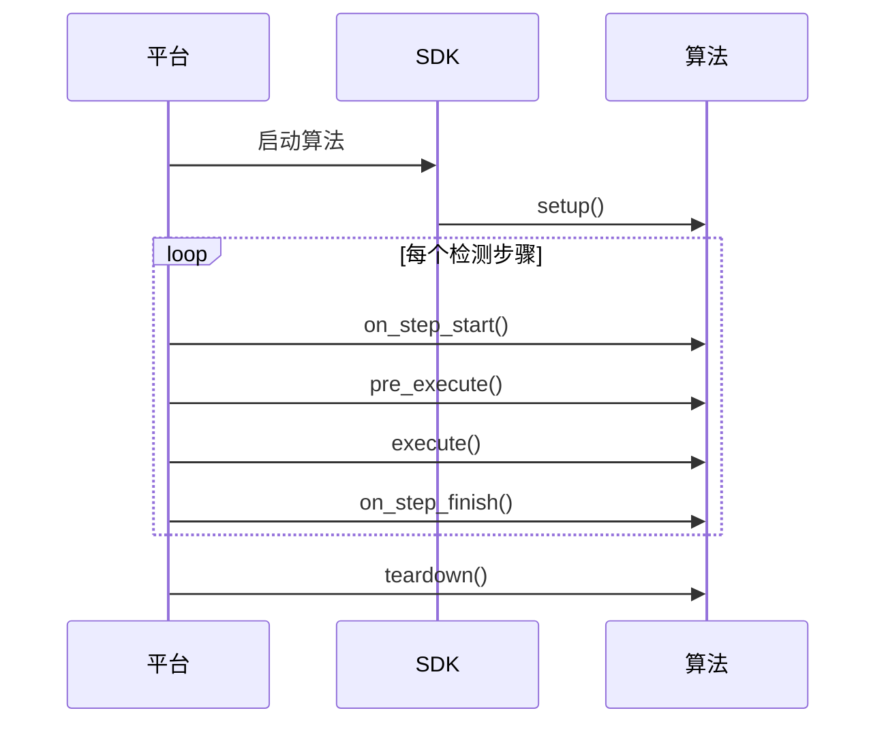
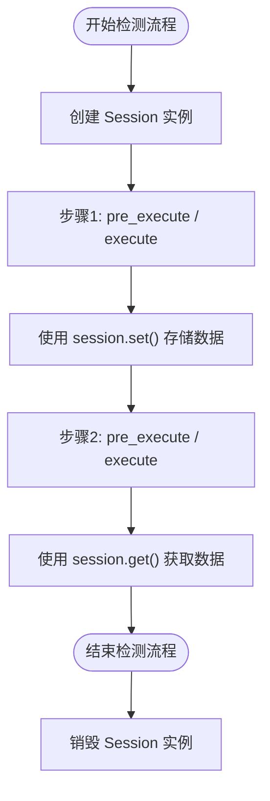
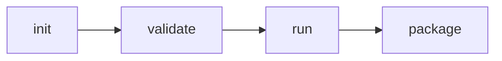
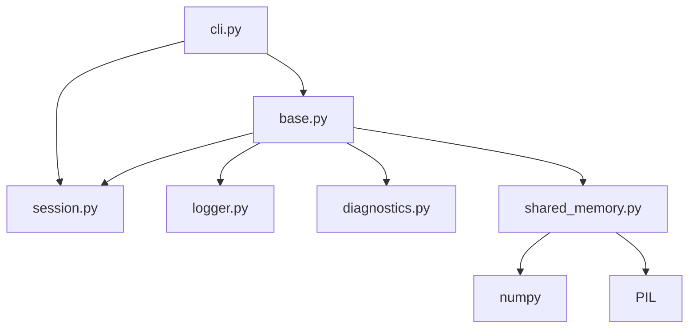

# 概述

<cite>
**本文档引用的文件**
- [main.py](file://algorithm-example/algorithm_example/main.py)
- [manifest.json](file://algorithm-example/manifest.json)
- [__init__.py](file://procvision_algorithm_sdk/__init__.py)
- [base.py](file://procvision_algorithm_sdk/base.py)
- [session.py](file://procvision_algorithm_sdk/session.py)
- [shared_memory.py](file://procvision_algorithm_sdk/shared_memory.py)
- [cli.py](file://procvision_algorithm_sdk/cli.py)
- [diagnostics.py](file://procvision_algorithm_sdk/diagnostics.py)
- [logger.py](file://procvision_algorithm_sdk/logger.py)
- [errors.py](file://procvision_algorithm_sdk/errors.py)
- [README.md](file://README.md)
- [algorithm_dev_tutorial.md](file://algorithm_dev_tutorial.md)
- [spec.md](file://spec.md)
</cite>

## 目录
1. [简介](#简介)
2. [项目结构](#项目结构)
3. [核心组件](#核心组件)
4. [架构概述](#架构概述)
5. [详细组件分析](#详细组件分析)
6. [依赖分析](#依赖分析)
7. [性能考量](#性能考量)
8. [故障排除指南](#故障排除指南)
9. [结论](#结论)

## 简介
工业视觉平台ProcVision算法SDK是一个为工业视觉应用设计的Python软件开发工具包。它提供了一套标准化的接口和工具，使算法开发者能够创建可与主平台无缝集成的算法模块。SDK的核心思想是实现平台与算法的解耦，通过定义清晰的接口契约，确保算法的可移植性、稳定性和可维护性。该SDK支持动态热加载、环境隔离和离线部署，旨在简化算法的开发、测试和交付流程。

## 项目结构
该项目遵循一个清晰的模块化结构，将核心SDK、示例代码、测试和文档分离。这种结构有助于维护代码的清晰度和可管理性。

```mermaid
graph TD
root[根目录] --> algorithm_example[algorithm-example]
root --> procvision_algorithm_sdk[procvision_algorithm_sdk]
root --> tests[tests]
root --> README_md[README.md]
root --> algorithm_dev_quickstart_md[algorithm_dev_quickstart.md]
root --> algorithm_dev_tutorial_md[algorithm_dev_tutorial.md]
root --> pyproject_toml[pyproject.toml]
root --> runner_spec_md[runner_spec.md]
root --> spec_md[spec.md]
root --> spec_architecture_review_md[spec_architecture_review.md]
root --> spec_runner_md[spec_runner.md]
root --> tag_recreate_ps1[tag-recreate.ps1]
algorithm_example --> algorithm_example_main[algorithm_example/main.py]
algorithm_example --> manifest_json[manifest.json]
procvision_algorithm_sdk --> init_py[__init__.py]
procvision_algorithm_sdk --> base_py[base.py]
procvision_algorithm_sdk --> session_py[session.py]
procvision_algorithm_sdk --> shared_memory_py[shared_memory.py]
procvision_algorithm_sdk --> cli_py[cli.py]
procvision_algorithm_sdk --> diagnostics_py[diagnostics.py]
procvision_algorithm_sdk --> logger_py[logger.py]
procvision_algorithm_sdk --> errors_py[errors.py]
```



**图示来源**
- [__init__.py](file://procvision_algorithm_sdk/__init__.py)
- [base.py](file://procvision_algorithm_sdk/base.py)
- [session.py](file://procvision_algorithm_sdk/session.py)
- [shared_memory.py](file://procvision_algorithm_sdk/shared_memory.py)
- [cli.py](file://procvision_algorithm_sdk/cli.py)
- [diagnostics.py](file://procvision_algorithm_sdk/diagnostics.py)
- [logger.py](file://procvision_algorithm_sdk/logger.py)
- [errors.py](file://procvision_algorithm_sdk/errors.py)
- [manifest.json](file://algorithm-example/manifest.json)

**本节来源**
- [__init__.py](file://procvision_algorithm_sdk/__init__.py)
- [base.py](file://procvision_algorithm_sdk/base.py)
- [session.py](file://procvision_algorithm_sdk/session.py)
- [shared_memory.py](file://procvision_algorithm_sdk/shared_memory.py)
- [cli.py](file://procvision_algorithm_sdk/cli.py)
- [diagnostics.py](file://procvision_algorithm_sdk/diagnostics.py)
- [logger.py](file://procvision_algorithm_sdk/logger.py)
- [errors.py](file://procvision_algorithm_sdk/errors.py)
- [manifest.json](file://algorithm-example/manifest.json)

## 核心组件
ProcVision算法SDK的核心组件包括一个抽象基类`BaseAlgorithm`，用于定义算法必须实现的接口，以及一系列辅助类和函数，用于处理会话状态、日志记录、诊断、共享内存图像读取和命令行操作。这些组件共同构成了一个完整的开发框架，使开发者能够专注于核心算法逻辑的实现，而无需关心底层的集成细节。

**本节来源**
- [__init__.py](file://procvision_algorithm_sdk/__init__.py)
- [base.py](file://procvision_algorithm_sdk/base.py)
- [session.py](file://procvision_algorithm_sdk/session.py)
- [shared_memory.py](file://procvision_algorithm_sdk/shared_memory.py)
- [diagnostics.py](file://procvision_algorithm_sdk/diagnostics.py)
- [logger.py](file://procvision_algorithm_sdk/logger.py)

## 架构概述
该SDK的架构围绕`BaseAlgorithm`抽象基类构建。算法开发者通过继承此类并实现其抽象方法来创建具体的算法。SDK通过`Session`类管理跨步骤的状态，通过`StructuredLogger`和`Diagnostics`类提供结构化日志和诊断数据上报功能，并通过`read_image_from_shared_memory`等函数处理与平台的图像数据交换。CLI工具`procvision-cli`则提供了一套完整的开发、验证和打包工具链。

```mermaid
classDiagram
class BaseAlgorithm {
+logger : StructuredLogger
+diagnostics : Diagnostics
+_resources_loaded : bool
+_model_version : Optional[str]
+_supported_pids : List[str]
+__init__()
+setup()
+teardown()
+on_step_start(step_index : int, session : Session, context : Dict[str, Any])
+on_step_finish(step_index : int, session : Session, result : Dict[str, Any])
+reset(session : Session)
+get_info() : Dict[str, Any]
+pre_execute(step_index : int, pid : str, session : Session, user_params : Dict[str, Any], shared_mem_id : str, image_meta : Dict[str, Any]) : Dict[str, Any]
+execute(step_index : int, pid : str, session : Session, user_params : Dict[str, Any], shared_mem_id : str, image_meta : Dict[str, Any]) : Dict[str, Any]
}
class Session {
-_id : str
-_state_store : Dict[str, Any]
-_context : Dict[str, Any]
+id : str
+context : Dict[str, Any]
+get(key : str, default : Any) : Any
+set(key : str, value : Any)
+delete(key : str) : bool
+exists(key : str) : bool
}
class StructuredLogger {
-sink : Any
+__init__(sink : Optional[Any])
+_emit(level : str, payload : Dict[str, Any])
+info(message : str, **fields : Any)
+debug(message : str, **fields : Any)
+error(message : str, **fields : Any)
}
class Diagnostics {
+items : Dict[str, Any]
+__init__()
+publish(key : str, value : Any)
+get() : Dict[str, Any]
}
class BaseAlgorithm <|-- UserAlgorithm
BaseAlgorithm --> Session
BaseAlgorithm --> StructuredLogger
BaseAlgorithm --> Diagnostics
BaseAlgorithm --> read_image_from_shared_memory
```

**图示来源**
- [base.py](file://procvision_algorithm_sdk/base.py)
- [session.py](file://procvision_algorithm_sdk/session.py)
- [logger.py](file://procvision_algorithm_sdk/logger.py)
- [diagnostics.py](file://procvision_algorithm_sdk/diagnostics.py)
- [shared_memory.py](file://procvision_algorithm_sdk/shared_memory.py)

## 详细组件分析
本节将深入分析SDK中的各个关键组件，解释其设计原理和使用方法。

### BaseAlgorithm 分析
`BaseAlgorithm`是SDK的核心抽象基类。所有自定义算法都必须继承此类并实现其抽象方法。它定义了算法的生命周期和与平台交互的接口。

#### 生命周期与方法
`BaseAlgorithm`定义了以下生命周期方法：
- `__init__()`: 构造函数，用于初始化轻量级资源。
- `setup()`: 在算法实例启动时调用，用于加载模型等重量级资源。
- `teardown()`: 在算法实例销毁前调用，用于释放资源。
- `on_step_start()` 和 `on_step_finish()`: 分别在每步执行前后调用，可用于记录时间戳或统计耗时。
- `reset()`: 当平台触发重新检测时调用，用于清理本次检测相关的临时资源。

#### 抽象方法
必须实现的抽象方法有：
- `get_info()`: 返回算法的元信息，如名称、版本、支持的产品型号（PID）和步骤配置。
- `pre_execute()`: 在执行核心检测逻辑前调用，可用于产出参考信息，如标定框。
- `execute()`: 执行核心检测逻辑，返回检测结果。



**图示来源**
- [base.py](file://procvision_algorithm_sdk/base.py)

**本节来源**
- [base.py](file://procvision_algorithm_sdk/base.py)
- [spec.md](file://spec.md)

### Session 分析
`Session`类用于在单次检测流程中跨步骤共享数据。它提供了一个键值存储（KV存储），允许算法在不同步骤之间传递信息。

#### API 与约束
- `get(key, default)`: 获取存储的值。
- `set(key, value)`: 设置存储的值，值必须是JSON可序列化的。
- `delete(key)`: 删除指定的键。
- `exists(key)`: 检查键是否存在。

`Session`的生命周期与单次检测流程绑定，跨产品检测会重新初始化。数据存储在内存中，不建议存储大量数据。



**图示来源**
- [session.py](file://procvision_algorithm_sdk/session.py)

**本节来源**
- [session.py](file://procvision_algorithm_sdk/session.py)
- [algorithm_dev_tutorial.md](file://algorithm_dev_tutorial.md)

### 共享内存与图像处理
SDK通过共享内存机制与平台交换图像数据。算法使用`read_image_from_shared_memory`函数从共享内存中读取图像。

#### 功能与兼容性
该函数支持从字节数据（JPEG/PNG）或`numpy.ndarray`中读取图像。它会自动处理灰度图到三通道的转换，并根据`image_meta`中的`color_space`字段进行BGR到RGB的转换。如果读取失败，会返回一个指定尺寸的零矩阵作为回退。

**本节来源**
- [shared_memory.py](file://procvision_algorithm_sdk/shared_memory.py)
- [algorithm_dev_tutorial.md](file://algorithm_dev_tutorial.md)

### CLI 工具分析
`procvision-cli`是一个命令行工具，为开发者提供了一套完整的开发辅助功能。

#### 子命令
- `validate`: 校验算法包的结构和入口实现。
- `run`: 在本地模拟运行算法，使用本地图片测试。
- `package`: 构建离线交付的ZIP包。
- `init`: 初始化一个新的算法项目脚手架。



**图示来源**
- [cli.py](file://procvision_algorithm_sdk/cli.py)

**本节来源**
- [cli.py](file://procvision_algorithm_sdk/cli.py)
- [README.md](file://README.md)

## 依赖分析
SDK的依赖关系清晰，核心模块之间耦合度低。`BaseAlgorithm`依赖于`Session`、`StructuredLogger`和`Diagnostics`等辅助类，而`cli.py`则依赖于`BaseAlgorithm`和`Session`来实现其功能。外部依赖包括`numpy`和`PIL`，用于图像处理。



**图示来源**
- [go.mod](file://pyproject.toml)

**本节来源**
- [pyproject.toml](file://pyproject.toml)
- [cli.py](file://procvision_algorithm_sdk/cli.py)
- [base.py](file://procvision_algorithm_sdk/base.py)

## 性能考量
SDK的设计考虑了性能因素。例如，`Session`的KV存储要求值是JSON可序列化的，这保证了数据交换的效率。共享内存图像读取经过优化，能够高效处理不同格式的图像数据。CLI工具的`validate`命令通过一系列快速检查来确保算法包的正确性，避免了在生产环境中出现集成问题。

## 故障排除指南
当遇到问题时，应首先检查`manifest.json`中的`supported_pids`是否与`get_info()`方法返回的`supported_pids`一致。其次，确保`requirements.txt`中的依赖项与目标环境兼容。使用`procvision-cli validate`命令可以快速发现结构和实现上的问题。查看结构化日志是诊断运行时错误的关键。

**本节来源**
- [errors.py](file://procvision_algorithm_sdk/errors.py)
- [logger.py](file://procvision_algorithm_sdk/logger.py)
- [algorithm_dev_tutorial.md](file://algorithm_dev_tutorial.md)

## 结论
ProcVision算法SDK提供了一个强大而灵活的框架，用于开发工业视觉应用的算法。通过遵循其定义的接口和规范，开发者可以创建出高质量、可维护且易于集成的算法模块。其提供的CLI工具极大地简化了开发和测试流程，确保了交付物的可靠性。该SDK是实现平台与算法解耦、提高开发效率的理想选择。