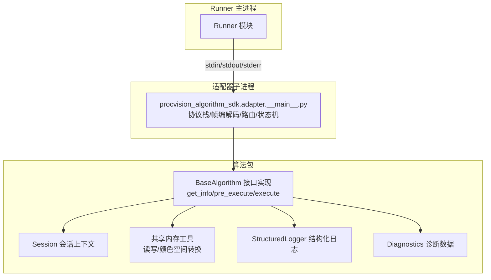
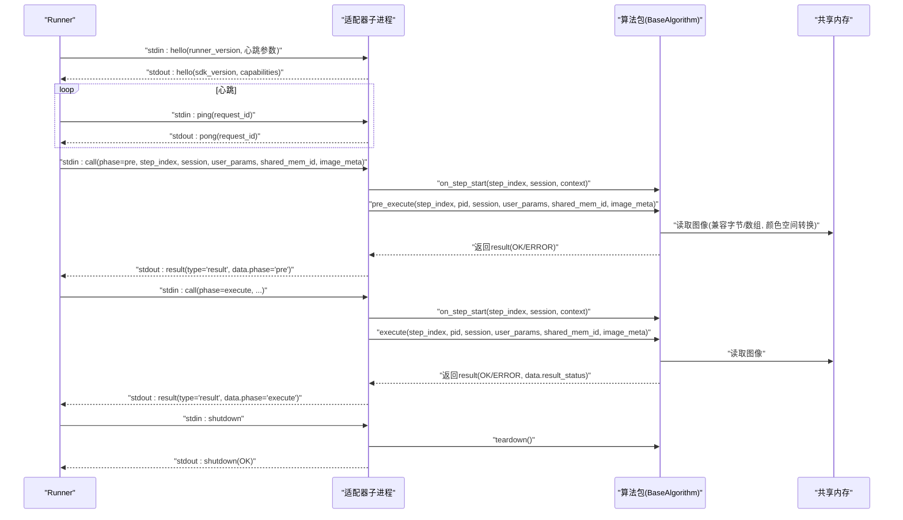
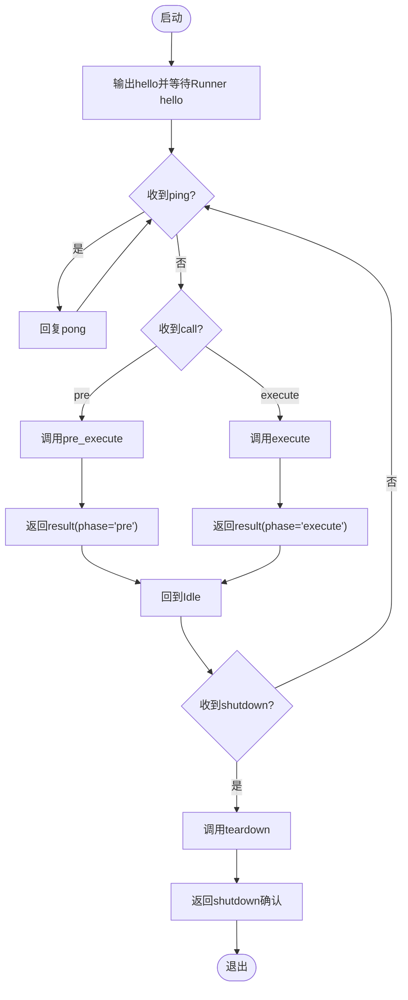
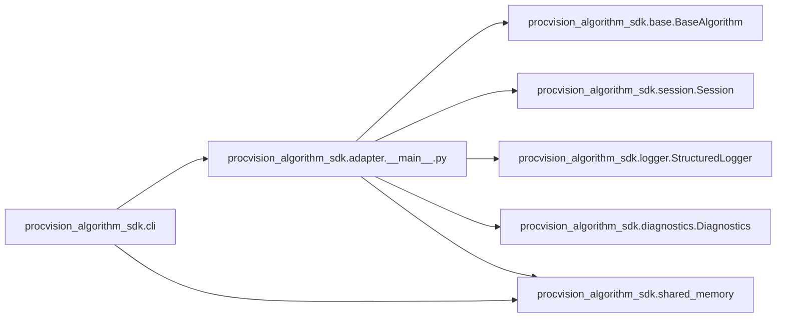

# 协议适配器规范

<cite>
**本文引用的文件**
- [protocol_adapter_spec.md](file://protocol_adapter_spec.md)
- [spec.md](file://spec.md)
- [README.md](file://README.md)
- [procvision_algorithm_sdk/adapter/__main__.py](file://procvision_algorithm_sdk/adapter/__main__.py)
- [procvision_algorithm_sdk/base.py](file://procvision_algorithm_sdk/base.py)
- [procvision_algorithm_sdk/session.py](file://procvision_algorithm_sdk/session.py)
- [procvision_algorithm_sdk/shared_memory.py](file://procvision_algorithm_sdk/shared_memory.py)
- [procvision_algorithm_sdk/logger.py](file://procvision_algorithm_sdk/logger.py)
- [procvision_algorithm_sdk/diagnostics.py](file://procvision_algorithm_sdk/diagnostics.py)
- [procvision_algorithm_sdk/cli.py](file://procvision_algorithm_sdk/cli.py)
- [tests/test_adapter_handshake.py](file://tests/test_adapter_handshake.py)
- [pyproject.toml](file://pyproject.toml)
</cite>

## 目录
1. [简介](#简介)
2. [项目结构](#项目结构)
3. [核心组件](#核心组件)
4. [架构总览](#架构总览)
5. [组件详解](#组件详解)
6. [依赖关系分析](#依赖关系分析)
7. [性能考量](#性能考量)
8. [故障排查指南](#故障排查指南)
9. [结论](#结论)
10. [附录](#附录)

## 简介
本文件系统化梳理“协议适配器规范”，聚焦于SDK内置的协议适配器（子进程）如何与Runner进行稳定、可诊断、可演进的通信。适配器负责协议握手、心跳保活、帧编解码、消息路由、状态机执行、日志与诊断输出，以及与算法包的生命周期钩子对接。算法包仅实现业务方法与可选钩子，通过统一的帧协议与Runner交互，确保平台与算法解耦、进程隔离与离线交付。

## 项目结构
围绕协议适配器，核心文件分布如下：
- 协议规范：protocol_adapter_spec.md（适配器行为与边界）
- SDK接口契约：spec.md（BaseAlgorithm、Session、共享内存、心跳与错误语义）
- 适配器实现：procvision_algorithm_sdk/adapter/__main__.py（子进程协议栈）
- SDK基础能力：base.py、session.py、shared_memory.py、logger.py、diagnostics.py
- CLI与开发工具：procvision_algorithm_sdk/cli.py（Dev Runner、帧编解码、适配器模式）
- 测试：tests/test_adapter_handshake.py（握手与关闭流程）
- 包配置：pyproject.toml（入口脚本、依赖）

图表来源
- [procvision_algorithm_sdk/adapter/__main__.py](file://procvision_algorithm_sdk/adapter/__main__.py#L1-L253)
- [procvision_algorithm_sdk/base.py](file://procvision_algorithm_sdk/base.py#L1-L58)
- [procvision_algorithm_sdk/session.py](file://procvision_algorithm_sdk/session.py#L1-L36)
- [procvision_algorithm_sdk/shared_memory.py](file://procvision_algorithm_sdk/shared_memory.py#L1-L117)
- [procvision_algorithm_sdk/logger.py](file://procvision_algorithm_sdk/logger.py#L1-L24)
- [procvision_algorithm_sdk/diagnostics.py](file://procvision_algorithm_sdk/diagnostics.py#L1-L12)

章节来源
- [protocol_adapter_spec.md](file://protocol_adapter_spec.md#L1-L184)
- [spec.md](file://spec.md#L1-L200)
- [README.md](file://README.md#L1-L131)

## 核心组件
- 协议适配器（子进程）：实现帧协议、握手、心跳、路由、状态机、错误与关闭处理，加载算法入口类并调用生命周期钩子与业务方法。
- BaseAlgorithm：算法包实现的抽象接口，定义 get_info、pre_execute、execute 与可选钩子。
- Session：会话上下文，跨步骤共享状态，仅在单次检测流程内有效。
- 共享内存工具：提供开发态与子进程态一致的读写接口，支持数组与字节两种形态，自动处理颜色空间转换。
- 结构化日志：统一输出到stderr，字段包含级别、时间戳、会话/步骤/耗时等，避免污染协议帧。
- 诊断数据：Diagnostics 提供键值对收集，配合结果返回或上报接口用于UI展示与远程排查。
- CLI（Dev Runner）：提供 validate/run/package/init 等命令，支持以适配器子进程方式模拟握手与调用。

章节来源
- [procvision_algorithm_sdk/adapter/__main__.py](file://procvision_algorithm_sdk/adapter/__main__.py#L1-L253)
- [procvision_algorithm_sdk/base.py](file://procvision_algorithm_sdk/base.py#L1-L58)
- [procvision_algorithm_sdk/session.py](file://procvision_algorithm_sdk/session.py#L1-L36)
- [procvision_algorithm_sdk/shared_memory.py](file://procvision_algorithm_sdk/shared_memory.py#L1-L117)
- [procvision_algorithm_sdk/logger.py](file://procvision_algorithm_sdk/logger.py#L1-L24)
- [procvision_algorithm_sdk/diagnostics.py](file://procvision_algorithm_sdk/diagnostics.py#L1-L12)
- [procvision_algorithm_sdk/cli.py](file://procvision_algorithm_sdk/cli.py#L1-L200)

## 架构总览
适配器作为子进程，通过stdin/stdout/stderr与Runner通信，严格遵循“4字节大端长度 + UTF-8 JSON”帧格式。启动后立即输出hello，等待Runner的hello与心跳参数，随后进入串行状态机：Idle → RunningPre → Idle → RunningExec → Idle → ShuttingDown。调用阶段按phase路由到pre_execute或execute，返回result帧；心跳由Runner定期发起，适配器需在超时前回复pong。

图表来源
- [protocol_adapter_spec.md](file://protocol_adapter_spec.md#L24-L123)
- [procvision_algorithm_sdk/adapter/__main__.py](file://procvision_algorithm_sdk/adapter/__main__.py#L128-L250)
- [procvision_algorithm_sdk/shared_memory.py](file://procvision_algorithm_sdk/shared_memory.py#L47-L117)
- [procvision_algorithm_sdk/base.py](file://procvision_algorithm_sdk/base.py#L1-L58)

## 组件详解

### 协议适配器（子进程）
- 帧编解码：实现长度前缀的JSON帧读写，保证无粘包；严格区分stdout（协议帧）与stderr（结构化日志）。
- 握手与能力：启动即输出hello，包含sdk_version与capabilities；Runner回应hello并携带心跳参数；能力不匹配时发送error并优雅退出。
- 心跳保活：收到ping立即回复pong，避免阻塞；Runner负责超时与重试策略。
- 路由与状态机：串行单并发，Idle→RunningPre→Idle→RunningExec→Idle→ShuttingDown；并发call按策略排队或返回错误。
- 调用路由：phase=pre→pre_execute；phase=execute→execute；返回result帧，data中回传phase与step_index。
- 生命周期钩子：在pre_execute/execute前后调用on_step_start/on_step_finish；teardown在shutdown或异常退出时调用。
- 错误处理：对非法返回、异常、资源不可用等情况返回error帧；错误码集合见规范。
- 关闭流程：Runner发送shutdown，适配器调用teardown并回传shutdown确认后退出。

图表来源
- [procvision_algorithm_sdk/adapter/__main__.py](file://procvision_algorithm_sdk/adapter/__main__.py#L128-L250)
- [protocol_adapter_spec.md](file://protocol_adapter_spec.md#L45-L123)

章节来源
- [procvision_algorithm_sdk/adapter/__main__.py](file://procvision_algorithm_sdk/adapter/__main__.py#L1-L253)
- [protocol_adapter_spec.md](file://protocol_adapter_spec.md#L24-L123)

### BaseAlgorithm 接口与生命周期
- 接口方法：get_info、pre_execute、execute；可选钩子：setup、teardown、on_step_start、on_step_finish、reset。
- 参数分组：步骤控制（step_index）、上下文（pid、session）、用户输入（user_params）、图像数据（shared_mem_id、image_meta）。
- 返回结构：首层status/message，二层data承载业务结果；pre_execute不返回业务判定，execute的业务判定在data.result_status（OK/NG）。
- 会话Session：仅在单次检测流程内有效，跨产品检测会重新初始化；不跨检测持久化数据，建议<100KB。

章节来源
- [spec.md](file://spec.md#L320-L401)
- [procvision_algorithm_sdk/base.py](file://procvision_algorithm_sdk/base.py#L1-L58)
- [procvision_algorithm_sdk/session.py](file://procvision_algorithm_sdk/session.py#L1-L36)

### 共享内存约定与读写
- Runner写入：JPEG字节或numpy数组（H×W×3，uint8），默认RGB；Mono8扩展为3通道。
- 元信息最小集：width、height、timestamp_ms、camera_id；可选color_space（默认RGB）。
- 读取兼容：适配器与算法侧均可使用read_image_from_shared_memory，自动处理字节与数组、颜色空间转换（BGR→RGB）。
- 写入调试：write_image_array_to_shared_memory用于调试回写或中间结果。

章节来源
- [protocol_adapter_spec.md](file://protocol_adapter_spec.md#L85-L92)
- [procvision_algorithm_sdk/shared_memory.py](file://procvision_algorithm_sdk/shared_memory.py#L1-L117)

### 结构化日志与诊断
- 日志输出：统一写入stderr，JSON Lines格式，字段包含level、timestamp_ms、message、step_index、pid、session_id、latency_ms、model_version、extra等。
- 诊断数据：Diagnostics收集键值对，配合结果返回或上报接口用于UI展示与远程排查。
- 适配器日志：仅在stdout输出协议帧，避免污染stderr。

章节来源
- [protocol_adapter_spec.md](file://protocol_adapter_spec.md#L124-L132)
- [procvision_algorithm_sdk/logger.py](file://procvision_algorithm_sdk/logger.py#L1-L24)
- [procvision_algorithm_sdk/diagnostics.py](file://procvision_algorithm_sdk/diagnostics.py#L1-L12)

### CLI（Dev Runner）与适配器模式
- validate：校验manifest、入口类、supported_pids一致性与返回结构；支持完整握手+调用校验（--full）。
- run：本地模拟运行，支持以适配器子进程方式通过帧协议与共享内存读写；支持tail-logs实时输出子进程日志。
- package：构建离线交付zip，下载wheels并打包源码、manifest、requirements与assets。
- init：初始化算法包脚手架，生成manifest与包源码目录。

章节来源
- [procvision_algorithm_sdk/cli.py](file://procvision_algorithm_sdk/cli.py#L1-L200)
- [README.md](file://README.md#L63-L105)

## 依赖关系分析
- 适配器依赖SDK基础能力：BaseAlgorithm、Session、SharedLogger、Diagnostics。
- 适配器通过入口自动发现机制加载算法类，支持命令行、环境变量、manifest、pyproject.toml与默认入口。
- CLI在适配器模式下，通过subprocess启动适配器子进程，复用帧编解码与共享内存工具。

图表来源
- [procvision_algorithm_sdk/cli.py](file://procvision_algorithm_sdk/cli.py#L521-L594)
- [procvision_algorithm_sdk/adapter/__main__.py](file://procvision_algorithm_sdk/adapter/__main__.py#L1-L253)
- [procvision_algorithm_sdk/base.py](file://procvision_algorithm_sdk/base.py#L1-L58)
- [procvision_algorithm_sdk/session.py](file://procvision_algorithm_sdk/session.py#L1-L36)
- [procvision_algorithm_sdk/logger.py](file://procvision_algorithm_sdk/logger.py#L1-L24)
- [procvision_algorithm_sdk/diagnostics.py](file://procvision_algorithm_sdk/diagnostics.py#L1-L12)
- [procvision_algorithm_sdk/shared_memory.py](file://procvision_algorithm_sdk/shared_memory.py#L1-L117)

章节来源
- [procvision_algorithm_sdk/adapter/__main__.py](file://procvision_algorithm_sdk/adapter/__main__.py#L60-L118)
- [procvision_algorithm_sdk/cli.py](file://procvision_algorithm_sdk/cli.py#L521-L594)
- [pyproject.toml](file://pyproject.toml#L31-L37)

## 性能考量
- 心跳与保活：Runner定期发送ping，适配器需在grace时间内回复pong；建议在高频业务调用期间降低心跳频率，空闲时恢复。
- 背压与并发：默认max_inflight=1，收到并发call时按到达顺序排队或返回错误；Runner需与算法包约定并发策略。
- 共享内存：避免在JSON中传输Base64图像，统一使用JPEG字节或数组；颜色空间转换在读取侧完成，减少重复转换开销。
- 资源限制：适配器避免创建无界线程与缓冲队列；Runner可结合容器或操作系统层实现CPU/GPU/内存限制。
- 日志与协议隔离：仅stdout输出协议帧，stderr输出结构化日志，避免协议流被污染。

章节来源
- [protocol_adapter_spec.md](file://protocol_adapter_spec.md#L56-L92)
- [spec.md](file://spec.md#L616-L677)

## 故障排查指南
- 握手失败：检查适配器是否输出hello，Runner是否回应hello；能力不匹配时查看error帧与日志。
- 心跳丢失：确认pong及时回复；Runner超时后会记录日志并尝试重启；检查算法处理是否阻塞。
- 调用超时：pre_execute默认≤10秒，execute默认≤30秒；检查算法内部耗时与资源占用。
- 共享内存读写：确认shared_mem_id与image_meta一致；颜色空间转换是否正确；必要时使用write_image_array_to_shared_memory进行调试。
- 错误码定位：依据规范中的错误码集合（如1000-1009）快速定位问题类型（未知/参数无效/未初始化/心跳丢失/共享内存未找到等）。
- 单元测试：使用tests/test_adapter_handshake.py验证hello与shutdown流程；结合CLI的validate与run进行端到端自测。

章节来源
- [protocol_adapter_spec.md](file://protocol_adapter_spec.md#L93-L123)
- [tests/test_adapter_handshake.py](file://tests/test_adapter_handshake.py#L1-L83)
- [procvision_algorithm_sdk/cli.py](file://procvision_algorithm_sdk/cli.py#L521-L594)

## 结论
协议适配器规范明确了Runner与算法包之间稳定、可诊断、可演进的通信契约。通过严格的帧协议、心跳保活、状态机与生命周期钩子，适配器实现了与Runner的解耦集成与进程隔离。算法包仅需实现BaseAlgorithm接口与可选钩子，即可在统一规范下完成离线交付与稳定运行。建议在开发与集成过程中严格遵循规范，充分利用CLI与测试用例保障质量。

## 附录
- 入口自动发现优先级：命令行(--entry) > 环境变量(PROC_ENTRY_POINT) > manifest.json/yaml > pyproject.toml > 默认(algorithm.main:Algorithm)。
- 启动命令（Runner集成）：Windows/Linux分别使用venv下的python解释器运行适配器模块，工作目录设为算法包根，常用环境变量包括PROC_ENV、PROC_ALGO_ROOT、PROC_SESSION_ID。
- 版本与兼容：协议适配器随SDK版本发布；Runner与算法包统一升级路径，遵循语义化版本；能力标记通过hello.capabilities宣告。

章节来源
- [protocol_adapter_spec.md](file://protocol_adapter_spec.md#L137-L155)
- [README.md](file://README.md#L75-L81)
- [pyproject.toml](file://pyproject.toml#L31-L37)