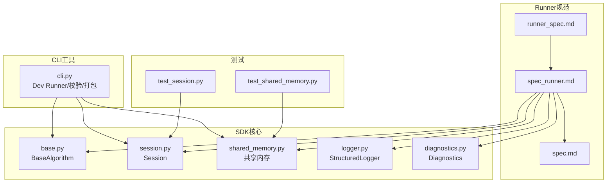
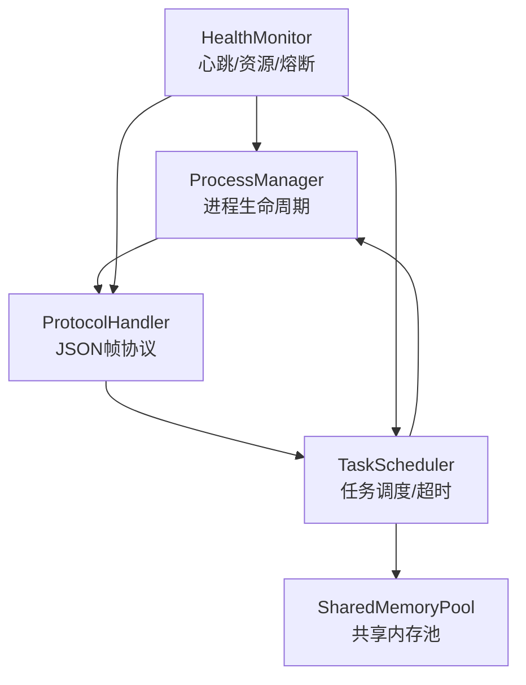
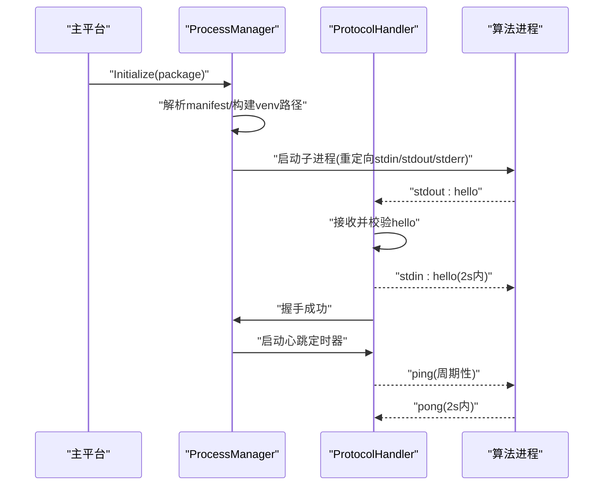
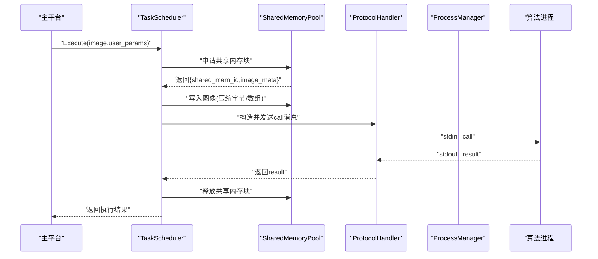
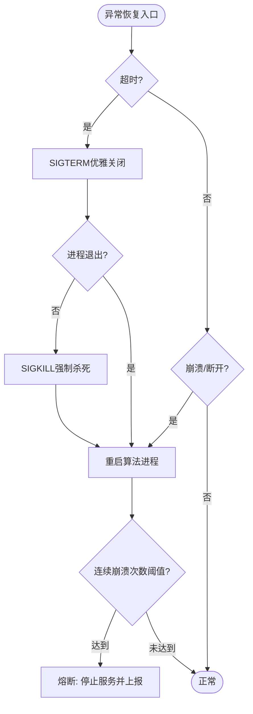
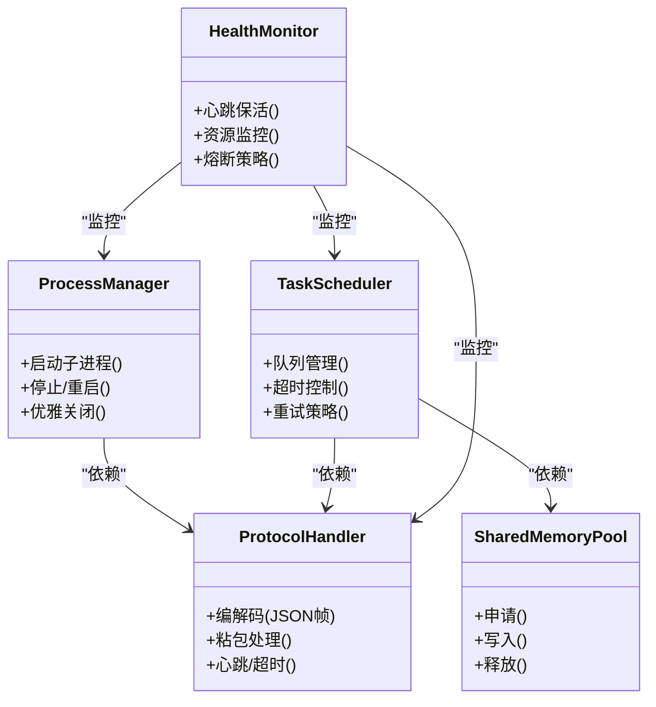
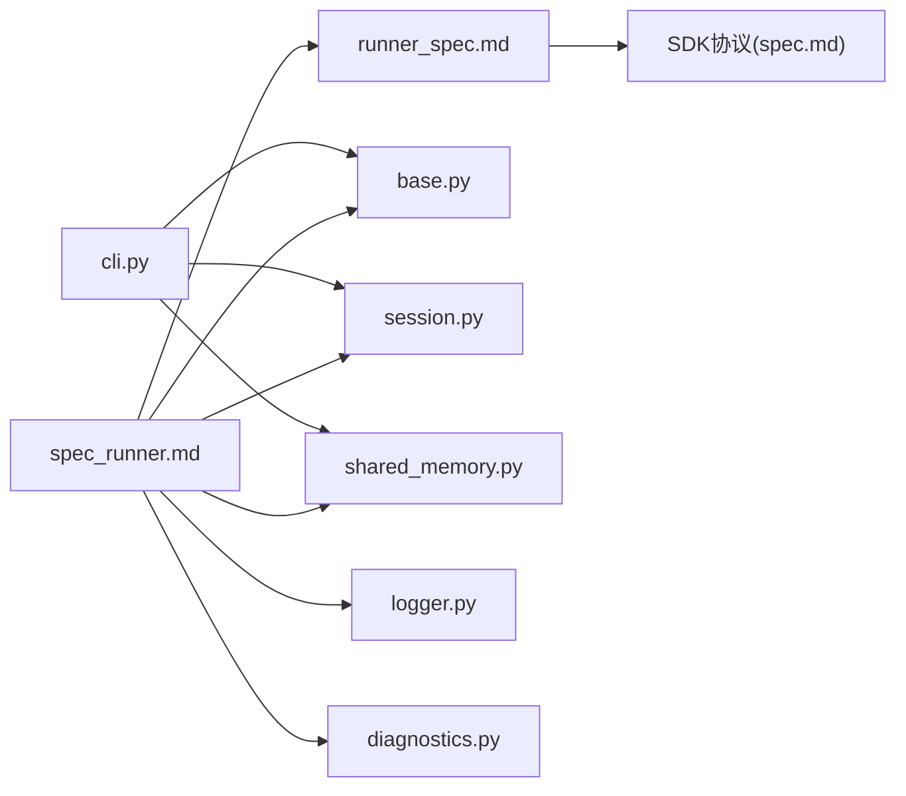

# 生产级Runner规范

<cite>
**本文引用的文件**
- [runner_spec.md](file://runner_spec.md)
- [spec_runner.md](file://spec_runner.md)
- [spec.md](file://spec.md)
- [README.md](file://README.md)
- [procvision_algorithm_sdk/base.py](file://procvision_algorithm_sdk/base.py)
- [procvision_algorithm_sdk/session.py](file://procvision_algorithm_sdk/session.py)
- [procvision_algorithm_sdk/shared_memory.py](file://procvision_algorithm_sdk/shared_memory.py)
- [procvision_algorithm_sdk/cli.py](file://procvision_algorithm_sdk/cli.py)
- [procvision_algorithm_sdk/logger.py](file://procvision_algorithm_sdk/logger.py)
- [procvision_algorithm_sdk/diagnostics.py](file://procvision_algorithm_sdk/diagnostics.py)
- [tests/test_shared_memory.py](file://tests/test_shared_memory.py)
- [tests/test_session.py](file://tests/test_session.py)
</cite>

## 目录
1. [简介](#简介)
2. [项目结构](#项目结构)
3. [核心组件](#核心组件)
4. [架构总览](#架构总览)
5. [详细组件分析](#详细组件分析)
6. [依赖关系分析](#依赖关系分析)
7. [性能考量](#性能考量)
8. [故障排查指南](#故障排查指南)
9. [结论](#结论)
10. [附录](#附录)

## 简介
本规范面向工业视觉平台的生产级Runner（Production Runner），定义其在主平台中的职责边界、模块化架构与关键流程，确保与SDK协议对齐、满足高并发与高稳定性的生产落地需求。Runner负责进程管理、通信调度、共享内存池管理、任务调度与健康监控，并提供包管理、遥测上报与安全隔离能力。

对比定位：
- Dev Runner（SDK内置）：侧重开发体验、协议验证与单次调试；
- Production Runner（平台侧）：强调高并发、高稳定性、容错恢复与资源隔离，与包管理/上报集成。

**章节来源**
- [spec_runner.md](file://spec_runner.md#L1-L33)

## 项目结构
本仓库围绕算法SDK与Runner规范展开，核心文件与职责如下：
- Runner规范文档：runner_spec.md、spec_runner.md，定义Runner职责、模块划分、关键流程与性能/安全/遥测要求。
- SDK基础能力：base.py（算法抽象基类）、session.py（会话KV）、shared_memory.py（共享内存读写）、logger.py（结构化日志）、diagnostics.py（诊断数据）。
- CLI工具：procvision_algorithm_sdk/cli.py，提供包校验、本地运行、离线包打包与脚手架初始化，体现Dev Runner行为与协议对齐。
- 单元测试：tests/test_shared_memory.py、tests/test_session.py，验证共享内存读写与会话KV行为。

**图表来源**
- [runner_spec.md](file://runner_spec.md#L1-L288)
- [spec_runner.md](file://spec_runner.md#L1-L192)
- [spec.md](file://spec.md#L634-L637)
- [procvision_algorithm_sdk/base.py](file://procvision_algorithm_sdk/base.py#L1-L58)
- [procvision_algorithm_sdk/session.py](file://procvision_algorithm_sdk/session.py#L1-L36)
- [procvision_algorithm_sdk/shared_memory.py](file://procvision_algorithm_sdk/shared_memory.py#L1-L53)
- [procvision_algorithm_sdk/cli.py](file://procvision_algorithm_sdk/cli.py#L1-L615)
- [procvision_algorithm_sdk/logger.py](file://procvision_algorithm_sdk/logger.py#L1-L24)
- [procvision_algorithm_sdk/diagnostics.py](file://procvision_algorithm_sdk/diagnostics.py#L1-L12)
- [tests/test_shared_memory.py](file://tests/test_shared_memory.py#L1-L16)
- [tests/test_session.py](file://tests/test_session.py#L1-L24)

**章节来源**
- [runner_spec.md](file://runner_spec.md#L1-L288)
- [spec_runner.md](file://spec_runner.md#L1-L192)
- [README.md](file://README.md#L1-L116)

## 核心组件
生产级Runner由以下五大模块构成，职责明确、边界清晰，协同完成进程生命周期、协议通信、共享内存、任务调度与健康监控。

- ProcessManager（进程管理）
  - 负责算法子进程的启动、停止、重启与僵尸进程清理；与包管理结合，按PID/版本路由到对应算法包；支持优雅关闭与强制终止。
- ProtocolHandler（协议处理）
  - 基于stdin/stdout的JSON帧协议，实现长度前缀封包、粘包拆分、hello/pong/ping/call/result等消息编解码；stderr用于结构化日志。
- SharedMemoryPool（共享内存池）
  - RingBuffer设计的共享内存池，负责申请、复用与回收内存块，支撑零拷贝图像传输；与SDK共享内存接口对齐。
- TaskScheduler（任务调度）
  - 维护请求队列与并发控制，为每个调用设置超时计时器；在超时/错误时触发重试或终止；与HealthMonitor联动。
- HealthMonitor（健康监控）
  - 心跳保活（ping/pong）、CPU/内存监控、看门狗与熔断策略；在心跳丢失/错误累计阈值时触发重启与熔断。

**章节来源**
- [spec_runner.md](file://spec_runner.md#L1-L80)
- [runner_spec.md](file://runner_spec.md#L1-L120)

## 架构总览
Runner采用模块化分层架构，各模块通过清晰的接口协作，形成稳定的生产级执行链路。

**图表来源**
- [spec_runner.md](file://spec_runner.md#L1-L80)

## 详细组件分析

### 启动流程（环境配置、进程启动、握手）
- 读取算法包manifest.json，解析entry_point与依赖配置；
- 配置Python解释器环境（虚拟环境路径），启动子进程并重定向stdin/stdout/stderr；
- 等待算法发送hello消息，Runner在2s内回复hello完成握手；
- 启动心跳定时器，进入running态。

**图表来源**
- [runner_spec.md](file://runner_spec.md#L1-L120)
- [spec_runner.md](file://spec_runner.md#L34-L80)

**章节来源**
- [runner_spec.md](file://runner_spec.md#L1-L120)
- [spec_runner.md](file://spec_runner.md#L34-L80)

### 执行流程（共享内存申请、图像写入、call消息发送、结果等待）
- 从相机获取图像数据；
- 从SharedMemoryPool申请空闲内存块；
- 将图像写入共享内存（支持压缩字节与数组两种模式）；
- 构造call消息（包含step_index、pid、session、user_params、shared_mem_id、image_meta、phase），写入子进程stdin；
- 启动超时计时器，等待result消息；
- 解析结果，释放共享内存块回池。

**图表来源**
- [runner_spec.md](file://runner_spec.md#L1-L120)
- [spec_runner.md](file://spec_runner.md#L34-L80)
- [procvision_algorithm_sdk/shared_memory.py](file://procvision_algorithm_sdk/shared_memory.py#L1-L53)

**章节来源**
- [runner_spec.md](file://runner_spec.md#L1-L120)
- [spec_runner.md](file://spec_runner.md#L34-L80)
- [procvision_algorithm_sdk/shared_memory.py](file://procvision_algorithm_sdk/shared_memory.py#L1-L53)

### 异常恢复流程（超时处理、崩溃检测、重启与熔断策略）
- 超时：若算法在规定时间内未响应，发送SIGTERM尝试优雅关闭；若无效，发送SIGKILL强制杀死；
- 崩溃：监听SIGCHLD或管道断开事件；
- 重启策略：立即重启（最多重试N次）；若短时间内连续崩溃（如1分钟内5次），进入“熔断状态”，停止服务并上报。

**图表来源**
- [spec_runner.md](file://spec_runner.md#L34-L80)

**章节来源**
- [spec_runner.md](file://spec_runner.md#L34-L80)

### 模块间交互与职责边界
- ProcessManager与ProtocolHandler：进程生命周期与协议编解码强耦合，握手、心跳、指令与结果均通过ProtocolHandler流转；
- SharedMemoryPool与TaskScheduler：任务调度依赖共享内存池的申请/释放，二者通过消息体中的shared_mem_id/image_meta衔接；
- HealthMonitor贯穿所有模块：对进程心跳、资源使用与异常进行统一监控，触发重启与熔断。

**图表来源**
- [spec_runner.md](file://spec_runner.md#L1-L80)

**章节来源**
- [spec_runner.md](file://spec_runner.md#L1-L80)

## 依赖关系分析
- Runner规范与SDK协议对齐：Runner规范与SDK规范在hello/pong/ping/call/result、image_meta、共享内存模式等方面保持一致；
- SDK模块依赖：BaseAlgorithm、Session、SharedMemory、StructuredLogger、Diagnostics为Runner提供算法侧能力与日志/状态支持；
- CLI工具：Dev Runner通过procvision-cli验证包结构、入口与协议一致性，体现Runner协议与SDK对齐。

**图表来源**
- [runner_spec.md](file://runner_spec.md#L1-L288)
- [spec_runner.md](file://spec_runner.md#L1-L192)
- [spec.md](file://spec.md#L634-L637)
- [procvision_algorithm_sdk/base.py](file://procvision_algorithm_sdk/base.py#L1-L58)
- [procvision_algorithm_sdk/session.py](file://procvision_algorithm_sdk/session.py#L1-L36)
- [procvision_algorithm_sdk/shared_memory.py](file://procvision_algorithm_sdk/shared_memory.py#L1-L53)
- [procvision_algorithm_sdk/logger.py](file://procvision_algorithm_sdk/logger.py#L1-L24)
- [procvision_algorithm_sdk/diagnostics.py](file://procvision_algorithm_sdk/diagnostics.py#L1-L12)
- [procvision_algorithm_sdk/cli.py](file://procvision_algorithm_sdk/cli.py#L1-L615)

**章节来源**
- [runner_spec.md](file://runner_spec.md#L1-L288)
- [spec_runner.md](file://spec_runner.md#L1-L192)
- [spec.md](file://spec.md#L634-L637)
- [procvision_algorithm_sdk/cli.py](file://procvision_algorithm_sdk/cli.py#L1-L615)

## 性能考量
- 启动时间：冷启动<2秒；
- 通信延迟：协议序列化+传输<1ms；
- 吞吐量：支持流水线模式，在多核CPU上不成为瓶颈；
- 内存开销：Runner自身管理开销<50MB；
- 共享内存：零拷贝传输，减少CPU与内存拷贝；
- 超时与重试：可配置pre_execute/execute超时与最大重试次数，避免阻塞；
- 资源配额：建议使用cgroups/Job Objects限制CPU/GPU/内存，防止泄漏影响系统。

**章节来源**
- [spec_runner.md](file://spec_runner.md#L81-L120)
- [runner_spec.md](file://runner_spec.md#L1-L120)

## 故障排查指南
- 协议问题
  - 确认stdout/stderr分离，协议帧长度前缀与JSON格式正确；
  - 检查hello/pong/ping/pong是否按规范往返；
- 共享内存问题
  - 确认shared_mem_id与image_meta一致，写入/读取模式与color_space匹配；
  - 使用单元测试验证读写回退逻辑；
- 会话状态问题
  - 确认Session的key为JSON可序列化，set/get/delete/exists行为正常；
- 心跳与超时
  - 检查心跳间隔与grace时间配置，确认超时后重试策略生效；
- 进程异常
  - 观察SIGCHLD/管道断开事件，确认重启与熔断策略触发条件。

**章节来源**
- [runner_spec.md](file://runner_spec.md#L1-L288)
- [tests/test_shared_memory.py](file://tests/test_shared_memory.py#L1-L16)
- [tests/test_session.py](file://tests/test_session.py#L1-L24)

## 结论
生产级Runner以模块化架构为核心，围绕进程管理、协议处理、共享内存、任务调度与健康监控五大模块协同工作，严格遵循SDK协议与Runner规范，满足高并发、高稳定性的生产落地需求。通过心跳保活、超时与重试、熔断策略与资源配额，Runner在异常情况下能够快速恢复并保障系统可用性；通过结构化日志与遥测上报，实现可观测与可追溯。

## 附录

### 关键流程对照表
- 启动流程：manifest解析→环境配置→进程启动→握手→心跳
- 执行流程：图像采集→共享内存申请→写入→构造call→发送→超时控制→等待result→释放
- 异常恢复：超时→优雅关闭→强制终止→重启→熔断

**章节来源**
- [spec_runner.md](file://spec_runner.md#L34-L80)
- [runner_spec.md](file://runner_spec.md#L1-L120)

### 与Dev Runner的区别
- Dev Runner（SDK内置）：强调开发体验与协议验证，适合单次调试；
- Production Runner（平台侧）：强调高并发、高稳定、容错恢复与资源隔离，集成包管理与遥测上报。

**章节来源**
- [spec_runner.md](file://spec_runner.md#L1-L33)
- [README.md](file://README.md#L1-L116)