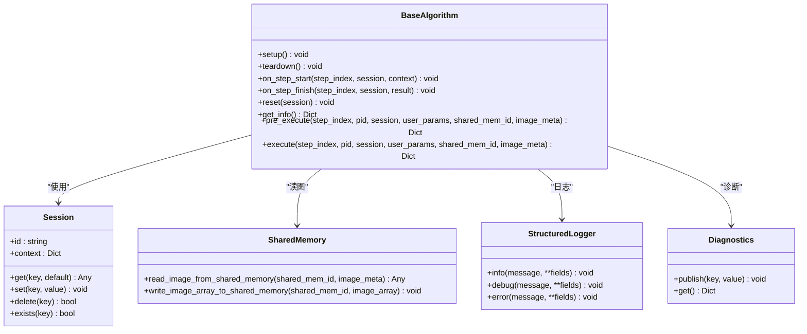

# 高级主题

<cite>
**本文引用的文件**
- [README.md](file://README.md)
- [spec.md](file://spec.md)
- [spec_architecture_review.md](file://spec_architecture_review.md)
- [algorithm_dev_tutorial.md](file://algorithm_dev_tutorial.md)
- [pyproject.toml](file://pyproject.toml)
- [procvision_algorithm_sdk/__init__.py](file://procvision_algorithm_sdk/__init__.py)
- [procvision_algorithm_sdk/base.py](file://procvision_algorithm_sdk/base.py)
- [procvision_algorithm_sdk/session.py](file://procvision_algorithm_sdk/session.py)
- [procvision_algorithm_sdk/shared_memory.py](file://procvision_algorithm_sdk/shared_memory.py)
- [procvision_algorithm_sdk/logger.py](file://procvision_algorithm_sdk/logger.py)
- [procvision_algorithm_sdk/diagnostics.py](file://procvision_algorithm_sdk/diagnostics.py)
- [procvision_algorithm_sdk/cli.py](file://procvision_algorithm_sdk/cli.py)
- [algorithm-example/manifest.json](file://algorithm-example/manifest.json)
- [tests/test_shared_memory.py](file://tests/test_shared_memory.py)
- [tests/test_session.py](file://tests/test_session.py)
- [tests/test_cli.py](file://tests/test_cli.py)
</cite>

## 目录
1. [简介](#简介)
2. [项目结构](#项目结构)
3. [核心组件](#核心组件)
4. [架构总览](#架构总览)
5. [关键组件深度分析](#关键组件深度分析)
6. [依赖关系分析](#依赖关系分析)
7. [性能考量](#性能考量)
8. [故障排查指南](#故障排查指南)
9. [结论](#结论)
10. [附录](#附录)

## 简介
本文件面向工业视觉平台ProcVision算法SDK的高级主题与架构文档，聚焦高阶设计、架构模式与系统边界，系统记录组件交互、数据流与集成模式，解释技术决策、权衡与约束，并提供基础设施要求、可扩展性考虑与部署拓扑建议。同时涵盖安全、监控与灾难恢复等横切关注点，以及技术栈、第三方依赖与版本兼容性说明。

## 项目结构
SDK采用“核心库 + CLI工具 + 示例工程 + 测试”的组织方式，强调解耦与可移植性：
- 核心库：抽象基类、会话上下文、共享内存读图、结构化日志与诊断、错误类型
- CLI：校验、运行、打包、初始化脚手架
- 示例工程：展示清单与入口实现
- 测试：覆盖核心行为与边界场景

图表来源
- [procvision_algorithm_sdk/base.py](file://procvision_algorithm_sdk/base.py#L1-L58)
- [procvision_algorithm_sdk/session.py](file://procvision_algorithm_sdk/session.py#L1-L36)
- [procvision_algorithm_sdk/shared_memory.py](file://procvision_algorithm_sdk/shared_memory.py#L1-L53)
- [procvision_algorithm_sdk/logger.py](file://procvision_algorithm_sdk/logger.py#L1-L24)
- [procvision_algorithm_sdk/diagnostics.py](file://procvision_algorithm_sdk/diagnostics.py#L1-L12)
- [procvision_algorithm_sdk/cli.py](file://procvision_algorithm_sdk/cli.py#L1-L615)
- [algorithm-example/manifest.json](file://algorithm-example/manifest.json#L1-L25)
- [tests/test_shared_memory.py](file://tests/test_shared_memory.py#L1-L16)
- [tests/test_session.py](file://tests/test_session.py#L1-L24)
- [tests/test_cli.py](file://tests/test_cli.py#L1-L20)

章节来源
- [README.md](file://README.md#L1-L116)
- [pyproject.toml](file://pyproject.toml#L1-L36)

## 核心组件
- BaseAlgorithm：定义算法生命周期钩子与接口契约，算法实现围绕该抽象展开
- Session：单次检测流程内的上下文与KV存储，支持只读上下文与JSON可序列化值
- 共享内存读写：提供读图与开发态写图能力，支持字节与数组两种输入
- StructuredLogger：结构化日志输出，统一字段与时间戳
- Diagnostics：诊断数据聚合，便于UI与平台采集
- CLI：校验、运行、打包、初始化脚手架，贯穿交付与自测流程

章节来源
- [procvision_algorithm_sdk/base.py](file://procvision_algorithm_sdk/base.py#L1-L58)
- [procvision_algorithm_sdk/session.py](file://procvision_algorithm_sdk/session.py#L1-L36)
- [procvision_algorithm_sdk/shared_memory.py](file://procvision_algorithm_sdk/shared_memory.py#L1-L53)
- [procvision_algorithm_sdk/logger.py](file://procvision_algorithm_sdk/logger.py#L1-L24)
- [procvision_algorithm_sdk/diagnostics.py](file://procvision_algorithm_sdk/diagnostics.py#L1-L12)
- [procvision_algorithm_sdk/cli.py](file://procvision_algorithm_sdk/cli.py#L1-L615)

## 架构总览
SDK采用“平台-算法解耦”的插件化架构，通过标准接口与协议实现算法与平台的松耦合集成。核心边界如下：
- 算法边界：实现BaseAlgorithm接口，不直接依赖平台细节
- 通信边界：CLI/Runner通过stdin/stdout协议与算法进程交互
- 数据边界：图像通过共享内存传递，元信息最小化
- 状态边界：Session仅在单次检测流程内有效，跨产品重新初始化

图表来源
- [procvision_algorithm_sdk/cli.py](file://procvision_algorithm_sdk/cli.py#L1-L615)
- [procvision_algorithm_sdk/base.py](file://procvision_algorithm_sdk/base.py#L1-L58)
- [procvision_algorithm_sdk/session.py](file://procvision_algorithm_sdk/session.py#L1-L36)
- [procvision_algorithm_sdk/shared_memory.py](file://procvision_algorithm_sdk/shared_memory.py#L1-L53)
- [procvision_algorithm_sdk/logger.py](file://procvision_algorithm_sdk/logger.py#L1-L24)
- [procvision_algorithm_sdk/diagnostics.py](file://procvision_algorithm_sdk/diagnostics.py#L1-L12)

## 关键组件深度分析

### BaseAlgorithm 抽象与生命周期
- 设计要点
  - 生命周期钩子：setup/teardown、on_step_start/on_step_finish、reset
  - 接口契约：get_info、pre_execute、execute，参数分组清晰，高频参数前置
  - 双层状态机：调用层status与业务层result_status分离
- 实现模式
  - 轻量初始化在__init__，重量级资源在setup
  - 会话内状态通过Session管理，跨检测持久化在实例属性
- 复杂度与性能
  - 生命周期钩子幂等，避免在execute中做重计算
  - 通过Diagnostics与StructuredLogger输出关键指标，便于监控

图表来源
- [procvision_algorithm_sdk/base.py](file://procvision_algorithm_sdk/base.py#L1-L58)
- [procvision_algorithm_sdk/session.py](file://procvision_algorithm_sdk/session.py#L1-L36)
- [procvision_algorithm_sdk/shared_memory.py](file://procvision_algorithm_sdk/shared_memory.py#L1-L53)
- [procvision_algorithm_sdk/logger.py](file://procvision_algorithm_sdk/logger.py#L1-L24)
- [procvision_algorithm_sdk/diagnostics.py](file://procvision_algorithm_sdk/diagnostics.py#L1-L12)

章节来源
- [procvision_algorithm_sdk/base.py](file://procvision_algorithm_sdk/base.py#L1-L58)
- [algorithm_dev_tutorial.md](file://algorithm_dev_tutorial.md#L1-L348)

### Session 状态共享与约束
- 设计要点
  - 仅在单次检测流程内有效，跨产品重新初始化
  - KV存储值必须JSON可序列化，避免跨进程/跨协议传输问题
  - context只读，state_store用于步骤间共享
- 边界与约束
  - 建议存储大小<100KB，避免内存压力
  - 不同产品流程使用不同Session实例
- 错误处理
  - 非序列化值set时抛TypeError，便于早期发现

图表来源
- [procvision_algorithm_sdk/session.py](file://procvision_algorithm_sdk/session.py#L1-L36)
- [procvision_algorithm_sdk/base.py](file://procvision_algorithm_sdk/base.py#L1-L58)

章节来源
- [procvision_algorithm_sdk/session.py](file://procvision_algorithm_sdk/session.py#L1-L36)
- [tests/test_session.py](file://tests/test_session.py#L1-L24)

### 共享内存读图与图像元信息
- 设计要点
  - JPEG-only约定，image_meta最小集合：width/height/timestamp_ms/camera_id
  - 支持字节与数组两种输入，自动颜色空间转换与通道扩展
  - 读取失败回退零矩阵，保证稳定性
- 复杂度与性能
  - 读图为O(HW)像素操作，建议在算法侧避免重复解码
  - 数组输入可直接使用，减少解码开销

图表来源
- [procvision_algorithm_sdk/shared_memory.py](file://procvision_algorithm_sdk/shared_memory.py#L1-L53)
- [tests/test_shared_memory.py](file://tests/test_shared_memory.py#L1-L16)

章节来源
- [procvision_algorithm_sdk/shared_memory.py](file://procvision_algorithm_sdk/shared_memory.py#L1-L53)
- [algorithm_dev_tutorial.md](file://algorithm_dev_tutorial.md#L1-L348)

### CLI：校验、运行、打包与初始化
- 校验(validate)
  - 校验清单、入口类继承、supported_pids一致性、返回结构
  - ZIP包结构校验（manifest/requirements/wheels）
- 运行(run)
  - 本地模拟Runner行为，写入共享内存并调用完整生命周期
- 打包(package)
  - 生成requirements.sanitized.txt，下载wheels，打包离线交付ZIP
- 初始化(init)
  - 生成脚手架与入口类，便于快速开始

图表来源
- [procvision_algorithm_sdk/cli.py](file://procvision_algorithm_sdk/cli.py#L1-L615)
- [algorithm-example/manifest.json](file://algorithm-example/manifest.json#L1-L25)

章节来源
- [procvision_algorithm_sdk/cli.py](file://procvision_algorithm_sdk/cli.py#L1-L615)
- [tests/test_cli.py](file://tests/test_cli.py#L1-L20)

### 协议与通信：Runner与算法进程
- 通信方式
  - stdin/stdout双向管道，帧格式为“4字节大端长度 + UTF-8 JSON”
- 消息类型
  - hello、call、result、ping、pong、error、shutdown
- 心跳与超时
  - Runner定期ping，算法需在超时内pong
  - pre_execute/execute分别有超时阈值，Runner据此采取优雅终止或强制kill
- 日志与协议隔离
  - 协议帧仅在stdout输出，stderr用于结构化日志

图表来源
- [spec.md](file://spec.md#L1-L2102)

章节来源
- [spec.md](file://spec.md#L1-L2102)

## 依赖关系分析
- 直接依赖
  - numpy>=1.21：图像数组与数值计算
  - pillow>=10.0.0：图像解码与PIL兼容
- 间接依赖
  - Python>=3.10：运行时环境
  - CLI作为控制台脚本入口，依赖SDK核心库
- 版本兼容
  - 与Runner/平台协议版本对齐，遵循spec.md的接口契约

图表来源
- [pyproject.toml](file://pyproject.toml#L1-L36)
- [procvision_algorithm_sdk/__init__.py](file://procvision_algorithm_sdk/__init__.py#L1-L20)

章节来源
- [pyproject.toml](file://pyproject.toml#L1-L36)
- [procvision_algorithm_sdk/__init__.py](file://procvision_algorithm_sdk/__init__.py#L1-L20)

## 性能考量
- 资源管理
  - 重量级资源（模型、显存）在setup中加载，teardown中释放
  - 会话内临时状态在on_step_finish中清理，避免累积
- I/O与解码
  - 共享内存读图避免磁盘IO，尽量使用数组输入减少解码
  - image_meta最小化，避免冗余字段
- 日志与诊断
  - 结构化日志与诊断数据聚合，避免频繁I/O
- 超时与心跳
  - 保持pong响应异步，避免阻塞execute
  - 严格遵守pre_execute/execute超时阈值

[本节为通用性能建议，不直接分析具体文件]

## 故障排查指南
- 常见问题
  - supported_pids不一致：清单与get_info必须完全一致
  - 返回结构错误：pre_execute不可包含业务判定，execute才返回result_status
  - wheels不匹配：在目标Python版本与ABI环境下生成requirements.txt
  - 图像尺寸异常：确保image_meta.width/height为正整数
- CLI自检
  - 使用validate快速定位清单、入口类、返回结构与ZIP包问题
  - 使用run进行本地模拟，观察日志与诊断
- 单元测试
  - 测试覆盖共享内存回退、Session序列化约束、CLI行为

章节来源
- [tests/test_shared_memory.py](file://tests/test_shared_memory.py#L1-L16)
- [tests/test_session.py](file://tests/test_session.py#L1-L24)
- [tests/test_cli.py](file://tests/test_cli.py#L1-L20)
- [algorithm_dev_tutorial.md](file://algorithm_dev_tutorial.md#L1-L348)

## 结论
本SDK通过清晰的抽象与严格的契约，实现了平台与算法的解耦与可移植性。Session、共享内存与结构化日志构成稳定的数据与状态边界，CLI贯穿开发、校验与交付流程。建议在生产中结合心跳与超时策略、完善的诊断与日志体系，确保系统的可靠性与可观测性。

[本节为总结性内容，不直接分析具体文件]

## 附录

### 技术栈与版本兼容
- Python：>=3.10
- 依赖：numpy>=1.21、pillow>=10.0.0
- 控制台脚本：procvision-cli

章节来源
- [pyproject.toml](file://pyproject.toml#L1-L36)

### 基础设施要求与部署拓扑
- 离线交付：算法包必须包含源码、manifest.json、requirements.txt与wheels目录
- 目标环境：固定的操作系统、Python版本与硬件规格
- Runner拓扑：单进程或多进程Runner，按PID路由到对应算法实例

章节来源
- [README.md](file://README.md#L1-L116)
- [spec.md](file://spec.md#L1-L2102)

### 安全、监控与灾难恢复
- 安全
  - 仅通过协议帧与结构化日志通信，避免协议污染
  - Session仅存储JSON可序列化数据，防止反序列化攻击
- 监控
  - 使用StructuredLogger与Diagnostics输出关键指标
  - Runner基于心跳与超时进行健康监控
- 灾难恢复
  - Runner在进程僵死或超时情况下进行优雅终止与强制kill
  - 进程崩溃具备有限次数的自动重启策略

章节来源
- [spec.md](file://spec.md#L1-L2102)
- [procvision_algorithm_sdk/logger.py](file://procvision_algorithm_sdk/logger.py#L1-L24)
- [procvision_algorithm_sdk/diagnostics.py](file://procvision_algorithm_sdk/diagnostics.py#L1-L12)

### 架构评审要点与权衡
- Session API定义与使用存在矛盾，需提供完整实现与示例
- 返回值Schema与status定义存在歧义，需统一双层状态机
- overlay能力描述前后矛盾，需彻底清理相关引用
- 参数类型系统（array/json）定义不足，需补充元素级约束与JSON Schema示例
- 心跳/超时机制细节缺失，需明确定义与策略

章节来源
- [spec_architecture_review.md](file://spec_architecture_review.md#L1-L1054)